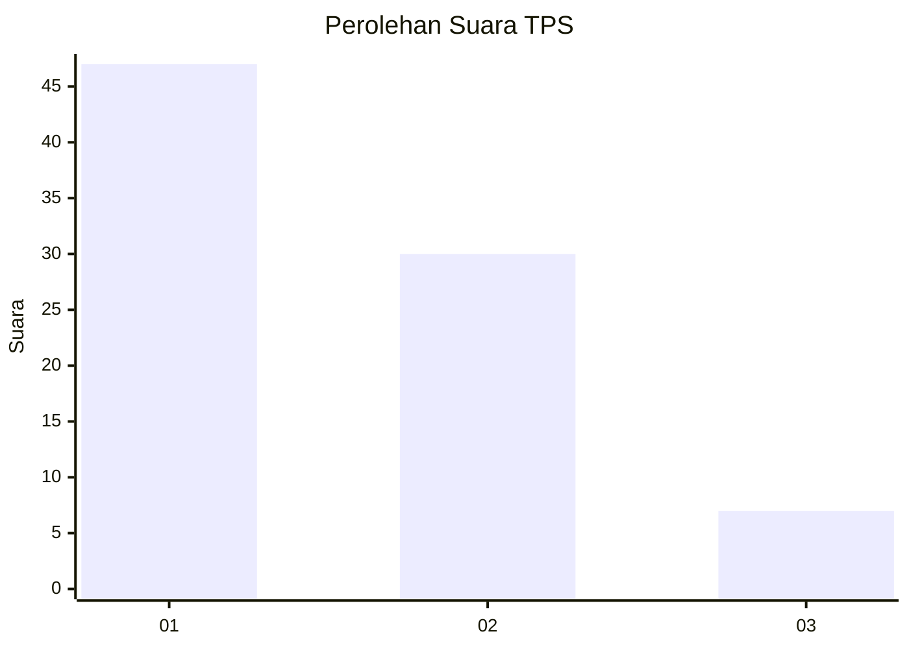
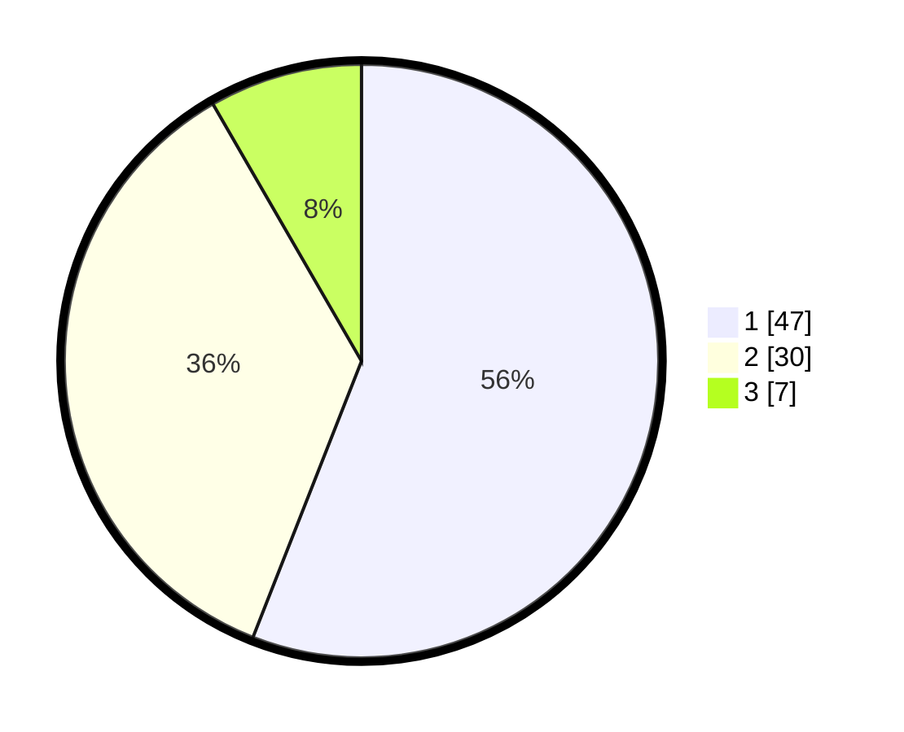

# Hasil

## Grafik

## Tabel

| No. | Nama Paslon    | Suara | Suara (raw) | Persentase |
|:--- |:-------------- | -----:| -----------:| ----------:|
| 1   | ANIES MUHAIMIN | 47    | [47][p-1]   | 55,95      |
| 2   | PRABOWO GIBRAN | 30    | [30][p-2]   | 35,71      |
| 3   | GANJAR MAHFUD  | 7     | [7][p-3]    | 8,33       |

[p-1]: https://github.com/gigit-pemilu/pemilu-2024/blob/main/pilpres/hitung-suara/sub/12-sumatera-utara/sub/07-deli-serdang/sub/26-percut-sei-tuan/sub/2017-bandar-setia/sub/073-tps/sub/paslon-1.txt
[p-2]: https://github.com/gigit-pemilu/pemilu-2024/blob/main/pilpres/hitung-suara/sub/12-sumatera-utara/sub/07-deli-serdang/sub/26-percut-sei-tuan/sub/2017-bandar-setia/sub/073-tps/sub/paslon-2.txt
[p-3]: https://github.com/gigit-pemilu/pemilu-2024/blob/main/pilpres/hitung-suara/sub/12-sumatera-utara/sub/07-deli-serdang/sub/26-percut-sei-tuan/sub/2017-bandar-setia/sub/073-tps/sub/paslon-3.txt

## Foto C Plano

https://sirekap-obj-formc.kpu.go.id/06e8/pemilu/ppwp/12/07/26/20/17/1207262017073-20240215-024857--eb467239-2770-463b-90fa-a0531811b3b4.jpg

https://sirekap-obj-formc.kpu.go.id/06e8/pemilu/ppwp/12/07/26/20/17/1207262017073-20240214-222351--67589305-a953-4514-9334-2bd801a4cb70.jpg

https://sirekap-obj-formc.kpu.go.id/06e8/pemilu/ppwp/12/07/26/20/17/1207262017073-20240214-222611--cee82fad-ed9c-4aed-b141-9eb7892503a0.jpg

## Metadata

| Key        | Value               |
| ---------- | ------------------- |
| Time Stamp | 2024-02-15 22:30:27 |

