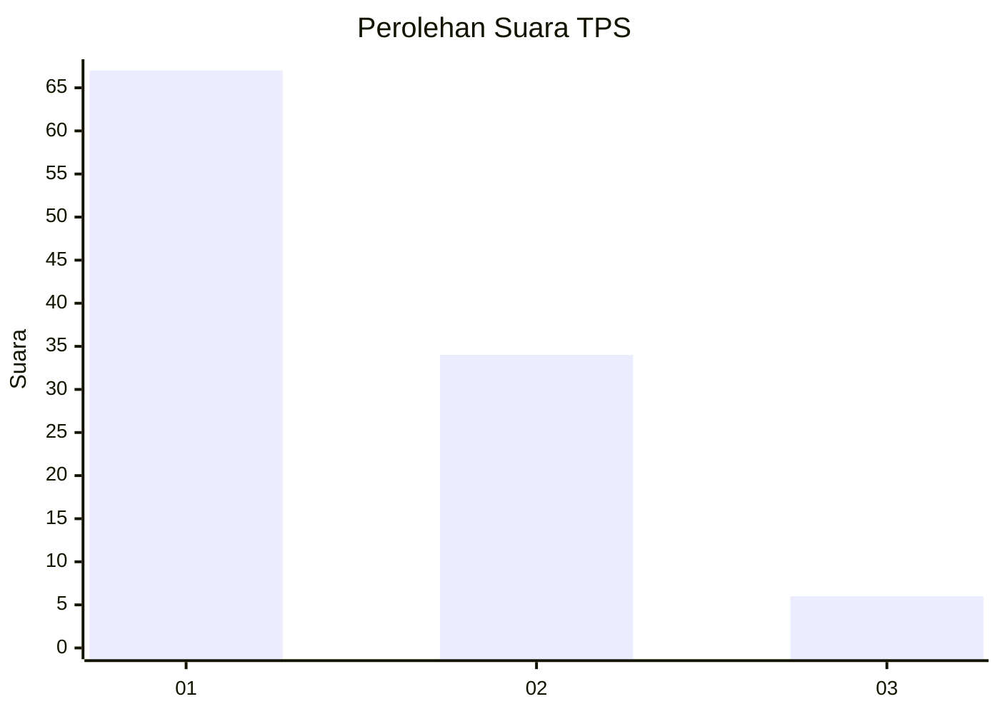
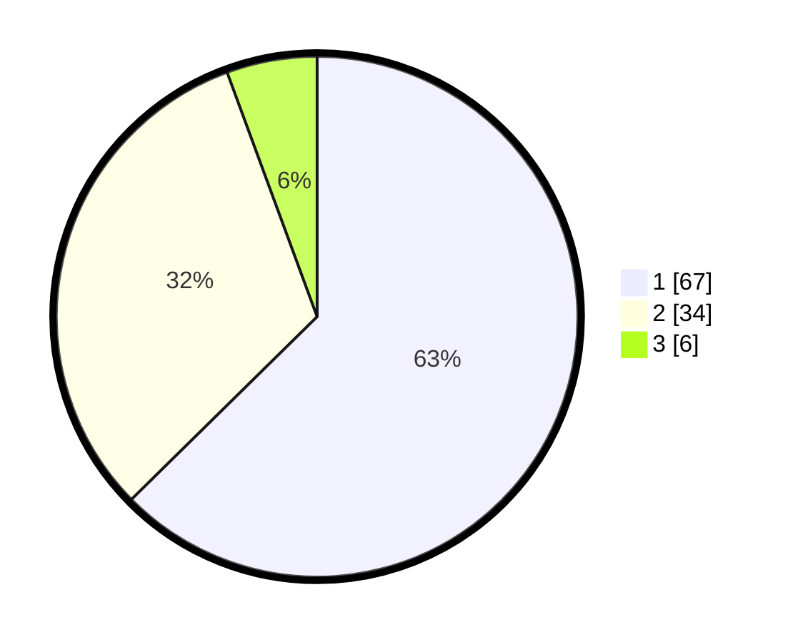

# Hasil

## Grafik

## Tabel

| No. | Nama Paslon    | Suara | Suara (raw) | Persentase |
|:--- |:-------------- | -----:| -----------:| ----------:|
| 1   | ANIES MUHAIMIN | 67    | [67][p-1]   | 62,62      |
| 2   | PRABOWO GIBRAN | 34    | [34][p-2]   | 31,78      |
| 3   | GANJAR MAHFUD  | 6     | [6][p-3]    | 5,61       |

[p-1]: https://github.com/gigit-pemilu/pemilu-2024-12-sumatera-utara/blob/main/pilpres/hitung-suara/sub/12-sumatera-utara/sub/07-deli-serdang/sub/26-percut-sei-tuan/sub/2018-sei-rotan/sub/046-tps/sub/paslon-1.txt
[p-2]: https://github.com/gigit-pemilu/pemilu-2024-12-sumatera-utara/blob/main/pilpres/hitung-suara/sub/12-sumatera-utara/sub/07-deli-serdang/sub/26-percut-sei-tuan/sub/2018-sei-rotan/sub/046-tps/sub/paslon-2.txt
[p-3]: https://github.com/gigit-pemilu/pemilu-2024-12-sumatera-utara/blob/main/pilpres/hitung-suara/sub/12-sumatera-utara/sub/07-deli-serdang/sub/26-percut-sei-tuan/sub/2018-sei-rotan/sub/046-tps/sub/paslon-3.txt

## Foto C Plano

https://sirekap-obj-formc.kpu.go.id/d9ce/pemilu/ppwp/12/07/26/20/18/1207262018046-20240215-000032--79e60d57-6fc1-47af-ba9e-c3356a7cf399.jpg

https://sirekap-obj-formc.kpu.go.id/d9ce/pemilu/ppwp/12/07/26/20/18/1207262018046-20240215-000039--31af8356-9c39-4e3a-a14d-68d6d9b4fa87.jpg

https://sirekap-obj-formc.kpu.go.id/d9ce/pemilu/ppwp/12/07/26/20/18/1207262018046-20240215-000949--80a26f01-8325-4d51-aee4-d5960d78ef3e.jpg

## Metadata

| Key        | Value               |
| ---------- | ------------------- |
| Time Stamp | 2024-02-15 12:00:28 |

