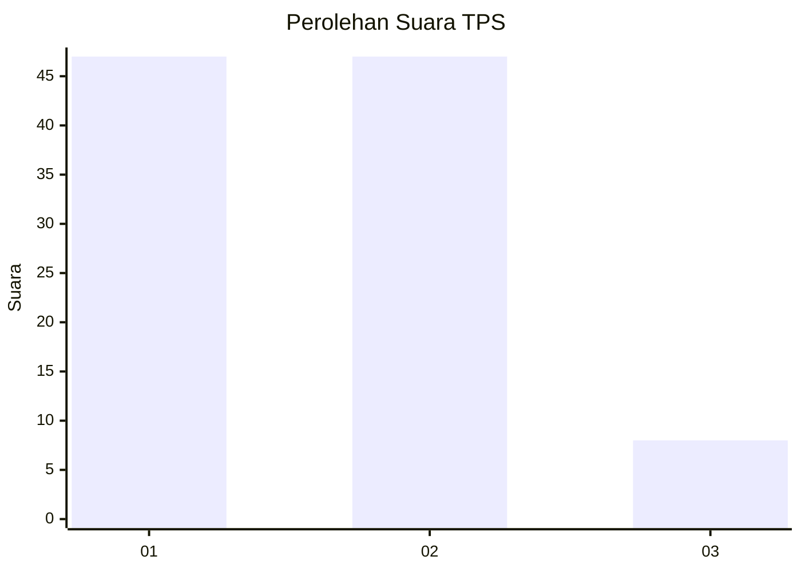
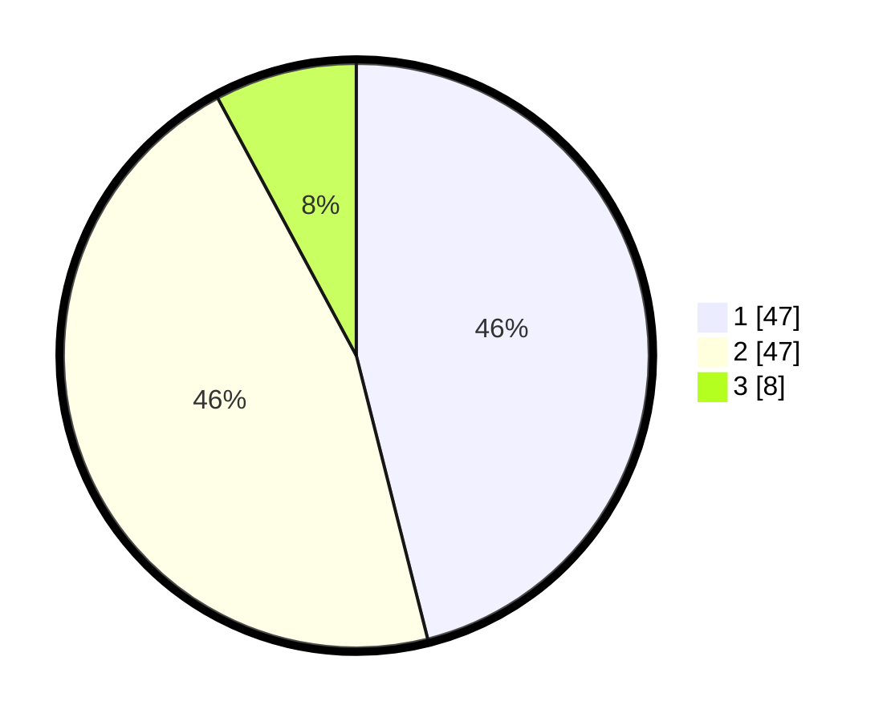

# Hasil

## Grafik

## Tabel

| No. | Nama Paslon    | Suara | Suara (raw) | Persentase |
|:--- |:-------------- | -----:| -----------:| ----------:|
| 1   | ANIES MUHAIMIN | 47    | [47][p-1]   | 46,08      |
| 2   | PRABOWO GIBRAN | 47    | [47][p-2]   | 46,08      |
| 3   | GANJAR MAHFUD  | 8     | [8][p-3]    | 7,84       |

[p-1]: https://github.com/gigit-pemilu/pemilu-2024-12-sumatera-utara/blob/main/pilpres/hitung-suara/sub/12-sumatera-utara/sub/07-deli-serdang/sub/26-percut-sei-tuan/sub/2018-sei-rotan/sub/048-tps/sub/paslon-1.txt
[p-2]: https://github.com/gigit-pemilu/pemilu-2024-12-sumatera-utara/blob/main/pilpres/hitung-suara/sub/12-sumatera-utara/sub/07-deli-serdang/sub/26-percut-sei-tuan/sub/2018-sei-rotan/sub/048-tps/sub/paslon-2.txt
[p-3]: https://github.com/gigit-pemilu/pemilu-2024-12-sumatera-utara/blob/main/pilpres/hitung-suara/sub/12-sumatera-utara/sub/07-deli-serdang/sub/26-percut-sei-tuan/sub/2018-sei-rotan/sub/048-tps/sub/paslon-3.txt

## Foto C Plano

https://sirekap-obj-formc.kpu.go.id/e67d/pemilu/ppwp/12/07/26/20/18/1207262018048-20240215-003633--f05d4e78-5ea9-45af-9165-4d83c34bfb3e.jpg

https://sirekap-obj-formc.kpu.go.id/e67d/pemilu/ppwp/12/07/26/20/18/1207262018048-20240215-010325--d9ae33c9-5ad4-46a3-850b-da6c6f7ba048.jpg

https://sirekap-obj-formc.kpu.go.id/e67d/pemilu/ppwp/12/07/26/20/18/1207262018048-20240215-010622--27d374cd-f0b4-4cfa-8941-5569f276ca13.jpg

## Metadata

| Key        | Value               |
| ---------- | ------------------- |
| Time Stamp | 2024-02-15 15:30:25 |

