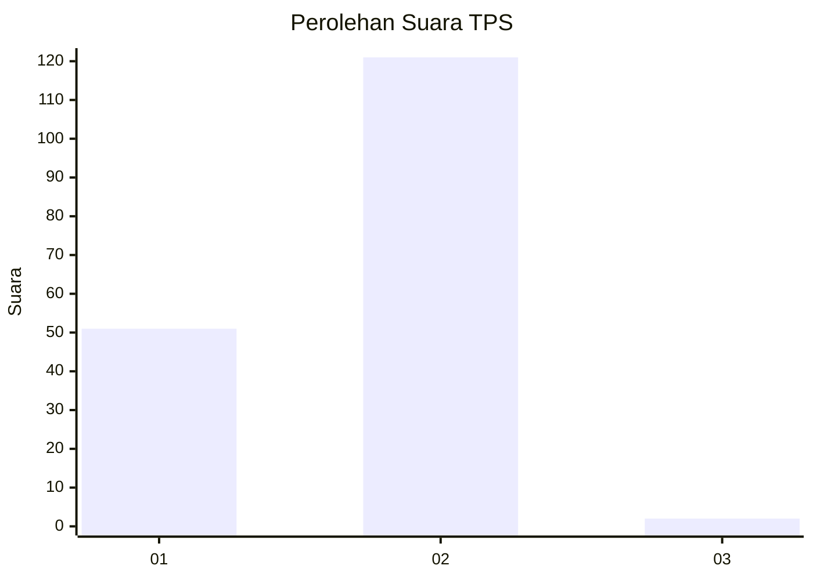
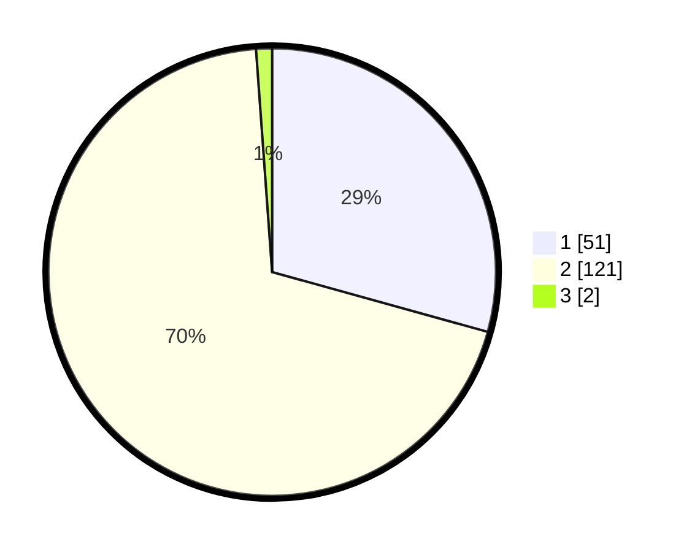

# Hasil

## Grafik

## Tabel

| No. | Nama Paslon    | Suara | Suara (raw) | Persentase |
|:--- |:-------------- | -----:| -----------:| ----------:|
| 1   | ANIES MUHAIMIN | 51    | [51][p-1]   | 29,31      |
| 2   | PRABOWO GIBRAN | 121   | [121][p-2]  | 69,54      |
| 3   | GANJAR MAHFUD  | 2     | [2][p-3]    | 1,15       |

[p-1]: https://github.com/gigit-pemilu/pemilu-2024-12-sumatera-utara/blob/main/pilpres/hitung-suara/sub/12-sumatera-utara/sub/07-deli-serdang/sub/27-batang-kuis/sub/2001-sena/sub/005-tps/sub/paslon-1.txt
[p-2]: https://github.com/gigit-pemilu/pemilu-2024-12-sumatera-utara/blob/main/pilpres/hitung-suara/sub/12-sumatera-utara/sub/07-deli-serdang/sub/27-batang-kuis/sub/2001-sena/sub/005-tps/sub/paslon-2.txt
[p-3]: https://github.com/gigit-pemilu/pemilu-2024-12-sumatera-utara/blob/main/pilpres/hitung-suara/sub/12-sumatera-utara/sub/07-deli-serdang/sub/27-batang-kuis/sub/2001-sena/sub/005-tps/sub/paslon-3.txt

## Foto C Plano

https://sirekap-obj-formc.kpu.go.id/f639/pemilu/ppwp/12/07/27/20/01/1207272001005-20240215-022710--622af158-7211-430f-837b-dbbbb9b6cd31.jpg

https://sirekap-obj-formc.kpu.go.id/f639/pemilu/ppwp/12/07/27/20/01/1207272001005-20240215-022838--2c906bee-a1ad-4dd8-8902-e179f8b5bb39.jpg

https://sirekap-obj-formc.kpu.go.id/f639/pemilu/ppwp/12/07/27/20/01/1207272001005-20240215-023117--72550a8d-81de-4c9d-930b-9749fea85408.jpg

## Metadata

| Key        | Value               |
| ---------- | ------------------- |
| Time Stamp | 2024-02-15 22:00:27 |

