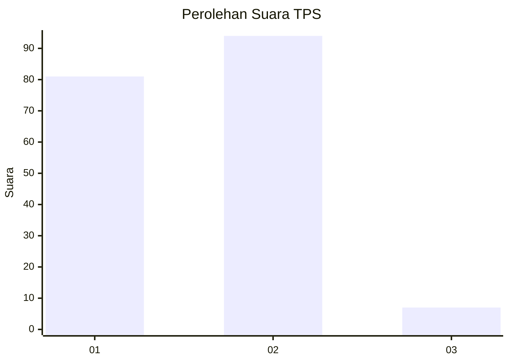
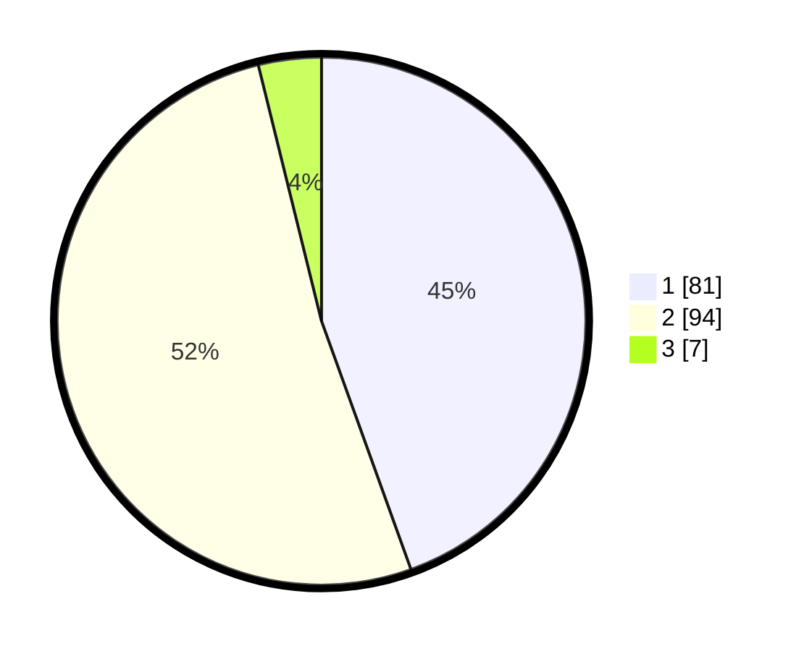

# Hasil

## Grafik

## Tabel

| No. | Nama Paslon    | Suara | Suara (raw) | Persentase |
|:--- |:-------------- | -----:| -----------:| ----------:|
| 1   | ANIES MUHAIMIN | 81    | [81][p-1]   | 44,51      |
| 2   | PRABOWO GIBRAN | 94    | [94][p-2]   | 51,65      |
| 3   | GANJAR MAHFUD  | 7     | [7][p-3]    | 3,85       |

[p-1]: https://github.com/gigit-pemilu/pemilu-2024/blob/main/pilpres/hitung-suara/sub/12-sumatera-utara/sub/07-deli-serdang/sub/27-batang-kuis/sub/2005-batangkuis-pekan/sub/001-tps/sub/paslon-1.txt
[p-2]: https://github.com/gigit-pemilu/pemilu-2024/blob/main/pilpres/hitung-suara/sub/12-sumatera-utara/sub/07-deli-serdang/sub/27-batang-kuis/sub/2005-batangkuis-pekan/sub/001-tps/sub/paslon-2.txt
[p-3]: https://github.com/gigit-pemilu/pemilu-2024/blob/main/pilpres/hitung-suara/sub/12-sumatera-utara/sub/07-deli-serdang/sub/27-batang-kuis/sub/2005-batangkuis-pekan/sub/001-tps/sub/paslon-3.txt

## Foto C Plano

https://sirekap-obj-formc.kpu.go.id/15ae/pemilu/ppwp/12/07/27/20/05/1207272005001-20240214-235043--b0c90451-529e-4e29-ace3-01f1f4bc4293.jpg

https://sirekap-obj-formc.kpu.go.id/15ae/pemilu/ppwp/12/07/27/20/05/1207272005001-20240215-000301--770eba5f-bbb2-4736-8bec-fbab37632d9e.jpg

https://sirekap-obj-formc.kpu.go.id/15ae/pemilu/ppwp/12/07/27/20/05/1207272005001-20240215-000618--b70124af-5c33-46ed-a201-5ba2c586b432.jpg

## Metadata

| Key        | Value               |
| ---------- | ------------------- |
| Time Stamp | 2024-02-24 23:00:00 |

