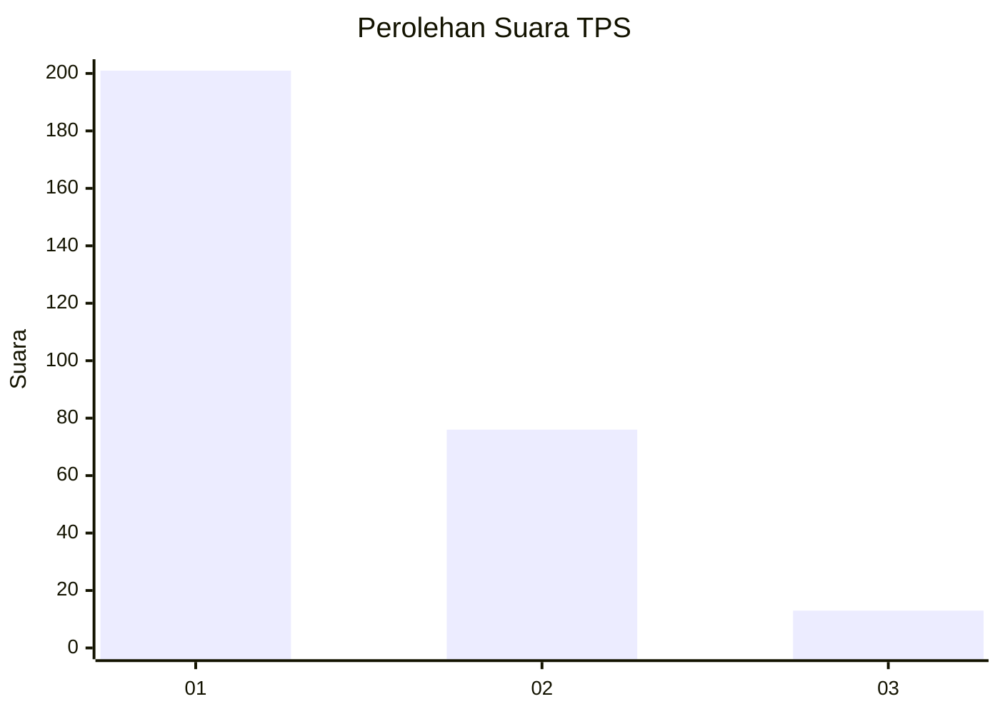
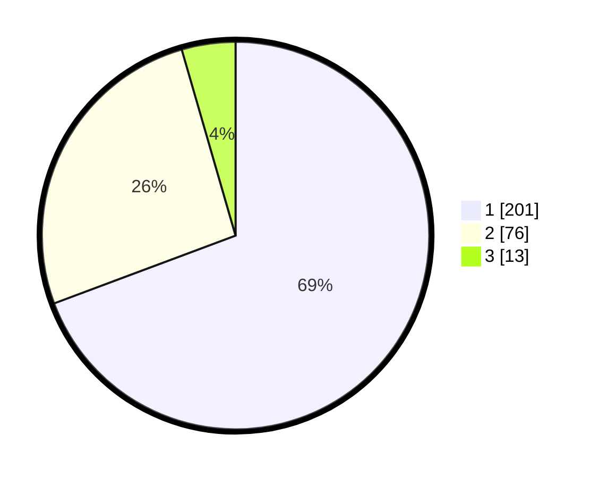

# Hasil

## Grafik

## Tabel

| No. | Nama Paslon    | Suara | Suara (raw) | Persentase |
|:--- |:-------------- | -----:| -----------:| ----------:|
| 1   | ANIES MUHAIMIN | 201   | [201][p-1]  | 69,31      |
| 2   | PRABOWO GIBRAN | 76    | [76][p-2]   | 26,21      |
| 3   | GANJAR MAHFUD  | 13    | [13][p-3]   | 4,48       |

[p-1]: https://github.com/gigit-pemilu/pemilu-2024-12-sumatera-utara/blob/main/pilpres/hitung-suara/sub/12-sumatera-utara/sub/07-deli-serdang/sub/27-batang-kuis/sub/2005-batangkuis-pekan/sub/009-tps/sub/paslon-1.txt
[p-2]: https://github.com/gigit-pemilu/pemilu-2024-12-sumatera-utara/blob/main/pilpres/hitung-suara/sub/12-sumatera-utara/sub/07-deli-serdang/sub/27-batang-kuis/sub/2005-batangkuis-pekan/sub/009-tps/sub/paslon-2.txt
[p-3]: https://github.com/gigit-pemilu/pemilu-2024-12-sumatera-utara/blob/main/pilpres/hitung-suara/sub/12-sumatera-utara/sub/07-deli-serdang/sub/27-batang-kuis/sub/2005-batangkuis-pekan/sub/009-tps/sub/paslon-3.txt

## Foto C Plano

https://sirekap-obj-formc.kpu.go.id/c50b/pemilu/ppwp/12/07/27/20/05/1207272005009-20240215-012741--1c4ff937-d1ff-4928-8a72-d2158fb95c90.jpg

https://sirekap-obj-formc.kpu.go.id/c50b/pemilu/ppwp/12/07/27/20/05/1207272005009-20240215-012817--fa250fe6-61cc-4a3c-a82a-babc4f642d94.jpg

https://sirekap-obj-formc.kpu.go.id/c50b/pemilu/ppwp/12/07/27/20/05/1207272005009-20240215-012850--59fa5664-a567-4900-b853-7386ae8d78cc.jpg

## Metadata

| Key        | Value               |
| ---------- | ------------------- |
| Time Stamp | 2024-02-25 17:00:00 |

