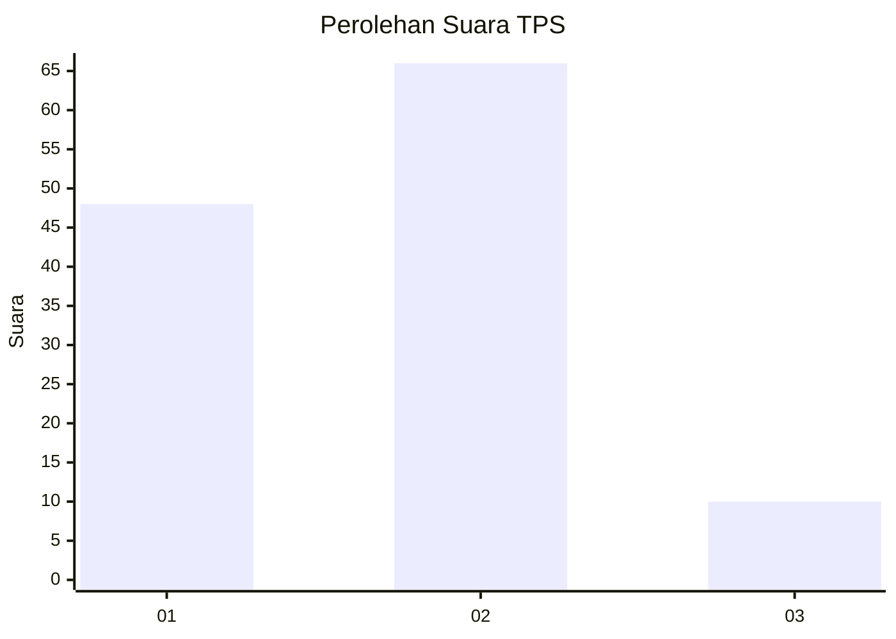

# Hasil

## Grafik

## Tabel

| No. | Nama Paslon    | Suara | Suara (raw) | Persentase |
|:--- |:-------------- | -----:| -----------:| ----------:|
| 1   | ANIES MUHAIMIN | 48    | [48][p-1]   | 38,71      |
| 2   | PRABOWO GIBRAN | 66    | [66][p-2]   | 53,23      |
| 3   | GANJAR MAHFUD  | 10    | [10][p-3]   | 8,06       |

[p-1]: https://github.com/gigit-pemilu/pemilu-2024-12-sumatera-utara/blob/main/pilpres/hitung-suara/sub/12-sumatera-utara/sub/07-deli-serdang/sub/28-lubuk-pakam/sub/1011-syahmad/sub/014-tps/sub/paslon-1.txt
[p-2]: https://github.com/gigit-pemilu/pemilu-2024-12-sumatera-utara/blob/main/pilpres/hitung-suara/sub/12-sumatera-utara/sub/07-deli-serdang/sub/28-lubuk-pakam/sub/1011-syahmad/sub/014-tps/sub/paslon-2.txt
[p-3]: https://github.com/gigit-pemilu/pemilu-2024-12-sumatera-utara/blob/main/pilpres/hitung-suara/sub/12-sumatera-utara/sub/07-deli-serdang/sub/28-lubuk-pakam/sub/1011-syahmad/sub/014-tps/sub/paslon-3.txt

## Foto C Plano

https://sirekap-obj-formc.kpu.go.id/bd47/pemilu/ppwp/12/07/28/10/11/1207281011014-20240215-012631--83dc47eb-4cf4-4905-b532-d1ff3cf6b5ab.jpg

https://sirekap-obj-formc.kpu.go.id/bd47/pemilu/ppwp/12/07/28/10/11/1207281011014-20240215-012721--a2551cbc-cc6c-45f8-a1c5-4f1c53517d6e.jpg

https://sirekap-obj-formc.kpu.go.id/bd47/pemilu/ppwp/12/07/28/10/11/1207281011014-20240215-012825--b9f3c353-868f-4a31-8ea1-529b85439547.jpg

## Metadata

| Key        | Value               |
| ---------- | ------------------- |
| Time Stamp | 2024-02-16 01:00:27 |

