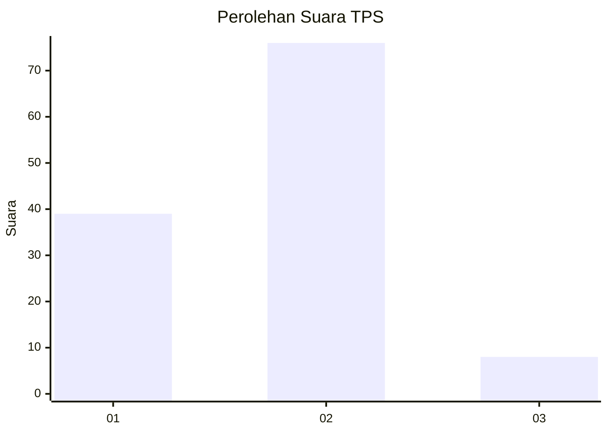
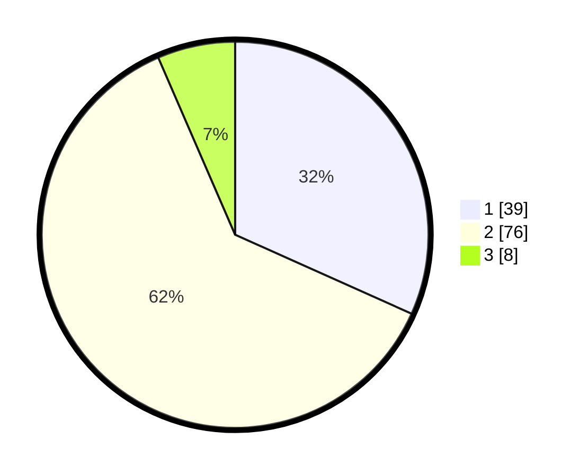

# Hasil

## Grafik

## Tabel

| No. | Nama Paslon    | Suara | Suara (raw) | Persentase |
|:--- |:-------------- | -----:| -----------:| ----------:|
| 1   | ANIES MUHAIMIN | 39    | [39][p-1]   | 31,71      |
| 2   | PRABOWO GIBRAN | 76    | [76][p-2]   | 61,79      |
| 3   | GANJAR MAHFUD  | 8     | [8][p-3]    | 6,50       |

[p-1]: https://github.com/gigit-pemilu/pemilu-2024/blob/main/pilpres/hitung-suara/sub/12-sumatera-utara/sub/07-deli-serdang/sub/28-lubuk-pakam/sub/1011-syahmad/sub/015-tps/sub/paslon-1.txt
[p-2]: https://github.com/gigit-pemilu/pemilu-2024/blob/main/pilpres/hitung-suara/sub/12-sumatera-utara/sub/07-deli-serdang/sub/28-lubuk-pakam/sub/1011-syahmad/sub/015-tps/sub/paslon-2.txt
[p-3]: https://github.com/gigit-pemilu/pemilu-2024/blob/main/pilpres/hitung-suara/sub/12-sumatera-utara/sub/07-deli-serdang/sub/28-lubuk-pakam/sub/1011-syahmad/sub/015-tps/sub/paslon-3.txt

## Foto C Plano

https://sirekap-obj-formc.kpu.go.id/55d3/pemilu/ppwp/12/07/28/10/11/1207281011015-20240214-234836--3e5904dc-1d3c-4bcb-b781-7c2683bb10e0.jpg

https://sirekap-obj-formc.kpu.go.id/55d3/pemilu/ppwp/12/07/28/10/11/1207281011015-20240214-235300--6cb1cb8e-d535-41bc-96c2-fe637e88898d.jpg

https://sirekap-obj-formc.kpu.go.id/55d3/pemilu/ppwp/12/07/28/10/11/1207281011015-20240214-235529--62b35097-bced-4a73-915f-0b065e3d2391.jpg

## Metadata

| Key        | Value               |
| ---------- | ------------------- |
| Time Stamp | 2024-02-15 20:00:44 |

