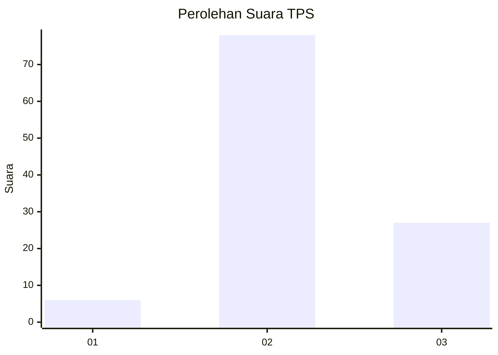
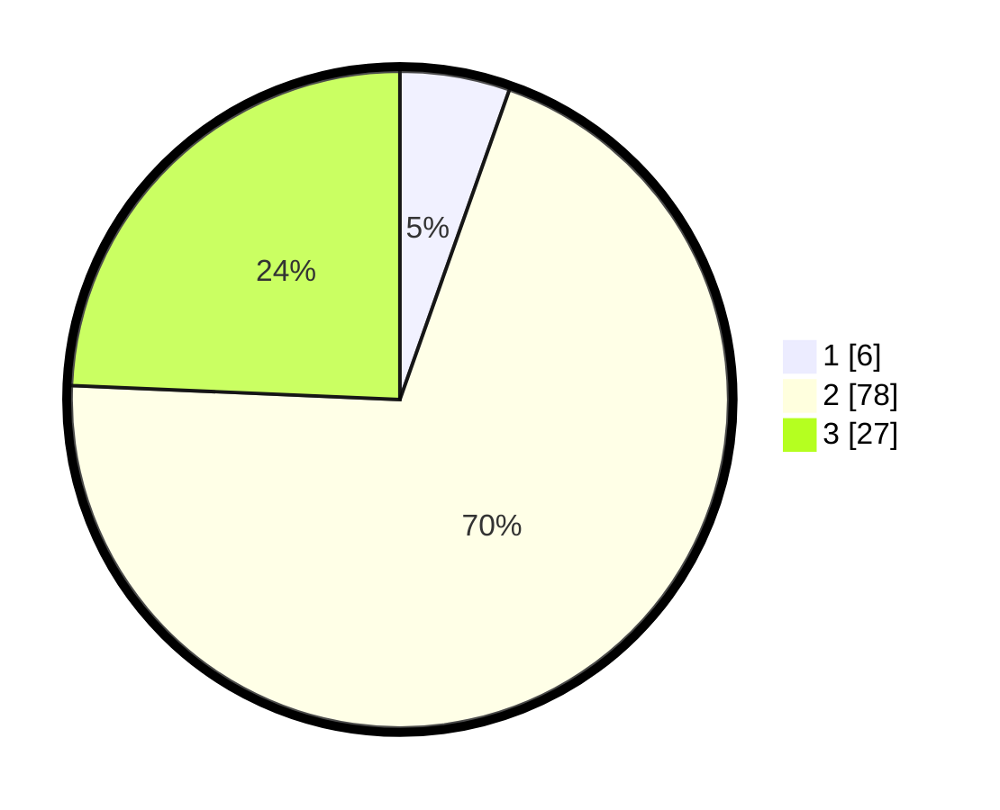

# Hasil

## Grafik

## Tabel

| No. | Nama Paslon    | Suara | Suara (raw) | Persentase |
|:--- |:-------------- | -----:| -----------:| ----------:|
| 1   | ANIES MUHAIMIN | 6     | [6][p-1]    | 5,41       |
| 2   | PRABOWO GIBRAN | 78    | [78][p-2]   | 70,27      |
| 3   | GANJAR MAHFUD  | 27    | [27][p-3]   | 24,32      |

[p-1]: https://github.com/gigit-pemilu/pemilu-2024-12-sumatera-utara/blob/main/pilpres/hitung-suara/sub/12-sumatera-utara/sub/07-deli-serdang/sub/28-lubuk-pakam/sub/2002-pagar-jati/sub/007-tps/sub/paslon-1.txt
[p-2]: https://github.com/gigit-pemilu/pemilu-2024-12-sumatera-utara/blob/main/pilpres/hitung-suara/sub/12-sumatera-utara/sub/07-deli-serdang/sub/28-lubuk-pakam/sub/2002-pagar-jati/sub/007-tps/sub/paslon-2.txt
[p-3]: https://github.com/gigit-pemilu/pemilu-2024-12-sumatera-utara/blob/main/pilpres/hitung-suara/sub/12-sumatera-utara/sub/07-deli-serdang/sub/28-lubuk-pakam/sub/2002-pagar-jati/sub/007-tps/sub/paslon-3.txt

## Foto C Plano

https://sirekap-obj-formc.kpu.go.id/0d48/pemilu/ppwp/12/07/28/20/02/1207282002007-20240214-224046--5f7ca4fe-4153-43c8-9437-128f5b865820.jpg

https://sirekap-obj-formc.kpu.go.id/0d48/pemilu/ppwp/12/07/28/20/02/1207282002007-20240214-222257--b3568e42-d1fb-4439-b01a-fe3c306c6c27.jpg

https://sirekap-obj-formc.kpu.go.id/0d48/pemilu/ppwp/12/07/28/20/02/1207282002007-20240214-222445--35f846ea-4413-4d44-a153-3f180228a501.jpg

## Metadata

| Key        | Value               |
| ---------- | ------------------- |
| Time Stamp | 2024-02-15 20:30:46 |

