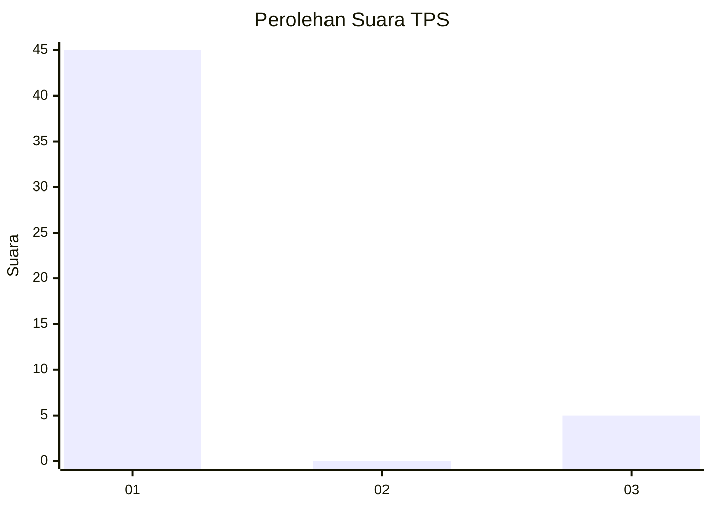
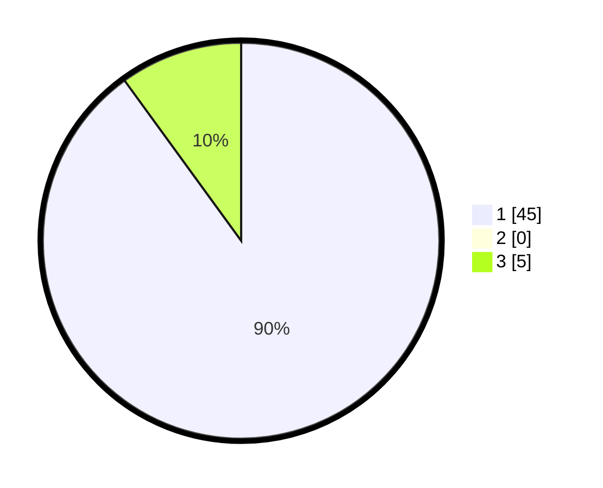

# Hasil

## Grafik

## Tabel

| No. | Nama Paslon    | Suara | Suara (raw) | Persentase |
|:--- |:-------------- | -----:| -----------:| ----------:|
| 1   | ANIES MUHAIMIN | 45    | [45][p-1]   | 90,00      |
| 2   | PRABOWO GIBRAN | 0     | [0][p-2]    | 0,00       |
| 3   | GANJAR MAHFUD  | 5     | [5][p-3]    | 10,00      |

[p-1]: https://github.com/gigit-pemilu/pemilu-2024/blob/main/pilpres/hitung-suara/sub/12-sumatera-utara/sub/07-deli-serdang/sub/31-pagar-merbau/sub/2005-jati-rejo/sub/002-tps/sub/paslon-1.txt
[p-2]: https://github.com/gigit-pemilu/pemilu-2024/blob/main/pilpres/hitung-suara/sub/12-sumatera-utara/sub/07-deli-serdang/sub/31-pagar-merbau/sub/2005-jati-rejo/sub/002-tps/sub/paslon-2.txt
[p-3]: https://github.com/gigit-pemilu/pemilu-2024/blob/main/pilpres/hitung-suara/sub/12-sumatera-utara/sub/07-deli-serdang/sub/31-pagar-merbau/sub/2005-jati-rejo/sub/002-tps/sub/paslon-3.txt

## Foto C Plano

https://sirekap-obj-formc.kpu.go.id/d420/pemilu/ppwp/12/07/31/20/05/1207312005002-20240215-034208--bb1b3e06-c40c-46c2-ba4d-90c9b9e03723.jpg

https://sirekap-obj-formc.kpu.go.id/d420/pemilu/ppwp/12/07/31/20/05/1207312005002-20240219-201130--67b9c5a3-6d4b-4e85-9945-5d46dcacb574.jpg

https://sirekap-obj-formc.kpu.go.id/d420/pemilu/ppwp/12/07/31/20/05/1207312005002-20240219-201222--96831a60-6dd4-4222-8e08-36202f7b9a98.jpg

## Metadata

| Key        | Value               |
| ---------- | ------------------- |
| Time Stamp | 2024-02-19 21:00:00 |

