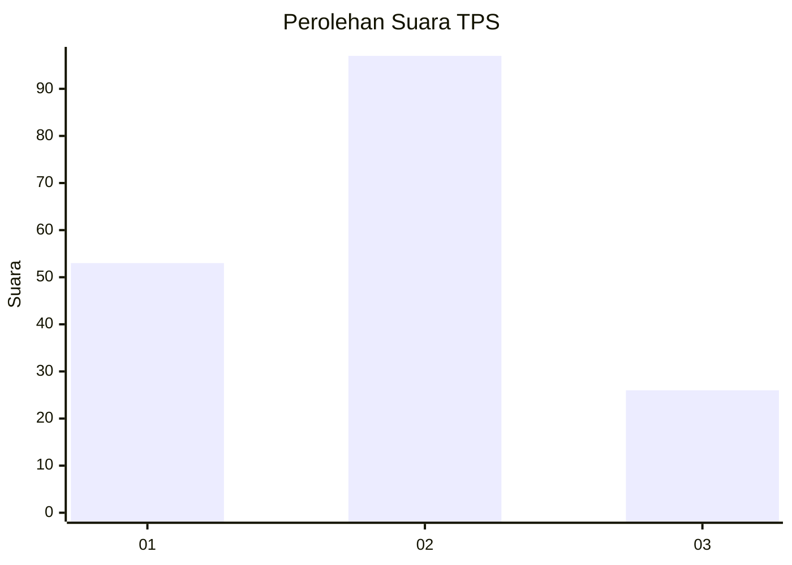
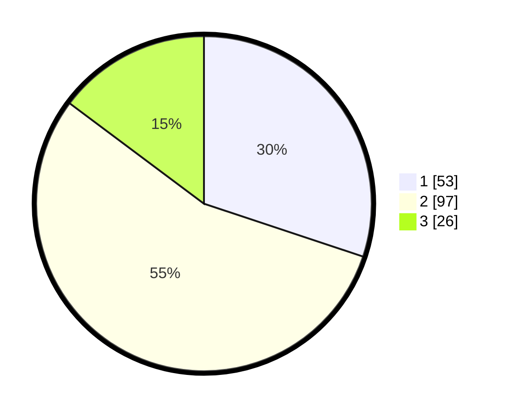

# Hasil

## Grafik

## Tabel

| No. | Nama Paslon    | Suara | Suara (raw) | Persentase |
|:--- |:-------------- | -----:| -----------:| ----------:|
| 1   | ANIES MUHAIMIN | 53    | [53][p-1]   | 30,11      |
| 2   | PRABOWO GIBRAN | 97    | [97][p-2]   | 55,11      |
| 3   | GANJAR MAHFUD  | 26    | [26][p-3]   | 14,77      |

[p-1]: https://github.com/gigit-pemilu/pemilu-2024/blob/main/pilpres/hitung-suara/sub/12-sumatera-utara/sub/07-deli-serdang/sub/32-pantai-labu/sub/2001-sei-tuan/sub/001-tps/sub/paslon-1.txt
[p-2]: https://github.com/gigit-pemilu/pemilu-2024/blob/main/pilpres/hitung-suara/sub/12-sumatera-utara/sub/07-deli-serdang/sub/32-pantai-labu/sub/2001-sei-tuan/sub/001-tps/sub/paslon-2.txt
[p-3]: https://github.com/gigit-pemilu/pemilu-2024/blob/main/pilpres/hitung-suara/sub/12-sumatera-utara/sub/07-deli-serdang/sub/32-pantai-labu/sub/2001-sei-tuan/sub/001-tps/sub/paslon-3.txt

## Foto C Plano

https://sirekap-obj-formc.kpu.go.id/4f83/pemilu/ppwp/12/07/32/20/01/1207322001001-20240215-030047--4f034fb0-2303-4fc5-b412-bae24e8902d1.jpg

https://sirekap-obj-formc.kpu.go.id/4f83/pemilu/ppwp/12/07/32/20/01/1207322001001-20240215-030219--b74132ff-382a-4455-a6e5-d24b0a1976d3.jpg

https://sirekap-obj-formc.kpu.go.id/4f83/pemilu/ppwp/12/07/32/20/01/1207322001001-20240215-030348--6f0df5ee-cc41-4e85-aa00-f07d63dce75f.jpg

## Metadata

| Key        | Value               |
| ---------- | ------------------- |
| Time Stamp | 2024-02-15 12:00:28 |

