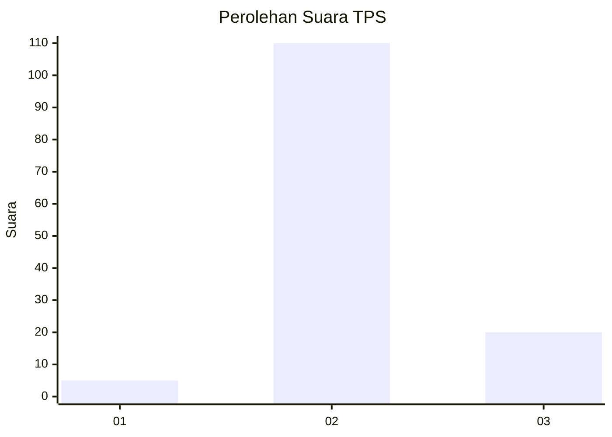
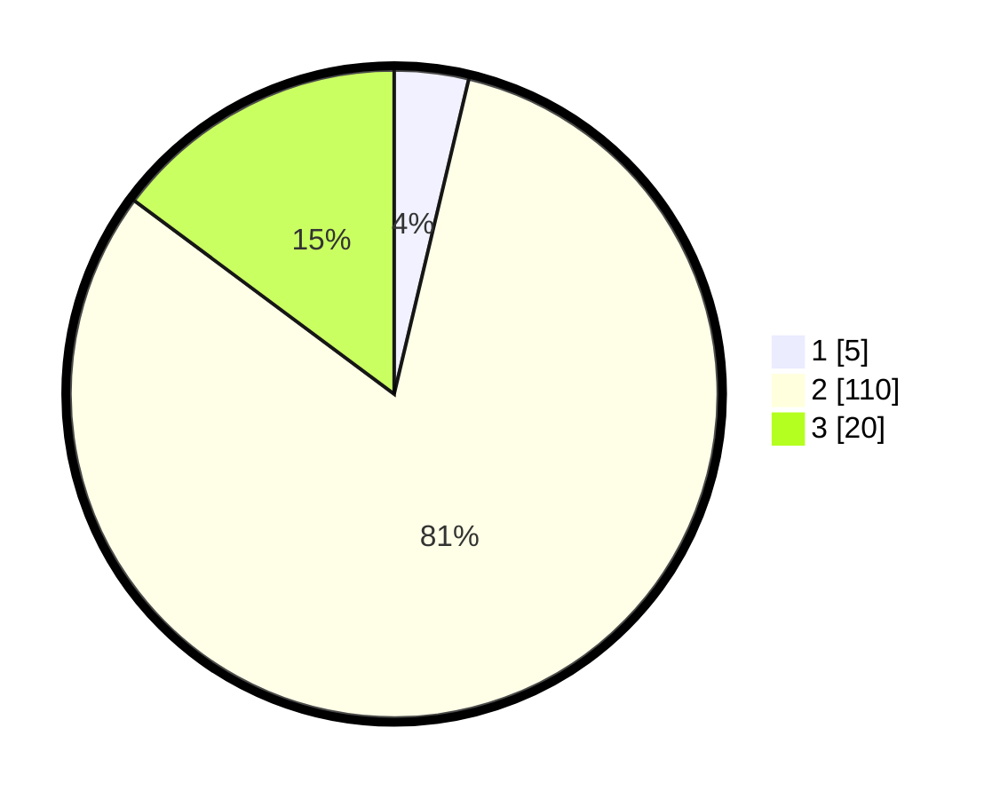

# Hasil

## Grafik

## Tabel

| No. | Nama Paslon    | Suara | Suara (raw) | Persentase |
|:--- |:-------------- | -----:| -----------:| ----------:|
| 1   | ANIES MUHAIMIN | 5     | [5][p-1]    | 3,70       |
| 2   | PRABOWO GIBRAN | 110   | [110][p-2]  | 81,48      |
| 3   | GANJAR MAHFUD  | 20    | [20][p-3]   | 14,81      |

[p-1]: https://github.com/gigit-pemilu/pemilu-2024/blob/main/pilpres/hitung-suara/sub/12-sumatera-utara/sub/07-deli-serdang/sub/32-pantai-labu/sub/2001-sei-tuan/sub/005-tps/sub/paslon-1.txt
[p-2]: https://github.com/gigit-pemilu/pemilu-2024/blob/main/pilpres/hitung-suara/sub/12-sumatera-utara/sub/07-deli-serdang/sub/32-pantai-labu/sub/2001-sei-tuan/sub/005-tps/sub/paslon-2.txt
[p-3]: https://github.com/gigit-pemilu/pemilu-2024/blob/main/pilpres/hitung-suara/sub/12-sumatera-utara/sub/07-deli-serdang/sub/32-pantai-labu/sub/2001-sei-tuan/sub/005-tps/sub/paslon-3.txt

## Foto C Plano

https://sirekap-obj-formc.kpu.go.id/b70a/pemilu/ppwp/12/07/32/20/01/1207322001005-20240215-090656--c6372f0d-a6ba-4a0a-8340-437ec7f675b2.jpg

https://sirekap-obj-formc.kpu.go.id/b70a/pemilu/ppwp/12/07/32/20/01/1207322001005-20240215-154605--70521a3c-d6ea-4b0b-9b25-c33c858c21bd.jpg

https://sirekap-obj-formc.kpu.go.id/b70a/pemilu/ppwp/12/07/32/20/01/1207322001005-20240215-091043--a1b4bdb7-3f45-4a54-a11e-3029a35e4740.jpg

## Metadata

| Key        | Value               |
| ---------- | ------------------- |
| Time Stamp | 2024-02-15 17:30:25 |

