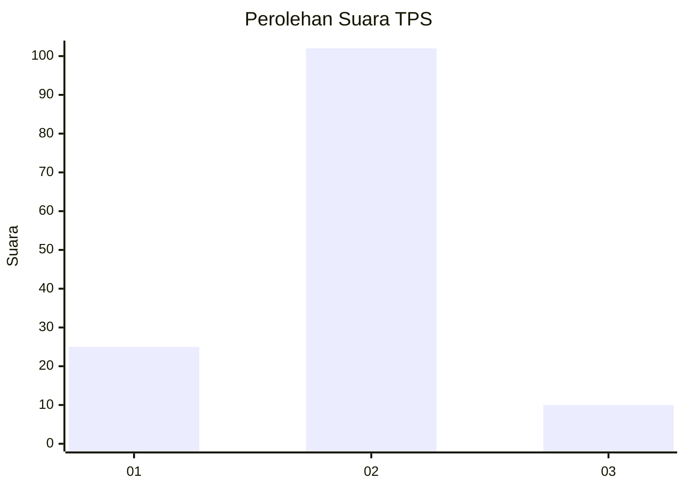
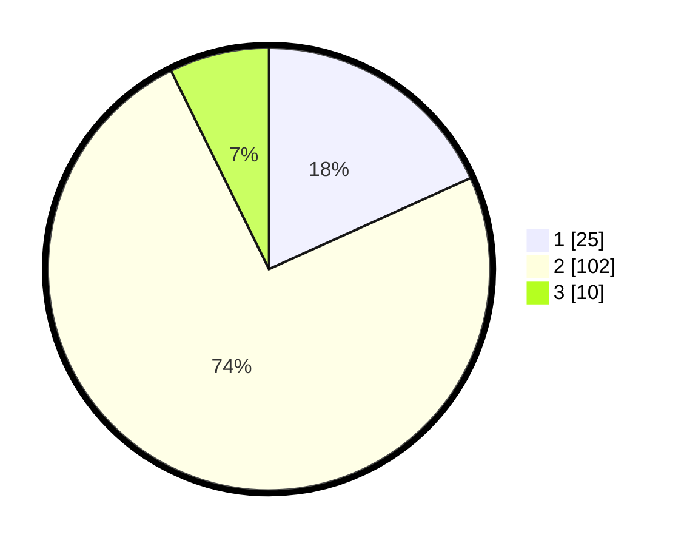

# Hasil

## Grafik

## Tabel

| No. | Nama Paslon    | Suara | Suara (raw) | Persentase |
|:--- |:-------------- | -----:| -----------:| ----------:|
| 1   | ANIES MUHAIMIN | 25    | [25][p-1]   | 18,25      |
| 2   | PRABOWO GIBRAN | 102   | [102][p-2]  | 74,45      |
| 3   | GANJAR MAHFUD  | 10    | [10][p-3]   | 7,30       |

[p-1]: https://github.com/gigit-pemilu/pemilu-2024-12-sumatera-utara/blob/main/pilpres/hitung-suara/sub/12-sumatera-utara/sub/07-deli-serdang/sub/32-pantai-labu/sub/2009-ramunia-1/sub/004-tps/sub/paslon-1.txt
[p-2]: https://github.com/gigit-pemilu/pemilu-2024-12-sumatera-utara/blob/main/pilpres/hitung-suara/sub/12-sumatera-utara/sub/07-deli-serdang/sub/32-pantai-labu/sub/2009-ramunia-1/sub/004-tps/sub/paslon-2.txt
[p-3]: https://github.com/gigit-pemilu/pemilu-2024-12-sumatera-utara/blob/main/pilpres/hitung-suara/sub/12-sumatera-utara/sub/07-deli-serdang/sub/32-pantai-labu/sub/2009-ramunia-1/sub/004-tps/sub/paslon-3.txt

## Foto C Plano

https://sirekap-obj-formc.kpu.go.id/3839/pemilu/ppwp/12/07/32/20/09/1207322009004-20240215-002048--2785c5a2-2375-402b-af41-349f264954c3.jpg

https://sirekap-obj-formc.kpu.go.id/3839/pemilu/ppwp/12/07/32/20/09/1207322009004-20240215-060758--e039eb3e-7e23-4671-afda-239070d45811.jpg

https://sirekap-obj-formc.kpu.go.id/3839/pemilu/ppwp/12/07/32/20/09/1207322009004-20240215-155437--1229dbca-0fcd-4e85-a19e-d507fbf5b14e.jpg

## Metadata

| Key        | Value               |
| ---------- | ------------------- |
| Time Stamp | 2024-02-15 16:00:26 |

