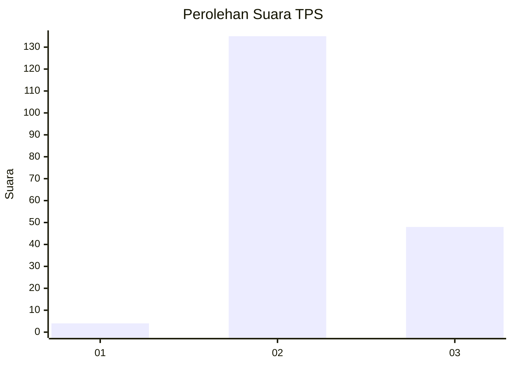
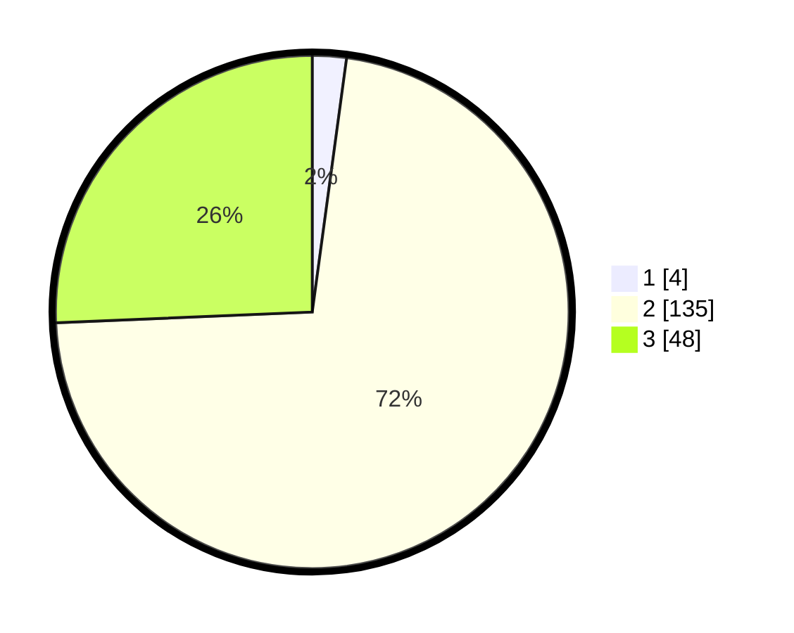

# Hasil

## Grafik

## Tabel

| No. | Nama Paslon    | Suara | Suara (raw) | Persentase |
|:--- |:-------------- | -----:| -----------:| ----------:|
| 1   | ANIES MUHAIMIN | 4     | [4][p-1]    | 2,14       |
| 2   | PRABOWO GIBRAN | 135   | [135][p-2]  | 72,19      |
| 3   | GANJAR MAHFUD  | 48    | [48][p-3]   | 25,67      |

[p-1]: https://github.com/gigit-pemilu/pemilu-2024/blob/main/pilpres/hitung-suara/sub/12-sumatera-utara/sub/07-deli-serdang/sub/33-beringin/sub/2001-serdang/sub/005-tps/sub/paslon-1.txt
[p-2]: https://github.com/gigit-pemilu/pemilu-2024/blob/main/pilpres/hitung-suara/sub/12-sumatera-utara/sub/07-deli-serdang/sub/33-beringin/sub/2001-serdang/sub/005-tps/sub/paslon-2.txt
[p-3]: https://github.com/gigit-pemilu/pemilu-2024/blob/main/pilpres/hitung-suara/sub/12-sumatera-utara/sub/07-deli-serdang/sub/33-beringin/sub/2001-serdang/sub/005-tps/sub/paslon-3.txt

## Foto C Plano

https://sirekap-obj-formc.kpu.go.id/4227/pemilu/ppwp/12/07/33/20/01/1207332001005-20240215-025557--b64ac15f-2a18-460a-ba29-c220888936ec.jpg

https://sirekap-obj-formc.kpu.go.id/4227/pemilu/ppwp/12/07/33/20/01/1207332001005-20240215-025807--fe01a274-bd40-453f-8f53-c4fa068a9225.jpg

https://sirekap-obj-formc.kpu.go.id/4227/pemilu/ppwp/12/07/33/20/01/1207332001005-20240215-030402--89894919-c5c4-4eae-84d8-223319e6132f.jpg

## Metadata

| Key        | Value               |
| ---------- | ------------------- |
| Time Stamp | 2024-02-15 21:30:27 |

