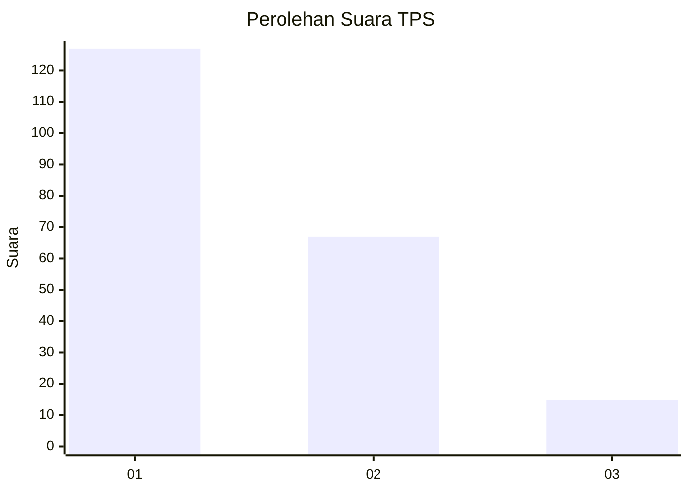
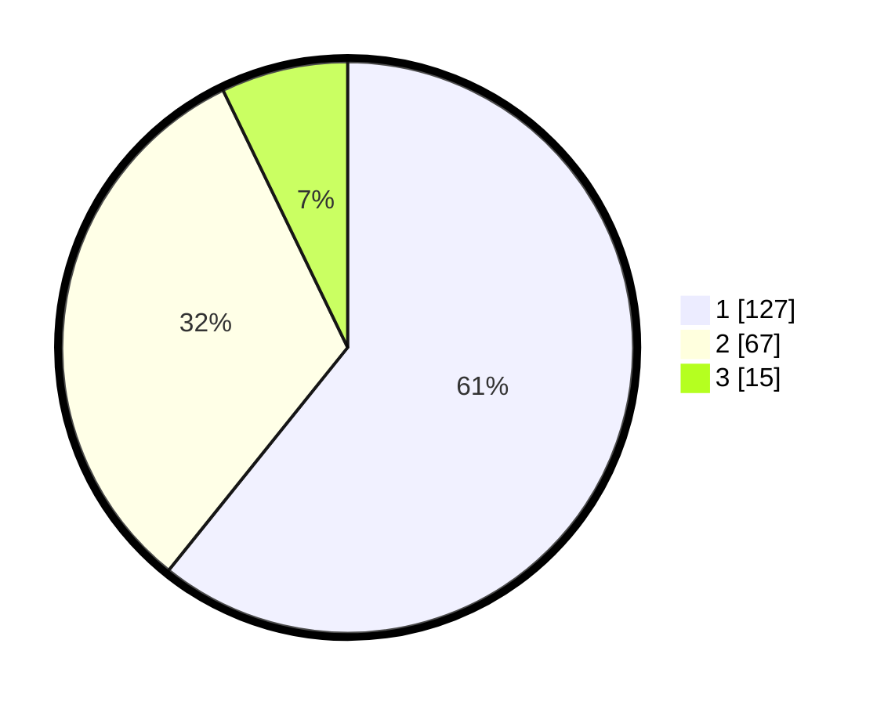

# Hasil

## Grafik

## Tabel

| No. | Nama Paslon    | Suara | Suara (raw) | Persentase |
|:--- |:-------------- | -----:| -----------:| ----------:|
| 1   | ANIES MUHAIMIN | 127   | [127][p-1]  | 60,77      |
| 2   | PRABOWO GIBRAN | 67    | [67][p-2]   | 32,06      |
| 3   | GANJAR MAHFUD  | 15    | [15][p-3]   | 7,18       |

[p-1]: https://github.com/gigit-pemilu/pemilu-2024/blob/main/pilpres/hitung-suara/sub/12-sumatera-utara/sub/07-deli-serdang/sub/33-beringin/sub/2003-aras-kabu/sub/007-tps/sub/paslon-1.txt
[p-2]: https://github.com/gigit-pemilu/pemilu-2024/blob/main/pilpres/hitung-suara/sub/12-sumatera-utara/sub/07-deli-serdang/sub/33-beringin/sub/2003-aras-kabu/sub/007-tps/sub/paslon-2.txt
[p-3]: https://github.com/gigit-pemilu/pemilu-2024/blob/main/pilpres/hitung-suara/sub/12-sumatera-utara/sub/07-deli-serdang/sub/33-beringin/sub/2003-aras-kabu/sub/007-tps/sub/paslon-3.txt

## Foto C Plano

https://sirekap-obj-formc.kpu.go.id/1e2a/pemilu/ppwp/12/07/33/20/03/1207332003007-20240215-031803--fd739b74-83ec-481d-82b6-0fdd639ebe1d.jpg

https://sirekap-obj-formc.kpu.go.id/1e2a/pemilu/ppwp/12/07/33/20/03/1207332003007-20240215-031806--f34c5c12-d02a-4235-806b-1d59477141dc.jpg

https://sirekap-obj-formc.kpu.go.id/1e2a/pemilu/ppwp/12/07/33/20/03/1207332003007-20240215-031809--f31e9572-7d18-44b8-94da-de2322aa610c.jpg

## Metadata

| Key        | Value               |
| ---------- | ------------------- |
| Time Stamp | 2024-02-15 22:00:27 |

