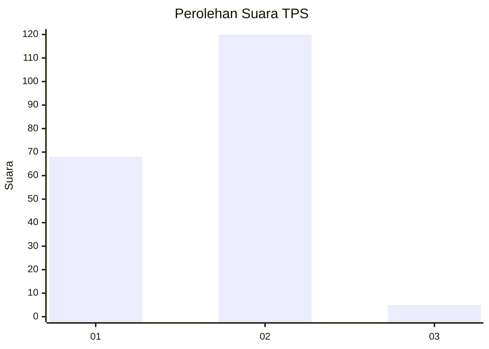
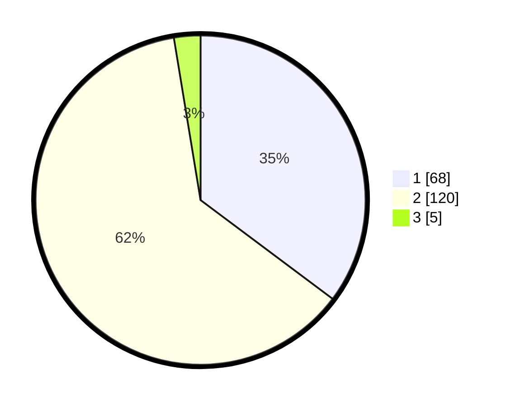

# Hasil

## Grafik

## Tabel

| No. | Nama Paslon    | Suara | Suara (raw) | Persentase |
|:--- |:-------------- | -----:| -----------:| ----------:|
| 1   | ANIES MUHAIMIN | 68    | [68][p-1]   | 35,23      |
| 2   | PRABOWO GIBRAN | 120   | [120][p-2]  | 62,18      |
| 3   | GANJAR MAHFUD  | 5     | [5][p-3]    | 2,59       |

[p-1]: https://github.com/gigit-pemilu/pemilu-2024-12-sumatera-utara/blob/main/pilpres/hitung-suara/sub/12-sumatera-utara/sub/07-deli-serdang/sub/33-beringin/sub/2005-emplasmen-kuala-namu/sub/004-tps/sub/paslon-1.txt
[p-2]: https://github.com/gigit-pemilu/pemilu-2024-12-sumatera-utara/blob/main/pilpres/hitung-suara/sub/12-sumatera-utara/sub/07-deli-serdang/sub/33-beringin/sub/2005-emplasmen-kuala-namu/sub/004-tps/sub/paslon-2.txt
[p-3]: https://github.com/gigit-pemilu/pemilu-2024-12-sumatera-utara/blob/main/pilpres/hitung-suara/sub/12-sumatera-utara/sub/07-deli-serdang/sub/33-beringin/sub/2005-emplasmen-kuala-namu/sub/004-tps/sub/paslon-3.txt

## Foto C Plano

https://sirekap-obj-formc.kpu.go.id/b482/pemilu/ppwp/12/07/33/20/05/1207332005004-20240214-155803--e1aee312-222a-4427-9ccf-0aaef71836e1.jpg

https://sirekap-obj-formc.kpu.go.id/b482/pemilu/ppwp/12/07/33/20/05/1207332005004-20240214-155905--05d7e84c-979f-430b-8b54-4c4ce8fdd0ec.jpg

https://sirekap-obj-formc.kpu.go.id/b482/pemilu/ppwp/12/07/33/20/05/1207332005004-20240214-160101--630f3fd8-cf2d-48a4-8477-6a797e8e382e.jpg

## Metadata

| Key        | Value               |
| ---------- | ------------------- |
| Time Stamp | 2024-02-15 22:00:27 |

