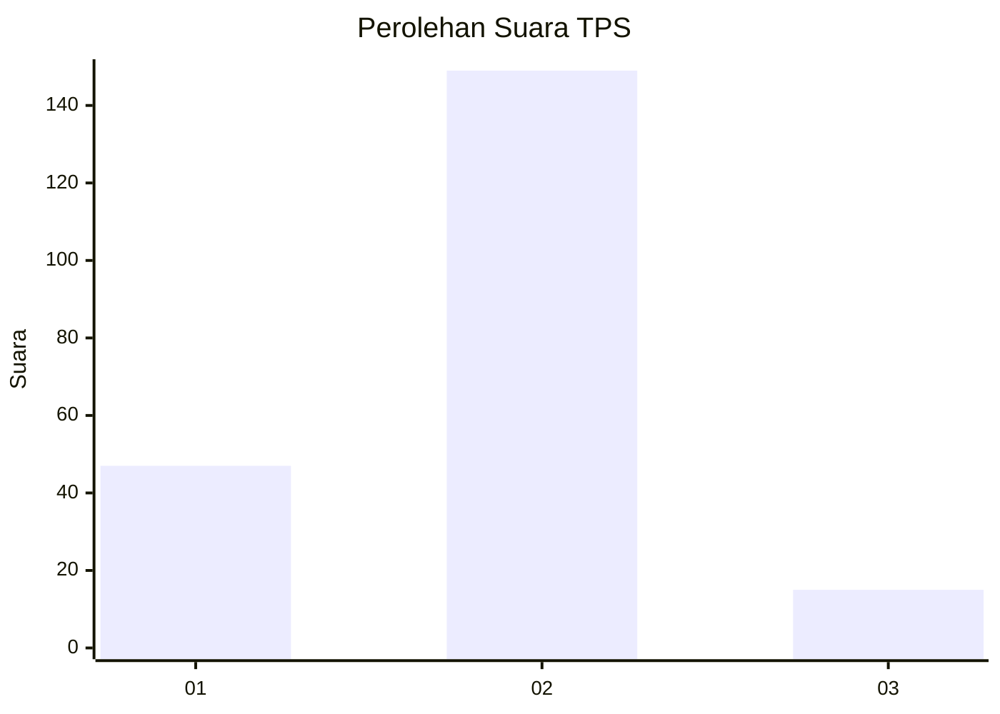
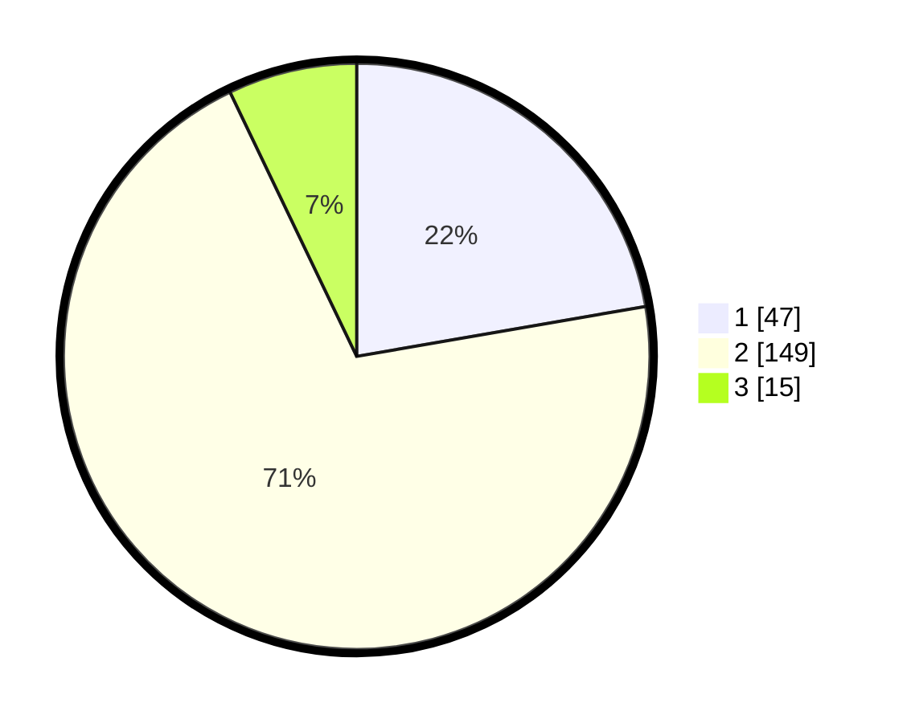

# Hasil

## Grafik

## Tabel

| No. | Nama Paslon    | Suara | Suara (raw) | Persentase |
|:--- |:-------------- | -----:| -----------:| ----------:|
| 1   | ANIES MUHAIMIN | 47    | [47][p-1]   | 22,27      |
| 2   | PRABOWO GIBRAN | 149   | [149][p-2]  | 70,62      |
| 3   | GANJAR MAHFUD  | 15    | [15][p-3]   | 7,11       |

[p-1]: https://github.com/gigit-pemilu/pemilu-2024-12-sumatera-utara/blob/main/pilpres/hitung-suara/sub/12-sumatera-utara/sub/07-deli-serdang/sub/33-beringin/sub/2006-pasar-v-kebun-kelapa/sub/012-tps/sub/paslon-1.txt
[p-2]: https://github.com/gigit-pemilu/pemilu-2024-12-sumatera-utara/blob/main/pilpres/hitung-suara/sub/12-sumatera-utara/sub/07-deli-serdang/sub/33-beringin/sub/2006-pasar-v-kebun-kelapa/sub/012-tps/sub/paslon-2.txt
[p-3]: https://github.com/gigit-pemilu/pemilu-2024-12-sumatera-utara/blob/main/pilpres/hitung-suara/sub/12-sumatera-utara/sub/07-deli-serdang/sub/33-beringin/sub/2006-pasar-v-kebun-kelapa/sub/012-tps/sub/paslon-3.txt

## Foto C Plano

https://sirekap-obj-formc.kpu.go.id/d014/pemilu/ppwp/12/07/33/20/06/1207332006012-20240215-010424--fa12df1d-745b-4596-b915-a59d927168c1.jpg

https://sirekap-obj-formc.kpu.go.id/d014/pemilu/ppwp/12/07/33/20/06/1207332006012-20240215-010427--92e38425-01af-48ba-8d05-7ec204e5da1a.jpg

https://sirekap-obj-formc.kpu.go.id/d014/pemilu/ppwp/12/07/33/20/06/1207332006012-20240215-010438--aa433097-708d-4d33-a65d-859f8dc582fd.jpg

## Metadata

| Key        | Value               |
| ---------- | ------------------- |
| Time Stamp | 2024-02-25 13:00:00 |

