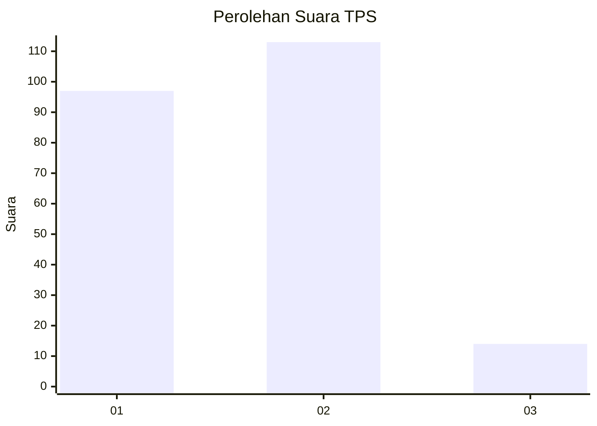
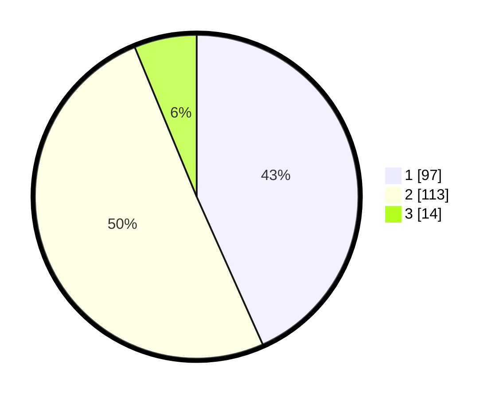

# Hasil

## Grafik

## Tabel

| No. | Nama Paslon    | Suara | Suara (raw) | Persentase |
|:--- |:-------------- | -----:| -----------:| ----------:|
| 1   | ANIES MUHAIMIN | 97    | [97][p-1]   | 43,30      |
| 2   | PRABOWO GIBRAN | 113   | [113][p-2]  | 50,45      |
| 3   | GANJAR MAHFUD  | 14    | [14][p-3]   | 6,25       |

[p-1]: https://github.com/gigit-pemilu/pemilu-2024/blob/main/pilpres/hitung-suara/sub/12-sumatera-utara/sub/07-deli-serdang/sub/33-beringin/sub/2006-pasar-v-kebun-kelapa/sub/014-tps/sub/paslon-1.txt
[p-2]: https://github.com/gigit-pemilu/pemilu-2024/blob/main/pilpres/hitung-suara/sub/12-sumatera-utara/sub/07-deli-serdang/sub/33-beringin/sub/2006-pasar-v-kebun-kelapa/sub/014-tps/sub/paslon-2.txt
[p-3]: https://github.com/gigit-pemilu/pemilu-2024/blob/main/pilpres/hitung-suara/sub/12-sumatera-utara/sub/07-deli-serdang/sub/33-beringin/sub/2006-pasar-v-kebun-kelapa/sub/014-tps/sub/paslon-3.txt

## Foto C Plano

https://sirekap-obj-formc.kpu.go.id/29e1/pemilu/ppwp/12/07/33/20/06/1207332006014-20240215-000137--890e4b08-e28b-4fbd-94d2-0b7ceef4fc6b.jpg

https://sirekap-obj-formc.kpu.go.id/29e1/pemilu/ppwp/12/07/33/20/06/1207332006014-20240215-000217--8b433d1e-fc21-419f-a25d-969c8dde0628.jpg

https://sirekap-obj-formc.kpu.go.id/29e1/pemilu/ppwp/12/07/33/20/06/1207332006014-20240215-000251--63c540ae-dc22-457f-bb7a-e874ff48736c.jpg

## Metadata

| Key        | Value               |
| ---------- | ------------------- |
| Time Stamp | 2024-02-25 11:00:00 |

