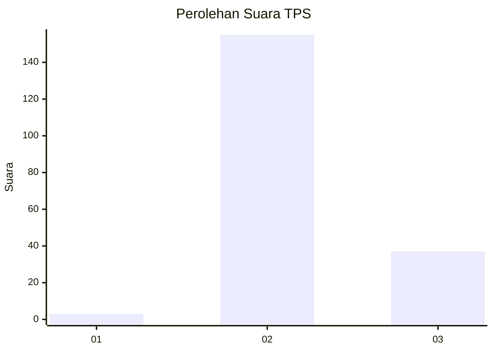
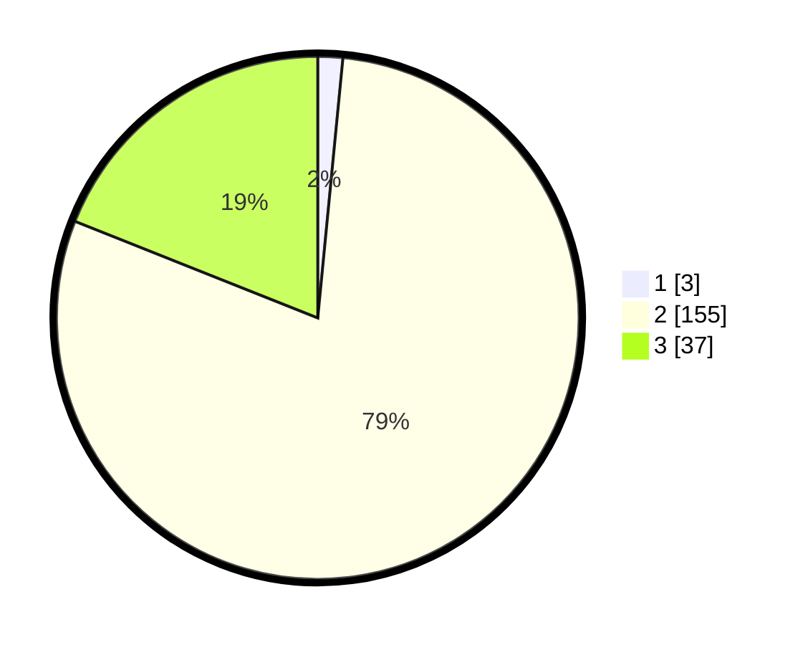

# Hasil

## Grafik

## Tabel

| No. | Nama Paslon    | Suara | Suara (raw) | Persentase |
|:--- |:-------------- | -----:| -----------:| ----------:|
| 1   | ANIES MUHAIMIN | 3     | [3][p-1]    | 1,54       |
| 2   | PRABOWO GIBRAN | 155   | [155][p-2]  | 79,49      |
| 3   | GANJAR MAHFUD  | 37    | [37][p-3]   | 18,97      |

[p-1]: https://github.com/gigit-pemilu/pemilu-2024/blob/main/pilpres/hitung-suara/sub/12-sumatera-utara/sub/07-deli-serdang/sub/33-beringin/sub/2008-sidoarjo-ii-ramunia/sub/001-tps/sub/paslon-1.txt
[p-2]: https://github.com/gigit-pemilu/pemilu-2024/blob/main/pilpres/hitung-suara/sub/12-sumatera-utara/sub/07-deli-serdang/sub/33-beringin/sub/2008-sidoarjo-ii-ramunia/sub/001-tps/sub/paslon-2.txt
[p-3]: https://github.com/gigit-pemilu/pemilu-2024/blob/main/pilpres/hitung-suara/sub/12-sumatera-utara/sub/07-deli-serdang/sub/33-beringin/sub/2008-sidoarjo-ii-ramunia/sub/001-tps/sub/paslon-3.txt

## Foto C Plano

https://sirekap-obj-formc.kpu.go.id/0ef8/pemilu/ppwp/12/07/33/20/08/1207332008001-20240215-105321--70bf7f1e-06ab-4652-a298-dd014044c957.jpg

https://sirekap-obj-formc.kpu.go.id/0ef8/pemilu/ppwp/12/07/33/20/08/1207332008001-20240215-110224--64baf2ab-e4e5-4553-9e82-4ba554c627b9.jpg

https://sirekap-obj-formc.kpu.go.id/0ef8/pemilu/ppwp/12/07/33/20/08/1207332008001-20240215-105747--8ec2d010-f28b-4cb2-9494-d7eb75aea4d7.jpg

## Metadata

| Key        | Value               |
| ---------- | ------------------- |
| Time Stamp | 2024-02-15 22:30:27 |

