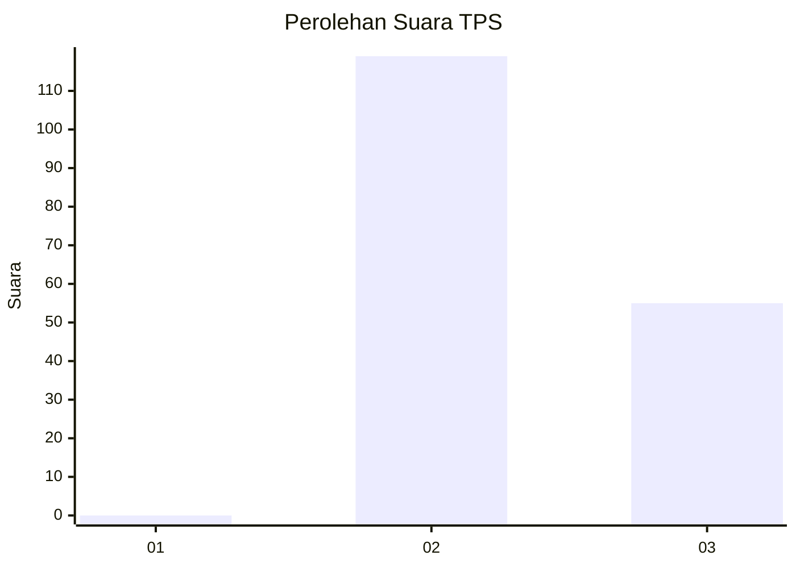
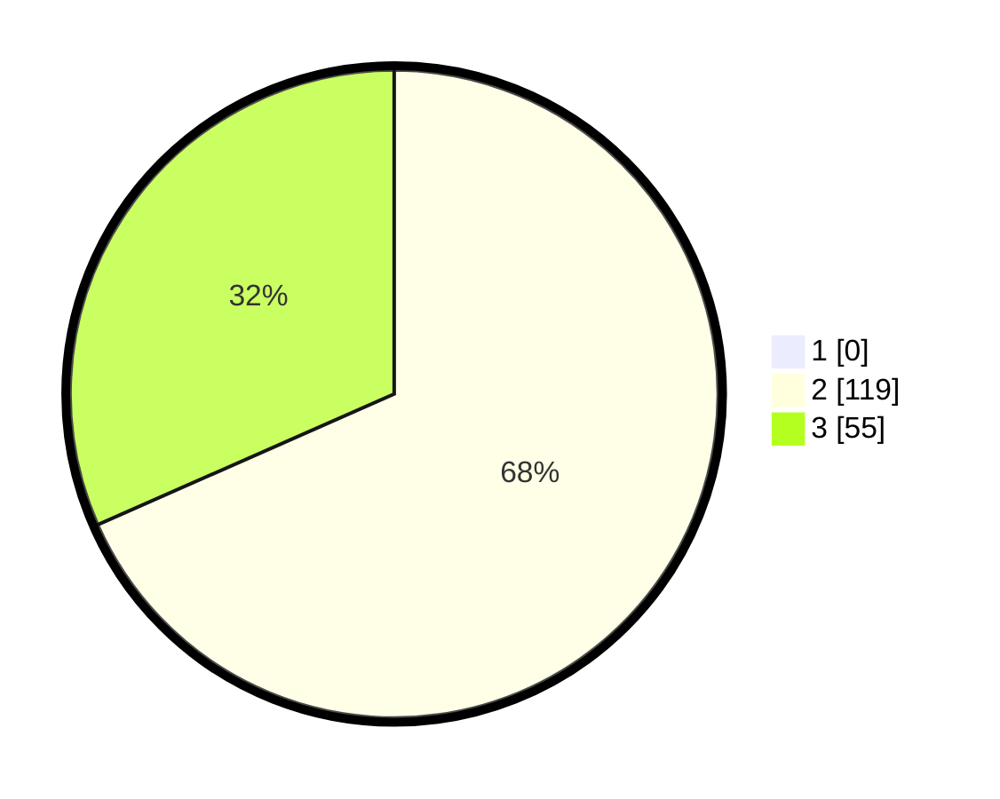

# Hasil

## Grafik

## Tabel

| No. | Nama Paslon    | Suara | Suara (raw) | Persentase |
|:--- |:-------------- | -----:| -----------:| ----------:|
| 1   | ANIES MUHAIMIN | 0     | [0][p-1]    | 0,00       |
| 2   | PRABOWO GIBRAN | 119   | [119][p-2]  | 68,39      |
| 3   | GANJAR MAHFUD  | 55    | [55][p-3]   | 31,61      |

[p-1]: https://github.com/gigit-pemilu/pemilu-2024/blob/main/pilpres/hitung-suara/sub/12-sumatera-utara/sub/07-deli-serdang/sub/33-beringin/sub/2008-sidoarjo-ii-ramunia/sub/008-tps/sub/paslon-1.txt
[p-2]: https://github.com/gigit-pemilu/pemilu-2024/blob/main/pilpres/hitung-suara/sub/12-sumatera-utara/sub/07-deli-serdang/sub/33-beringin/sub/2008-sidoarjo-ii-ramunia/sub/008-tps/sub/paslon-2.txt
[p-3]: https://github.com/gigit-pemilu/pemilu-2024/blob/main/pilpres/hitung-suara/sub/12-sumatera-utara/sub/07-deli-serdang/sub/33-beringin/sub/2008-sidoarjo-ii-ramunia/sub/008-tps/sub/paslon-3.txt

## Foto C Plano

https://sirekap-obj-formc.kpu.go.id/c550/pemilu/ppwp/12/07/33/20/08/1207332008008-20240215-105536--faed7c37-d7f9-483b-b86d-6aaf0548704c.jpg

https://sirekap-obj-formc.kpu.go.id/c550/pemilu/ppwp/12/07/33/20/08/1207332008008-20240215-110141--a84255de-e1ba-45e3-a1af-4d7d9bd4f4e0.jpg

https://sirekap-obj-formc.kpu.go.id/c550/pemilu/ppwp/12/07/33/20/08/1207332008008-20240215-110629--6cc58174-a90b-456e-a2ad-c5f76b3b03b0.jpg

## Metadata

| Key        | Value               |
| ---------- | ------------------- |
| Time Stamp | 2024-02-24 23:00:00 |

