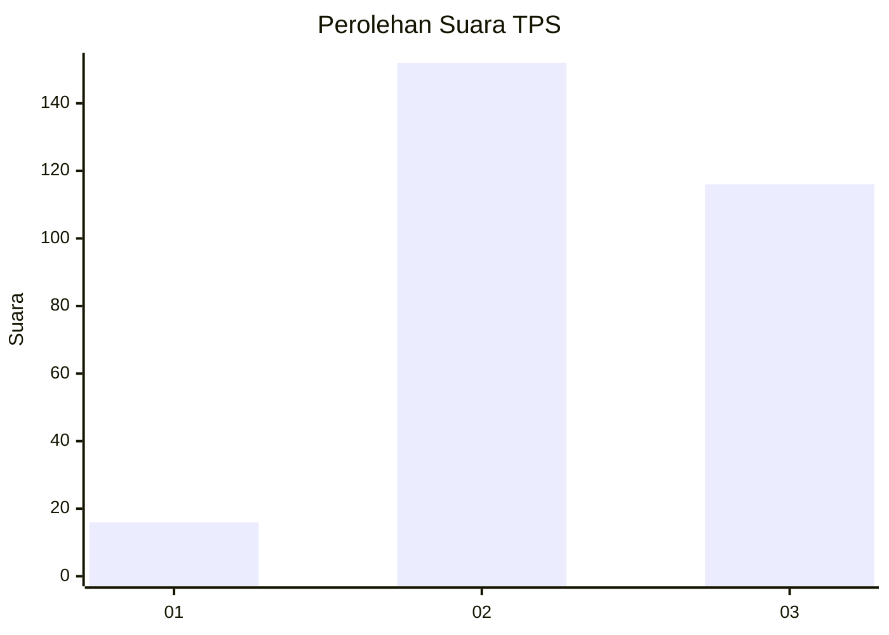
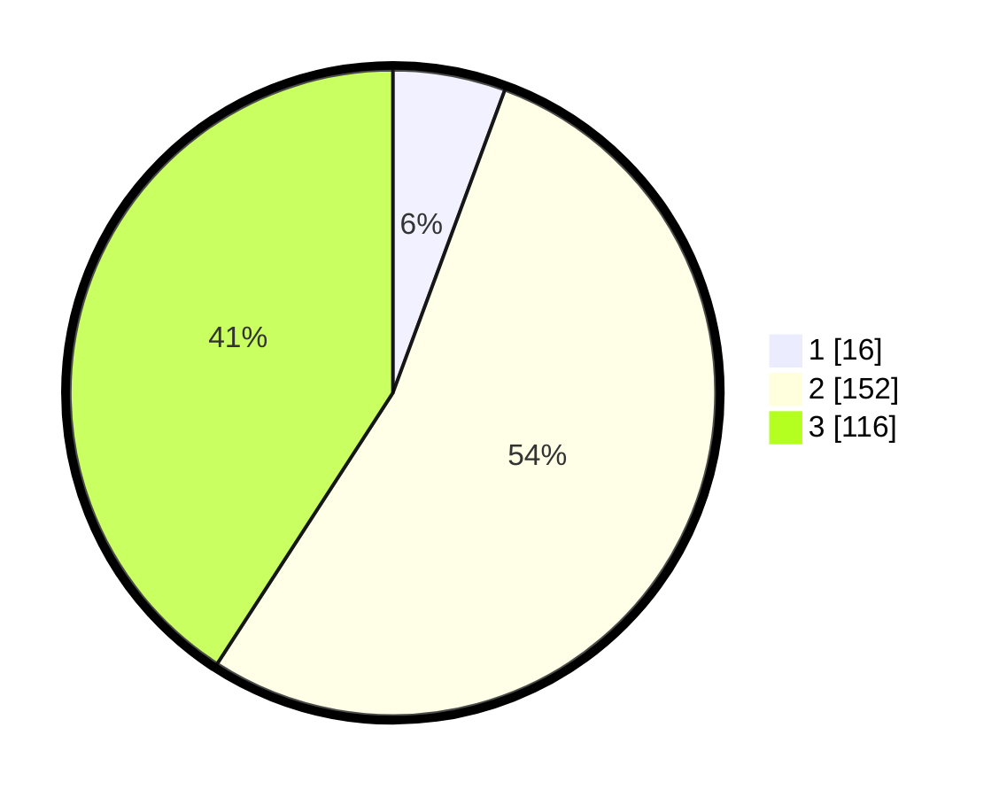

# Hasil

## Grafik

## Tabel

| No. | Nama Paslon    | Suara | Suara (raw) | Persentase |
|:--- |:-------------- | -----:| -----------:| ----------:|
| 1   | ANIES MUHAIMIN | 16    | [16][p-1]   | 5,63       |
| 2   | PRABOWO GIBRAN | 152   | [152][p-2]  | 53,52      |
| 3   | GANJAR MAHFUD  | 116   | [116][p-3]  | 40,85      |

[p-1]: https://github.com/gigit-pemilu/pemilu-2024/blob/main/pilpres/hitung-suara/sub/12-sumatera-utara/sub/08-simalungun/sub/01-siantar/sub/2011-lestari-indah/sub/901-tps/sub/paslon-1.txt
[p-2]: https://github.com/gigit-pemilu/pemilu-2024/blob/main/pilpres/hitung-suara/sub/12-sumatera-utara/sub/08-simalungun/sub/01-siantar/sub/2011-lestari-indah/sub/901-tps/sub/paslon-2.txt
[p-3]: https://github.com/gigit-pemilu/pemilu-2024/blob/main/pilpres/hitung-suara/sub/12-sumatera-utara/sub/08-simalungun/sub/01-siantar/sub/2011-lestari-indah/sub/901-tps/sub/paslon-3.txt

## Foto C Plano

https://sirekap-obj-formc.kpu.go.id/8ae8/pemilu/ppwp/12/08/01/20/11/1208012011901-20240220-122011--7a957e96-2e72-4a2e-9e25-aa51e859abc7.jpg

https://sirekap-obj-formc.kpu.go.id/8ae8/pemilu/ppwp/12/08/01/20/11/1208012011901-20240216-191408--ad91c879-85c6-4f51-a5ad-7b343b961d3f.jpg

https://sirekap-obj-formc.kpu.go.id/8ae8/pemilu/ppwp/12/08/01/20/11/1208012011901-20240216-191418--8d4f1ba7-8ee9-4602-b735-f17a6d8263e5.jpg

## Metadata

| Key        | Value               |
| ---------- | ------------------- |
| Time Stamp | 2024-02-20 13:00:00 |

