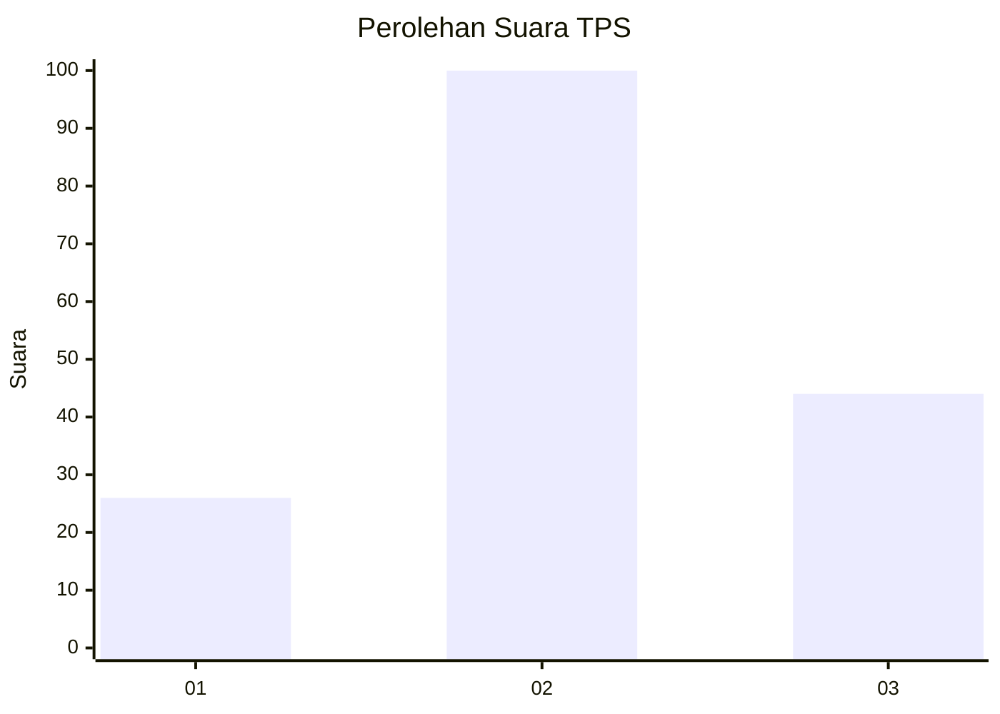
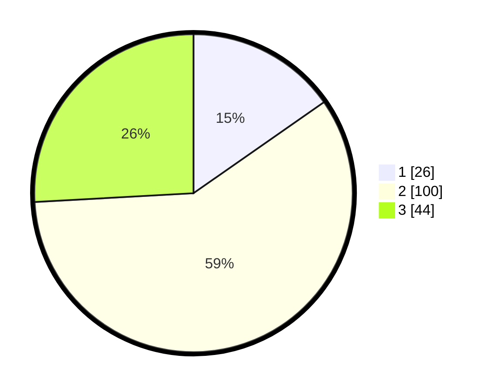

# Hasil

## Grafik

## Tabel

| No. | Nama Paslon    | Suara | Suara (raw) | Persentase |
|:--- |:-------------- | -----:| -----------:| ----------:|
| 1   | ANIES MUHAIMIN | 26    | [26][p-1]   | 15,29      |
| 2   | PRABOWO GIBRAN | 100   | [100][p-2]  | 58,82      |
| 3   | GANJAR MAHFUD  | 44    | [44][p-3]   | 25,88      |

[p-1]: https://github.com/gigit-pemilu/pemilu-2024/blob/main/pilpres/hitung-suara/sub/12-sumatera-utara/sub/08-simalungun/sub/01-siantar/sub/2013-dolok-hataran/sub/006-tps/sub/paslon-1.txt
[p-2]: https://github.com/gigit-pemilu/pemilu-2024/blob/main/pilpres/hitung-suara/sub/12-sumatera-utara/sub/08-simalungun/sub/01-siantar/sub/2013-dolok-hataran/sub/006-tps/sub/paslon-2.txt
[p-3]: https://github.com/gigit-pemilu/pemilu-2024/blob/main/pilpres/hitung-suara/sub/12-sumatera-utara/sub/08-simalungun/sub/01-siantar/sub/2013-dolok-hataran/sub/006-tps/sub/paslon-3.txt

## Foto C Plano

https://sirekap-obj-formc.kpu.go.id/0970/pemilu/ppwp/12/08/01/20/13/1208012013006-20240215-042245--1fe8697d-0add-4ed5-ae33-ec3531bf65b7.jpg

https://sirekap-obj-formc.kpu.go.id/0970/pemilu/ppwp/12/08/01/20/13/1208012013006-20240215-041913--79e4a1ce-4d61-4b08-a945-227ae256a8ac.jpg

https://sirekap-obj-formc.kpu.go.id/0970/pemilu/ppwp/12/08/01/20/13/1208012013006-20240215-042110--c3e15513-91a3-4146-a0a7-d2a9ef19a4db.jpg

## Metadata

| Key        | Value               |
| ---------- | ------------------- |
| Time Stamp | 2024-02-25 18:00:00 |

