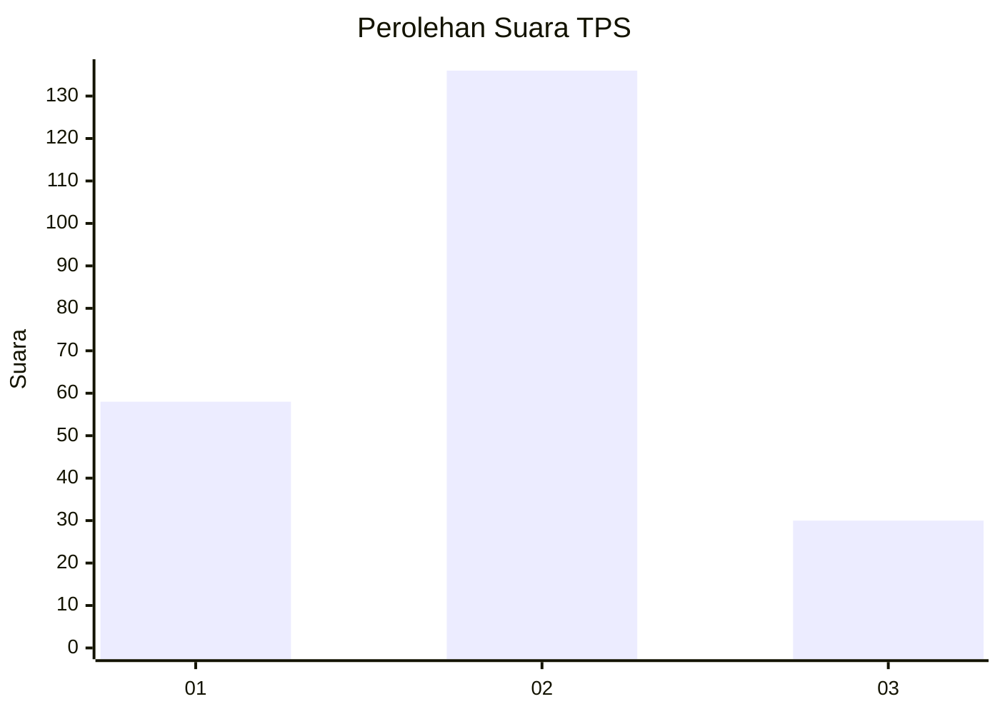
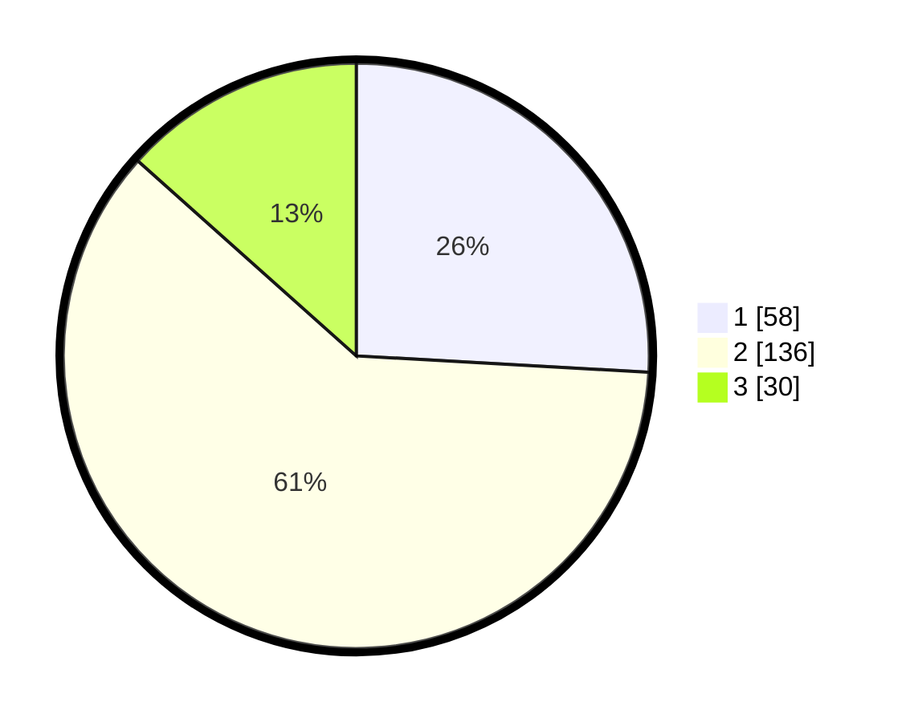

# Hasil

## Grafik

## Tabel

| No. | Nama Paslon    | Suara | Suara (raw) | Persentase |
|:--- |:-------------- | -----:| -----------:| ----------:|
| 1   | ANIES MUHAIMIN | 58    | [58][p-1]   | 25,89      |
| 2   | PRABOWO GIBRAN | 136   | [136][p-2]  | 60,71      |
| 3   | GANJAR MAHFUD  | 30    | [30][p-3]   | 13,39      |

[p-1]: https://github.com/gigit-pemilu/pemilu-2024/blob/main/pilpres/hitung-suara/sub/12-sumatera-utara/sub/08-simalungun/sub/02-gunung-malela/sub/2001-dolog-malela/sub/004-tps/sub/paslon-1.txt
[p-2]: https://github.com/gigit-pemilu/pemilu-2024/blob/main/pilpres/hitung-suara/sub/12-sumatera-utara/sub/08-simalungun/sub/02-gunung-malela/sub/2001-dolog-malela/sub/004-tps/sub/paslon-2.txt
[p-3]: https://github.com/gigit-pemilu/pemilu-2024/blob/main/pilpres/hitung-suara/sub/12-sumatera-utara/sub/08-simalungun/sub/02-gunung-malela/sub/2001-dolog-malela/sub/004-tps/sub/paslon-3.txt

## Foto C Plano

https://sirekap-obj-formc.kpu.go.id/211e/pemilu/ppwp/12/08/02/20/01/1208022001004-20240214-203022--931edd0e-c01c-4d31-9091-fb3afc422347.jpg

https://sirekap-obj-formc.kpu.go.id/211e/pemilu/ppwp/12/08/02/20/01/1208022001004-20240214-203350--1f5d0001-c883-47bd-831b-b72343b03fd1.jpg

https://sirekap-obj-formc.kpu.go.id/211e/pemilu/ppwp/12/08/02/20/01/1208022001004-20240214-203524--424fdc27-2e0e-48b5-8834-0048d1fdaaf4.jpg

## Metadata

| Key        | Value               |
| ---------- | ------------------- |
| Time Stamp | 2024-02-16 14:00:34 |

