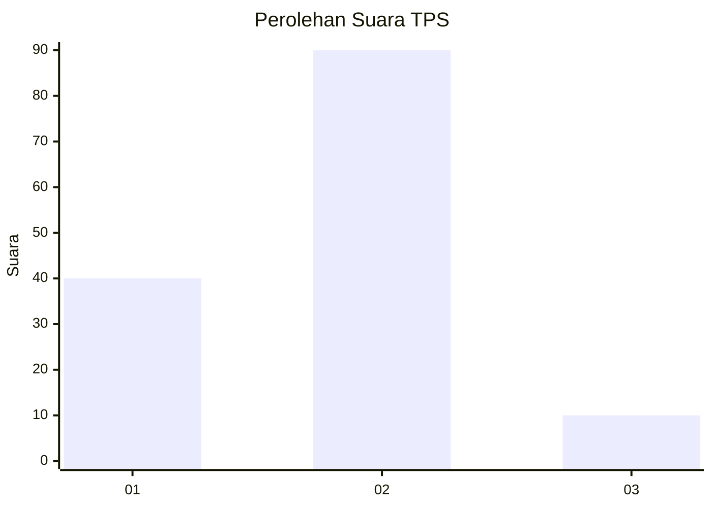
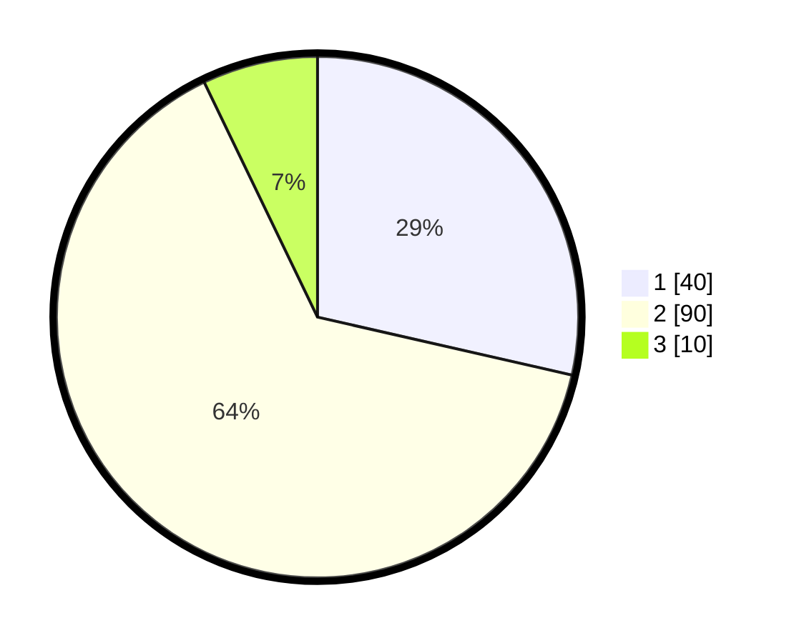

# Hasil

## Grafik

## Tabel

| No. | Nama Paslon    | Suara | Suara (raw) | Persentase |
|:--- |:-------------- | -----:| -----------:| ----------:|
| 1   | ANIES MUHAIMIN | 40    | [40][p-1]   | 28,57      |
| 2   | PRABOWO GIBRAN | 90    | [90][p-2]   | 64,29      |
| 3   | GANJAR MAHFUD  | 10    | [10][p-3]   | 7,14       |

[p-1]: https://github.com/gigit-pemilu/pemilu-2024-12-sumatera-utara/blob/main/pilpres/hitung-suara/sub/12-sumatera-utara/sub/08-simalungun/sub/02-gunung-malela/sub/2013-pamatang-sahkuda/sub/001-tps/sub/paslon-1.txt
[p-2]: https://github.com/gigit-pemilu/pemilu-2024-12-sumatera-utara/blob/main/pilpres/hitung-suara/sub/12-sumatera-utara/sub/08-simalungun/sub/02-gunung-malela/sub/2013-pamatang-sahkuda/sub/001-tps/sub/paslon-2.txt
[p-3]: https://github.com/gigit-pemilu/pemilu-2024-12-sumatera-utara/blob/main/pilpres/hitung-suara/sub/12-sumatera-utara/sub/08-simalungun/sub/02-gunung-malela/sub/2013-pamatang-sahkuda/sub/001-tps/sub/paslon-3.txt

## Foto C Plano

https://sirekap-obj-formc.kpu.go.id/92c5/pemilu/ppwp/12/08/02/20/13/1208022013001-20240214-212358--89fe9ee7-63a7-4629-a48e-4c19fbc4db4a.jpg

https://sirekap-obj-formc.kpu.go.id/92c5/pemilu/ppwp/12/08/02/20/13/1208022013001-20240214-212622--5b6070aa-bba6-4559-a1a2-47f15286c12c.jpg

https://sirekap-obj-formc.kpu.go.id/92c5/pemilu/ppwp/12/08/02/20/13/1208022013001-20240214-212806--77954bca-32ce-4bd1-aa89-54d3c61f49fb.jpg

## Metadata

| Key        | Value               |
| ---------- | ------------------- |
| Time Stamp | 2024-02-24 22:31:28 |

