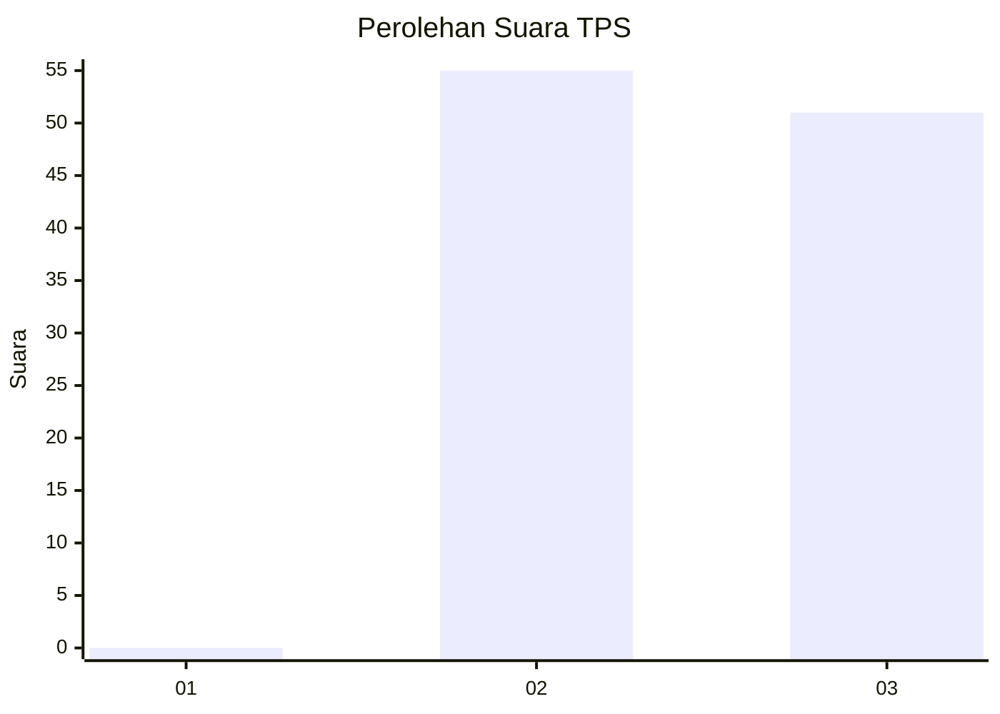
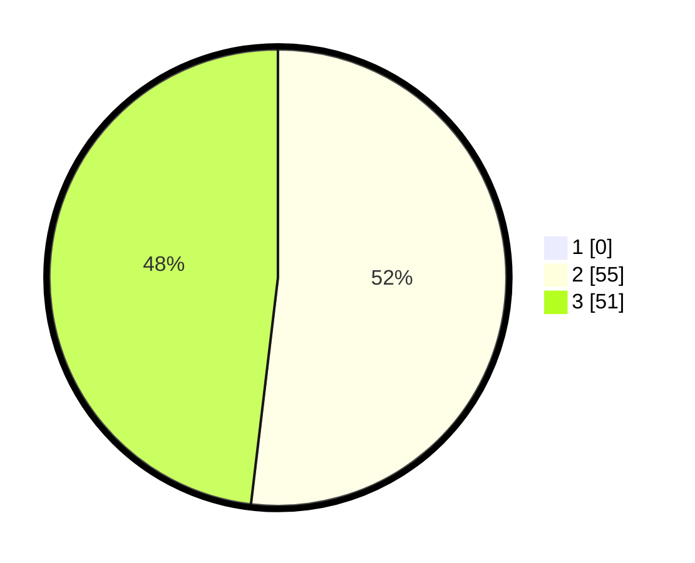

# Hasil

## Grafik

## Tabel

| No. | Nama Paslon    | Suara | Suara (raw) | Persentase |
|:--- |:-------------- | -----:| -----------:| ----------:|
| 1   | ANIES MUHAIMIN | 0     | [0][p-1]    | 0,00       |
| 2   | PRABOWO GIBRAN | 55    | [55][p-2]   | 51,89      |
| 3   | GANJAR MAHFUD  | 51    | [51][p-3]   | 48,11      |

[p-1]: https://github.com/gigit-pemilu/pemilu-2024/blob/main/pilpres/hitung-suara/sub/12-sumatera-utara/sub/08-simalungun/sub/04-panei/sub/2001-janggir-leto/sub/002-tps/sub/paslon-1.txt
[p-2]: https://github.com/gigit-pemilu/pemilu-2024/blob/main/pilpres/hitung-suara/sub/12-sumatera-utara/sub/08-simalungun/sub/04-panei/sub/2001-janggir-leto/sub/002-tps/sub/paslon-2.txt
[p-3]: https://github.com/gigit-pemilu/pemilu-2024/blob/main/pilpres/hitung-suara/sub/12-sumatera-utara/sub/08-simalungun/sub/04-panei/sub/2001-janggir-leto/sub/002-tps/sub/paslon-3.txt

## Foto C Plano

https://sirekap-obj-formc.kpu.go.id/9c18/pemilu/ppwp/12/08/04/20/01/1208042001002-20240215-035307--354f122b-5659-4f0b-a6f1-b722afe6b015.jpg

https://sirekap-obj-formc.kpu.go.id/9c18/pemilu/ppwp/12/08/04/20/01/1208042001002-20240214-155744--3c04b5d4-fbcc-410f-9174-a06bf1504279.jpg

https://sirekap-obj-formc.kpu.go.id/9c18/pemilu/ppwp/12/08/04/20/01/1208042001002-20240214-160122--3ed28675-22ac-4bc6-91d7-7050590ccf13.jpg

## Metadata

| Key        | Value               |
| ---------- | ------------------- |
| Time Stamp | 2024-02-25 22:00:00 |

