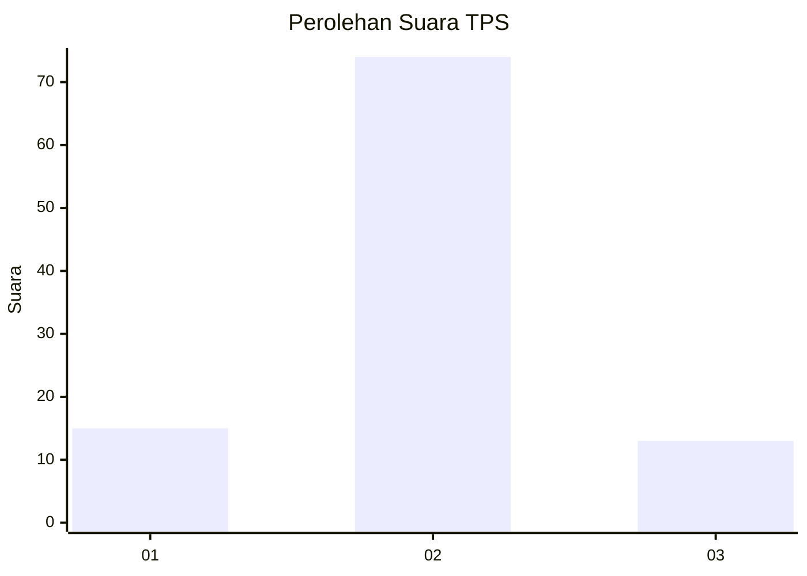
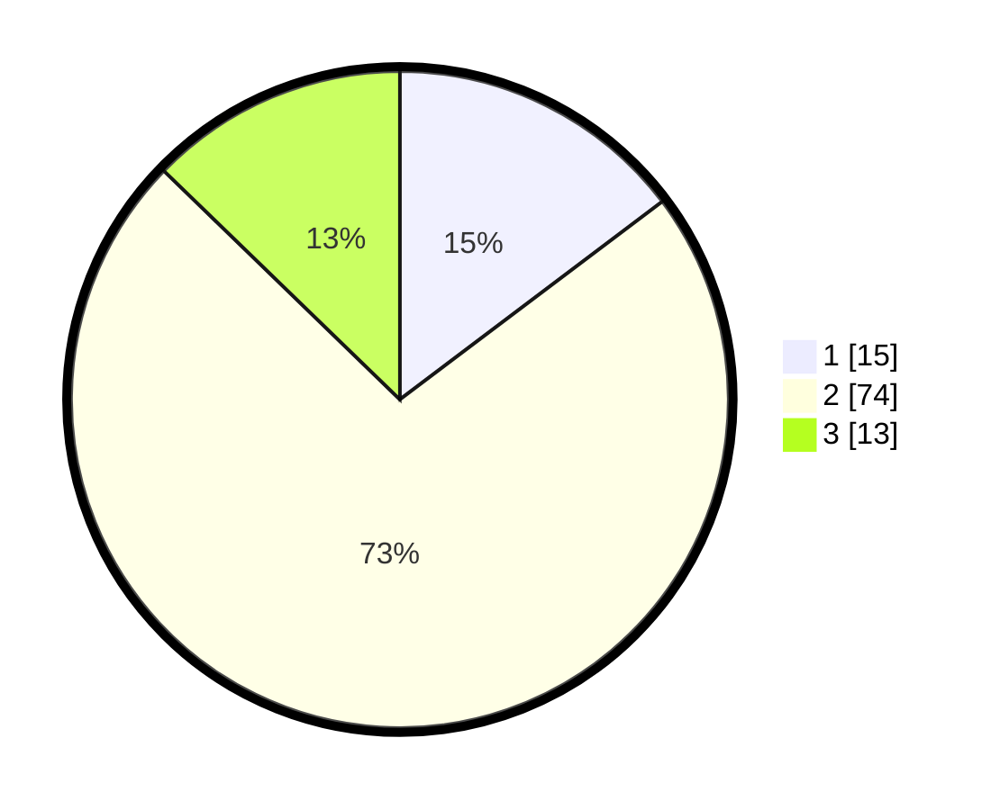

# Hasil

## Grafik

## Tabel

| No. | Nama Paslon    | Suara | Suara (raw) | Persentase |
|:--- |:-------------- | -----:| -----------:| ----------:|
| 1   | ANIES MUHAIMIN | 15    | [15][p-1]   | 14,71      |
| 2   | PRABOWO GIBRAN | 74    | [74][p-2]   | 72,55      |
| 3   | GANJAR MAHFUD  | 13    | [13][p-3]   | 12,75      |

[p-1]: https://github.com/gigit-pemilu/pemilu-2024/blob/main/pilpres/hitung-suara/sub/12-sumatera-utara/sub/08-simalungun/sub/04-panei/sub/2005-bangun-rakyat/sub/003-tps/sub/paslon-1.txt
[p-2]: https://github.com/gigit-pemilu/pemilu-2024/blob/main/pilpres/hitung-suara/sub/12-sumatera-utara/sub/08-simalungun/sub/04-panei/sub/2005-bangun-rakyat/sub/003-tps/sub/paslon-2.txt
[p-3]: https://github.com/gigit-pemilu/pemilu-2024/blob/main/pilpres/hitung-suara/sub/12-sumatera-utara/sub/08-simalungun/sub/04-panei/sub/2005-bangun-rakyat/sub/003-tps/sub/paslon-3.txt

## Foto C Plano

https://sirekap-obj-formc.kpu.go.id/b5f1/pemilu/ppwp/12/08/04/20/05/1208042005003-20240214-232400--b0281f9f-03aa-440c-82a9-121f8bbc612c.jpg

https://sirekap-obj-formc.kpu.go.id/b5f1/pemilu/ppwp/12/08/04/20/05/1208042005003-20240214-232528--20213a3c-e933-43ea-84a6-509b8cca87c5.jpg

https://sirekap-obj-formc.kpu.go.id/b5f1/pemilu/ppwp/12/08/04/20/05/1208042005003-20240214-232636--57da3599-6c58-45f2-b52f-fc0c6dc4f7de.jpg

## Metadata

| Key        | Value               |
| ---------- | ------------------- |
| Time Stamp | 2024-02-25 15:00:00 |

