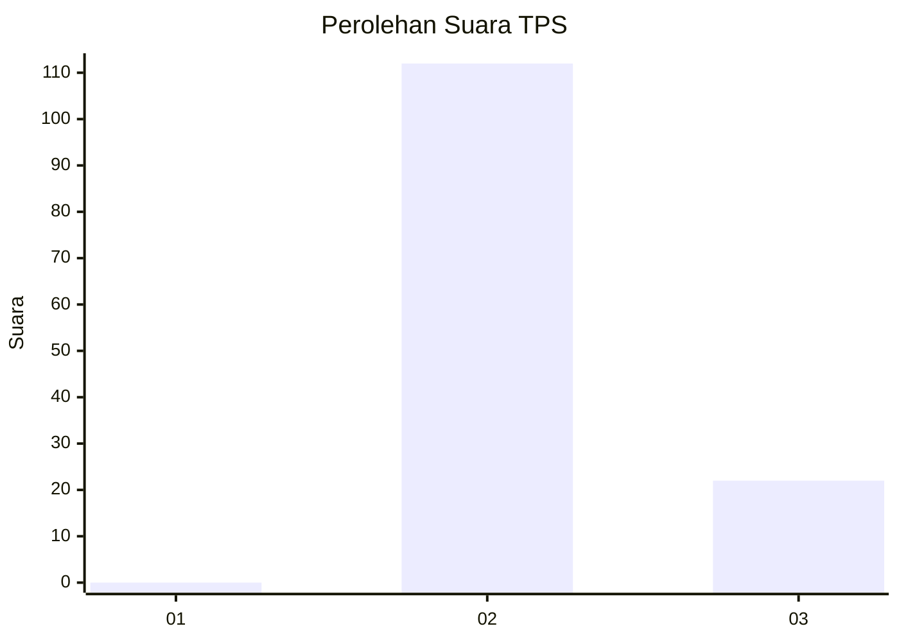
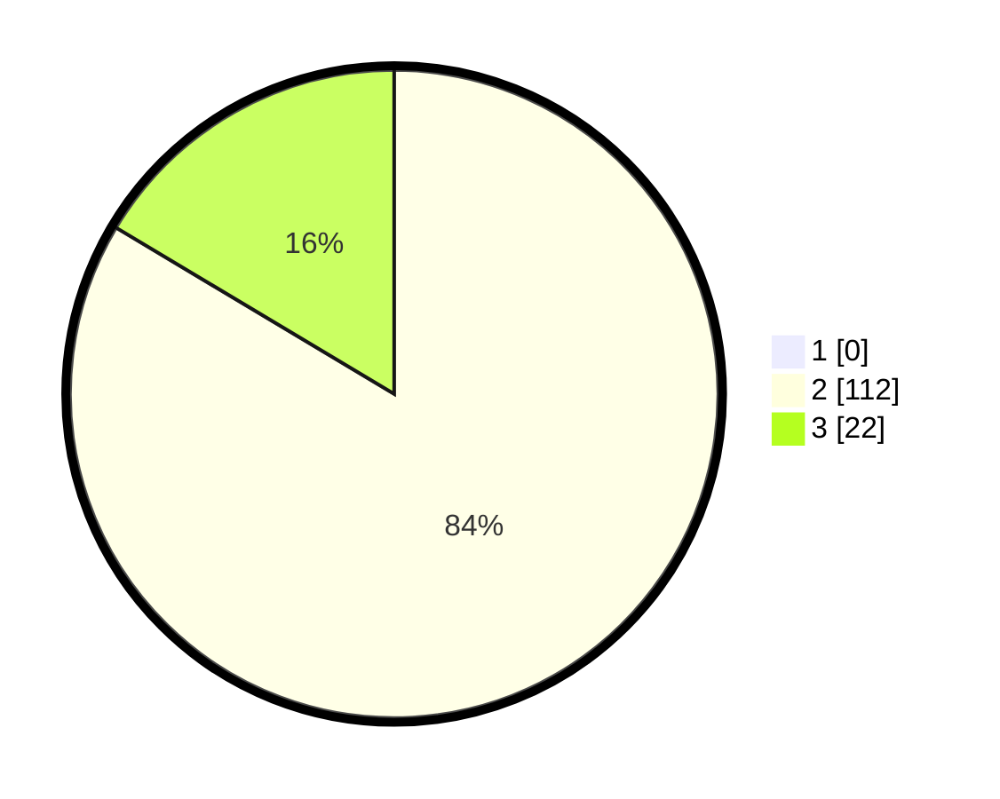

# Hasil

## Grafik

## Tabel

| No. | Nama Paslon    | Suara | Suara (raw) | Persentase |
|:--- |:-------------- | -----:| -----------:| ----------:|
| 1   | ANIES MUHAIMIN | 0     | [0][p-1]    | 0,00       |
| 2   | PRABOWO GIBRAN | 112   | [112][p-2]  | 83,58      |
| 3   | GANJAR MAHFUD  | 22    | [22][p-3]   | 16,42      |

[p-1]: https://github.com/gigit-pemilu/pemilu-2024/blob/main/pilpres/hitung-suara/sub/12-sumatera-utara/sub/08-simalungun/sub/04-panei/sub/2005-bangun-rakyat/sub/006-tps/sub/paslon-1.txt
[p-2]: https://github.com/gigit-pemilu/pemilu-2024/blob/main/pilpres/hitung-suara/sub/12-sumatera-utara/sub/08-simalungun/sub/04-panei/sub/2005-bangun-rakyat/sub/006-tps/sub/paslon-2.txt
[p-3]: https://github.com/gigit-pemilu/pemilu-2024/blob/main/pilpres/hitung-suara/sub/12-sumatera-utara/sub/08-simalungun/sub/04-panei/sub/2005-bangun-rakyat/sub/006-tps/sub/paslon-3.txt

## Foto C Plano

https://sirekap-obj-formc.kpu.go.id/b74f/pemilu/ppwp/12/08/04/20/05/1208042005006-20240214-235753--7174f381-e56f-4f77-8da5-49c752a56317.jpg

https://sirekap-obj-formc.kpu.go.id/b74f/pemilu/ppwp/12/08/04/20/05/1208042005006-20240214-235608--4cf2df4f-898e-43b6-9bbb-ad33d2e3d42a.jpg

https://sirekap-obj-formc.kpu.go.id/b74f/pemilu/ppwp/12/08/04/20/05/1208042005006-20240214-235726--cc44ed62-995a-495c-993c-69901c7e1d32.jpg

## Metadata

| Key        | Value               |
| ---------- | ------------------- |
| Time Stamp | 2024-02-25 17:00:00 |

