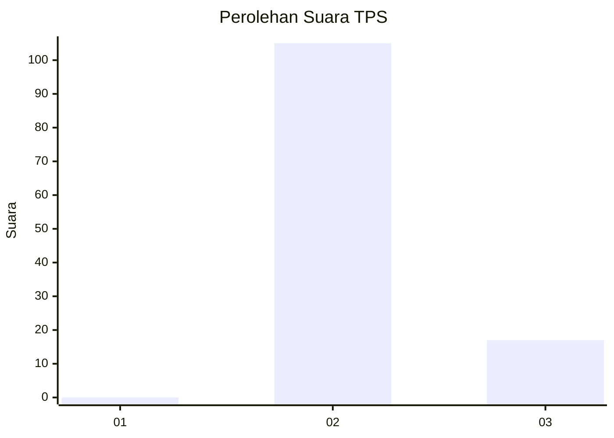
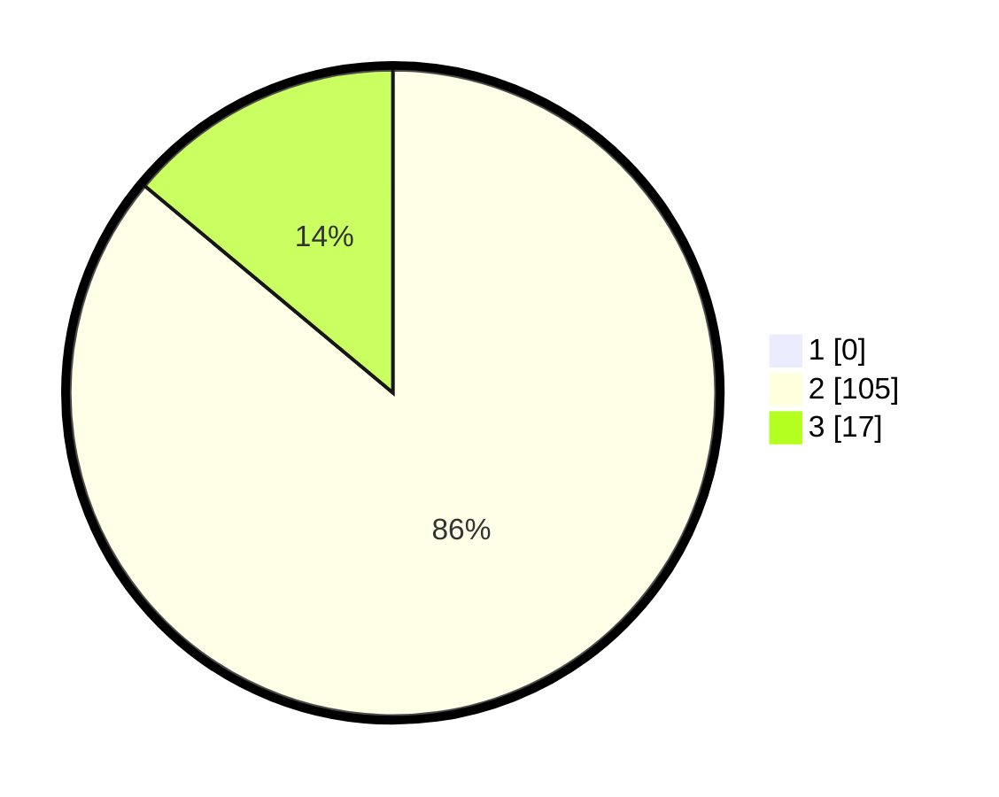

# Hasil

## Grafik

## Tabel

| No. | Nama Paslon    | Suara | Suara (raw) | Persentase |
|:--- |:-------------- | -----:| -----------:| ----------:|
| 1   | ANIES MUHAIMIN | 0     | [0][p-1]    | 0,00       |
| 2   | PRABOWO GIBRAN | 105   | [105][p-2]  | 86,07      |
| 3   | GANJAR MAHFUD  | 17    | [17][p-3]   | 13,93      |

[p-1]: https://github.com/gigit-pemilu/pemilu-2024/blob/main/pilpres/hitung-suara/sub/12-sumatera-utara/sub/08-simalungun/sub/04-panei/sub/2008-bah-bolon-tongah/sub/004-tps/sub/paslon-1.txt
[p-2]: https://github.com/gigit-pemilu/pemilu-2024/blob/main/pilpres/hitung-suara/sub/12-sumatera-utara/sub/08-simalungun/sub/04-panei/sub/2008-bah-bolon-tongah/sub/004-tps/sub/paslon-2.txt
[p-3]: https://github.com/gigit-pemilu/pemilu-2024/blob/main/pilpres/hitung-suara/sub/12-sumatera-utara/sub/08-simalungun/sub/04-panei/sub/2008-bah-bolon-tongah/sub/004-tps/sub/paslon-3.txt

## Foto C Plano

https://sirekap-obj-formc.kpu.go.id/6dcd/pemilu/ppwp/12/08/04/20/08/1208042008004-20240214-220910--dd8d11e3-8495-49ca-a596-88ed528718a1.jpg

https://sirekap-obj-formc.kpu.go.id/6dcd/pemilu/ppwp/12/08/04/20/08/1208042008004-20240214-221434--0c73a6ab-4af3-455e-b573-94a9d21b379f.jpg

https://sirekap-obj-formc.kpu.go.id/6dcd/pemilu/ppwp/12/08/04/20/08/1208042008004-20240214-221654--7e949389-fb9d-4acb-a0bf-a7871df3fb56.jpg

## Metadata

| Key        | Value               |
| ---------- | ------------------- |
| Time Stamp | 2024-02-25 12:00:00 |

