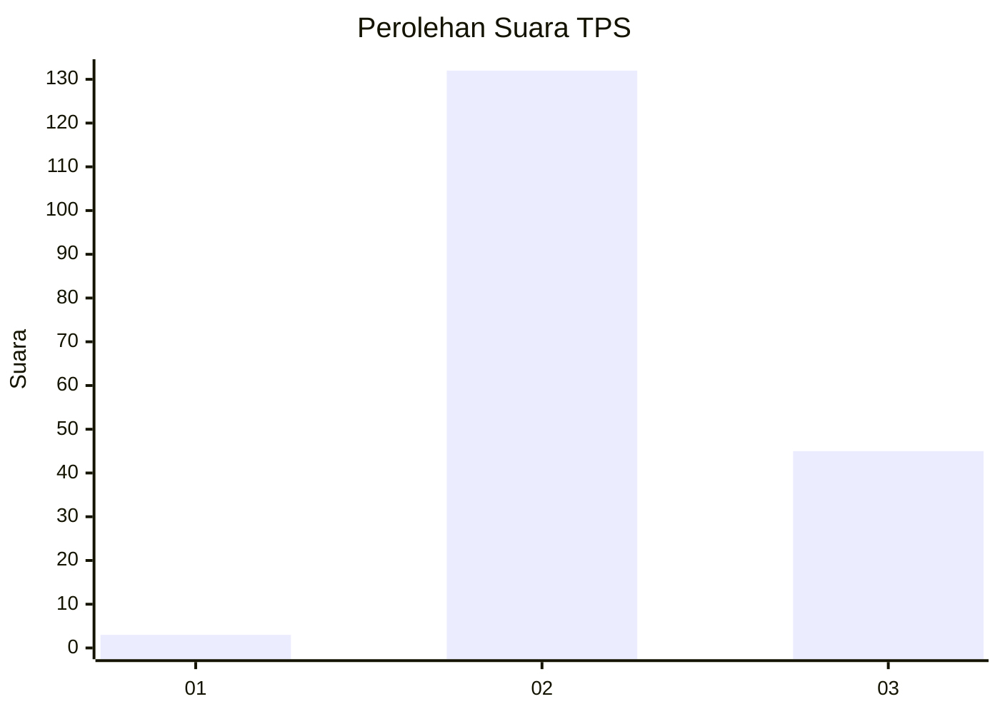
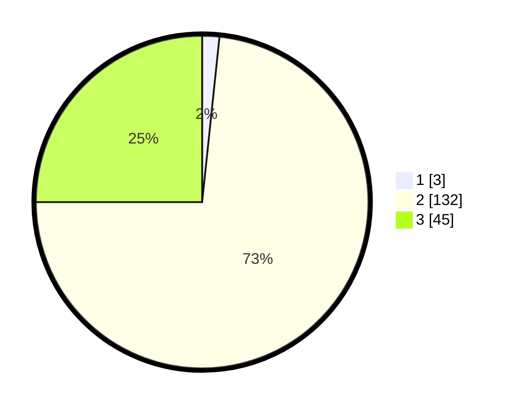

# Hasil

## Grafik

## Tabel

| No. | Nama Paslon    | Suara | Suara (raw) | Persentase |
|:--- |:-------------- | -----:| -----------:| ----------:|
| 1   | ANIES MUHAIMIN | 3     | [3][p-1]    | 1,67       |
| 2   | PRABOWO GIBRAN | 132   | [132][p-2]  | 73,33      |
| 3   | GANJAR MAHFUD  | 45    | [45][p-3]   | 25,00      |

[p-1]: https://github.com/gigit-pemilu/pemilu-2024-12-sumatera-utara/blob/main/pilpres/hitung-suara/sub/12-sumatera-utara/sub/08-simalungun/sub/05-panombeian-panei/sub/2001-panombeian/sub/003-tps/sub/paslon-1.txt
[p-2]: https://github.com/gigit-pemilu/pemilu-2024-12-sumatera-utara/blob/main/pilpres/hitung-suara/sub/12-sumatera-utara/sub/08-simalungun/sub/05-panombeian-panei/sub/2001-panombeian/sub/003-tps/sub/paslon-2.txt
[p-3]: https://github.com/gigit-pemilu/pemilu-2024-12-sumatera-utara/blob/main/pilpres/hitung-suara/sub/12-sumatera-utara/sub/08-simalungun/sub/05-panombeian-panei/sub/2001-panombeian/sub/003-tps/sub/paslon-3.txt

## Foto C Plano

https://sirekap-obj-formc.kpu.go.id/ffe5/pemilu/ppwp/12/08/05/20/01/1208052001003-20240214-235346--e457d965-ac89-49e5-b71e-acaf3fb94a59.jpg

https://sirekap-obj-formc.kpu.go.id/ffe5/pemilu/ppwp/12/08/05/20/01/1208052001003-20240214-235355--1c763a6b-aca5-4d89-ab20-6d45545d810f.jpg

https://sirekap-obj-formc.kpu.go.id/ffe5/pemilu/ppwp/12/08/05/20/01/1208052001003-20240214-235454--bffb5843-327c-4aa8-b9e3-eba5762cff6c.jpg

## Metadata

| Key        | Value               |
| ---------- | ------------------- |
| Time Stamp | 2024-02-17 10:00:02 |

