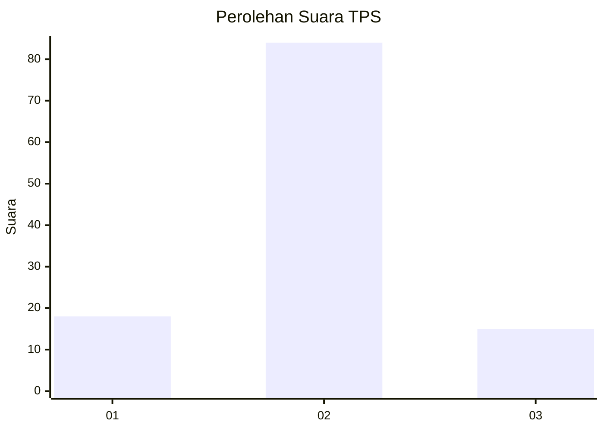
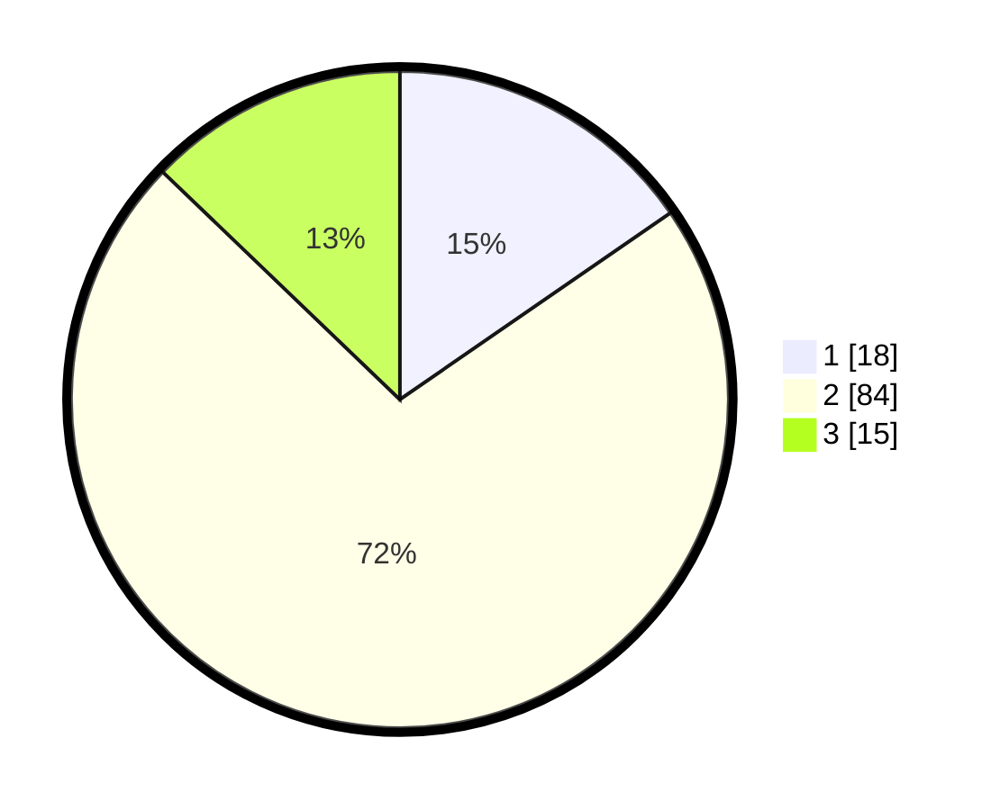

# Hasil

## Grafik

## Tabel

| No. | Nama Paslon    | Suara | Suara (raw) | Persentase |
|:--- |:-------------- | -----:| -----------:| ----------:|
| 1   | ANIES MUHAIMIN | 18    | [18][p-1]   | 15,38      |
| 2   | PRABOWO GIBRAN | 84    | [84][p-2]   | 71,79      |
| 3   | GANJAR MAHFUD  | 15    | [15][p-3]   | 12,82      |

[p-1]: https://github.com/gigit-pemilu/pemilu-2024/blob/main/pilpres/hitung-suara/sub/12-sumatera-utara/sub/08-simalungun/sub/05-panombeian-panei/sub/2004-marjandi/sub/004-tps/sub/paslon-1.txt
[p-2]: https://github.com/gigit-pemilu/pemilu-2024/blob/main/pilpres/hitung-suara/sub/12-sumatera-utara/sub/08-simalungun/sub/05-panombeian-panei/sub/2004-marjandi/sub/004-tps/sub/paslon-2.txt
[p-3]: https://github.com/gigit-pemilu/pemilu-2024/blob/main/pilpres/hitung-suara/sub/12-sumatera-utara/sub/08-simalungun/sub/05-panombeian-panei/sub/2004-marjandi/sub/004-tps/sub/paslon-3.txt

## Foto C Plano

https://sirekap-obj-formc.kpu.go.id/fc40/pemilu/ppwp/12/08/05/20/04/1208052004004-20240215-002058--89e6412d-074c-4ea8-8513-450026f8353e.jpg

https://sirekap-obj-formc.kpu.go.id/fc40/pemilu/ppwp/12/08/05/20/04/1208052004004-20240215-002658--b5474a41-b348-42c0-a04c-0ac6bab55634.jpg

https://sirekap-obj-formc.kpu.go.id/fc40/pemilu/ppwp/12/08/05/20/04/1208052004004-20240215-003045--021a98ef-91be-49e2-a90f-446118dd178f.jpg

## Metadata

| Key        | Value               |
| ---------- | ------------------- |
| Time Stamp | 2024-02-17 10:00:02 |

