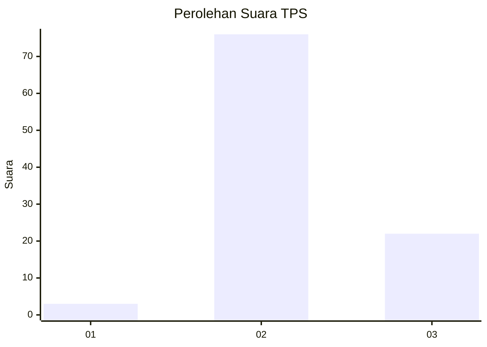
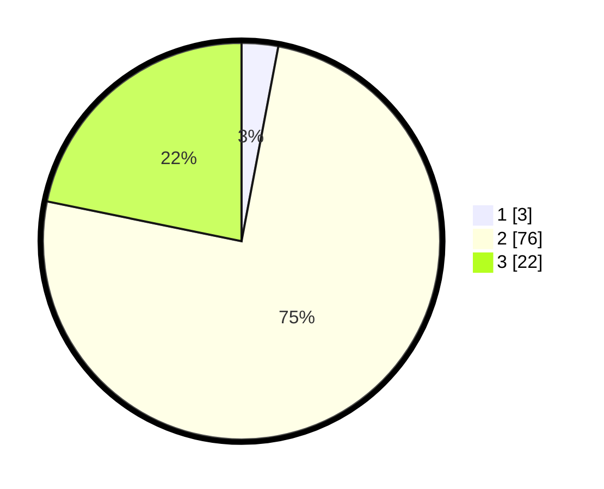

# Hasil

## Grafik

## Tabel

| No. | Nama Paslon    | Suara | Suara (raw) | Persentase |
|:--- |:-------------- | -----:| -----------:| ----------:|
| 1   | ANIES MUHAIMIN | 3     | [3][p-1]    | 2,97       |
| 2   | PRABOWO GIBRAN | 76    | [76][p-2]   | 75,25      |
| 3   | GANJAR MAHFUD  | 22    | [22][p-3]   | 21,78      |

[p-1]: https://github.com/gigit-pemilu/pemilu-2024/blob/main/pilpres/hitung-suara/sub/12-sumatera-utara/sub/08-simalungun/sub/05-panombeian-panei/sub/2005-simpang-panei/sub/006-tps/sub/paslon-1.txt
[p-2]: https://github.com/gigit-pemilu/pemilu-2024/blob/main/pilpres/hitung-suara/sub/12-sumatera-utara/sub/08-simalungun/sub/05-panombeian-panei/sub/2005-simpang-panei/sub/006-tps/sub/paslon-2.txt
[p-3]: https://github.com/gigit-pemilu/pemilu-2024/blob/main/pilpres/hitung-suara/sub/12-sumatera-utara/sub/08-simalungun/sub/05-panombeian-panei/sub/2005-simpang-panei/sub/006-tps/sub/paslon-3.txt

## Foto C Plano

https://sirekap-obj-formc.kpu.go.id/892f/pemilu/ppwp/12/08/05/20/05/1208052005006-20240216-214242--9db94931-d6c1-4c33-bf78-f7d9ec954b6e.jpg

https://sirekap-obj-formc.kpu.go.id/892f/pemilu/ppwp/12/08/05/20/05/1208052005006-20240216-192713--3681822c-1c88-4466-a2bf-c9ae00979f2f.jpg

https://sirekap-obj-formc.kpu.go.id/892f/pemilu/ppwp/12/08/05/20/05/1208052005006-20240216-144603--14874dfa-ae80-4ea9-be06-bee27171b0cb.jpg

## Metadata

| Key        | Value               |
| ---------- | ------------------- |
| Time Stamp | 2024-02-16 22:01:00 |

