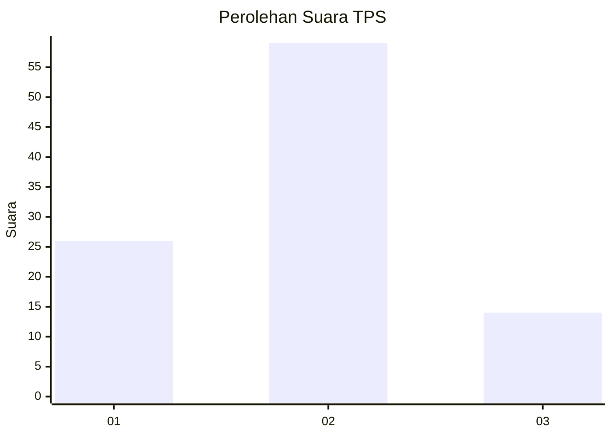
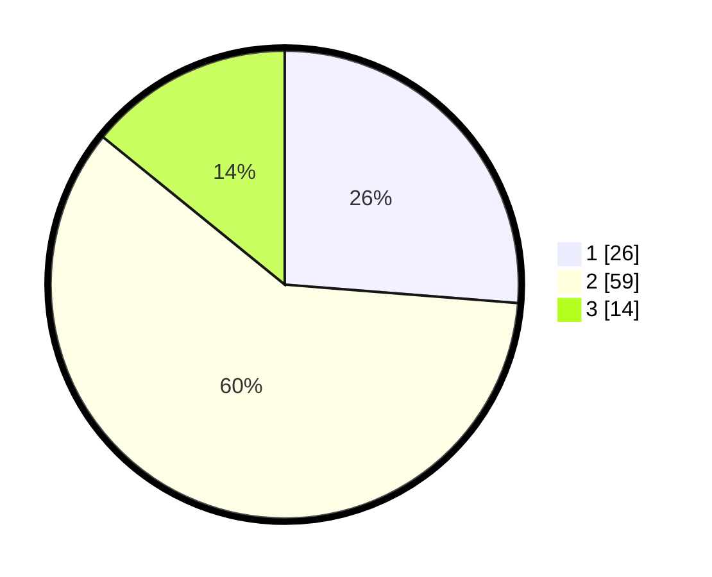

# Hasil

## Grafik

## Tabel

| No. | Nama Paslon    | Suara | Suara (raw) | Persentase |
|:--- |:-------------- | -----:| -----------:| ----------:|
| 1   | ANIES MUHAIMIN | 26    | [26][p-1]   | 26,26      |
| 2   | PRABOWO GIBRAN | 59    | [59][p-2]   | 59,60      |
| 3   | GANJAR MAHFUD  | 14    | [14][p-3]   | 14,14      |

[p-1]: https://github.com/gigit-pemilu/pemilu-2024/blob/main/pilpres/hitung-suara/sub/12-sumatera-utara/sub/08-simalungun/sub/05-panombeian-panei/sub/2011-rukun-mulyo/sub/008-tps/sub/paslon-1.txt
[p-2]: https://github.com/gigit-pemilu/pemilu-2024/blob/main/pilpres/hitung-suara/sub/12-sumatera-utara/sub/08-simalungun/sub/05-panombeian-panei/sub/2011-rukun-mulyo/sub/008-tps/sub/paslon-2.txt
[p-3]: https://github.com/gigit-pemilu/pemilu-2024/blob/main/pilpres/hitung-suara/sub/12-sumatera-utara/sub/08-simalungun/sub/05-panombeian-panei/sub/2011-rukun-mulyo/sub/008-tps/sub/paslon-3.txt

## Foto C Plano

https://sirekap-obj-formc.kpu.go.id/e1b6/pemilu/ppwp/12/08/05/20/11/1208052011008-20240214-201926--2e6ad9b3-07ad-45f7-84ec-a778049ccfa7.jpg

https://sirekap-obj-formc.kpu.go.id/e1b6/pemilu/ppwp/12/08/05/20/11/1208052011008-20240214-224443--2fd2e1e6-49b1-404a-b6f1-6dd1f47e79d4.jpg

https://sirekap-obj-formc.kpu.go.id/e1b6/pemilu/ppwp/12/08/05/20/11/1208052011008-20240214-202820--f14a2b9f-c366-46a1-b21d-964877118cc2.jpg

## Metadata

| Key        | Value               |
| ---------- | ------------------- |
| Time Stamp | 2024-02-25 22:00:00 |

