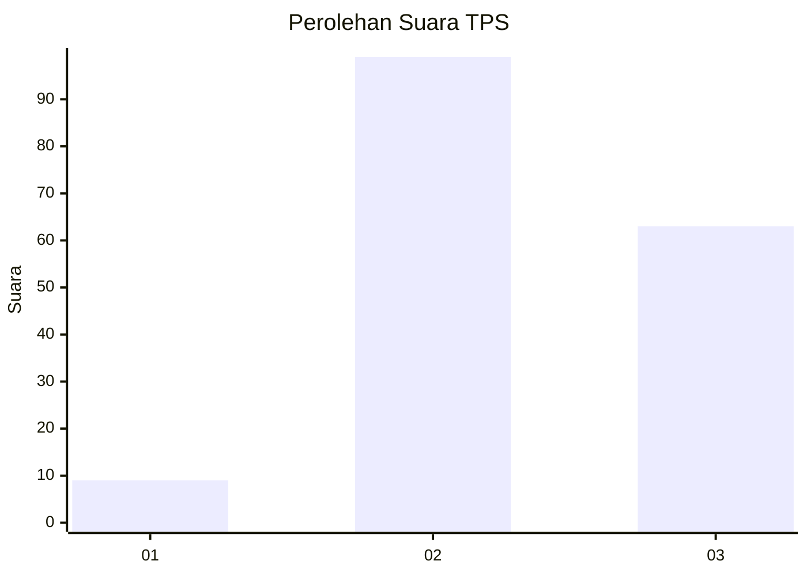
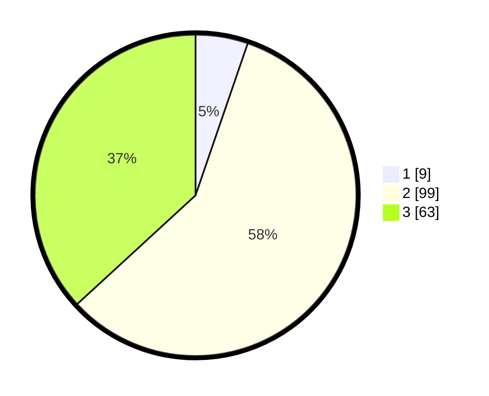

# Hasil

## Grafik

## Tabel

| No. | Nama Paslon    | Suara | Suara (raw) | Persentase |
|:--- |:-------------- | -----:| -----------:| ----------:|
| 1   | ANIES MUHAIMIN | 9     | [9][p-1]    | 5,26       |
| 2   | PRABOWO GIBRAN | 99    | [99][p-2]   | 57,89      |
| 3   | GANJAR MAHFUD  | 63    | [63][p-3]   | 36,84      |

[p-1]: https://github.com/gigit-pemilu/pemilu-2024/blob/main/pilpres/hitung-suara/sub/12-sumatera-utara/sub/08-simalungun/sub/06-jorlang-hataran/sub/1008-tiga-balata/sub/007-tps/sub/paslon-1.txt
[p-2]: https://github.com/gigit-pemilu/pemilu-2024/blob/main/pilpres/hitung-suara/sub/12-sumatera-utara/sub/08-simalungun/sub/06-jorlang-hataran/sub/1008-tiga-balata/sub/007-tps/sub/paslon-2.txt
[p-3]: https://github.com/gigit-pemilu/pemilu-2024/blob/main/pilpres/hitung-suara/sub/12-sumatera-utara/sub/08-simalungun/sub/06-jorlang-hataran/sub/1008-tiga-balata/sub/007-tps/sub/paslon-3.txt

## Foto C Plano

https://sirekap-obj-formc.kpu.go.id/c888/pemilu/ppwp/12/08/06/10/08/1208061008007-20240214-234339--1580269b-1a7c-48bc-b56d-4af4c6c00e8b.jpg

https://sirekap-obj-formc.kpu.go.id/c888/pemilu/ppwp/12/08/06/10/08/1208061008007-20240214-233957--1e3809d8-b440-4029-9988-0d447f47fe48.jpg

https://sirekap-obj-formc.kpu.go.id/c888/pemilu/ppwp/12/08/06/10/08/1208061008007-20240214-234234--b3e1b526-e69f-444b-8a8b-fc211b4876f1.jpg

## Metadata

| Key        | Value               |
| ---------- | ------------------- |
| Time Stamp | 2024-02-19 21:00:00 |

