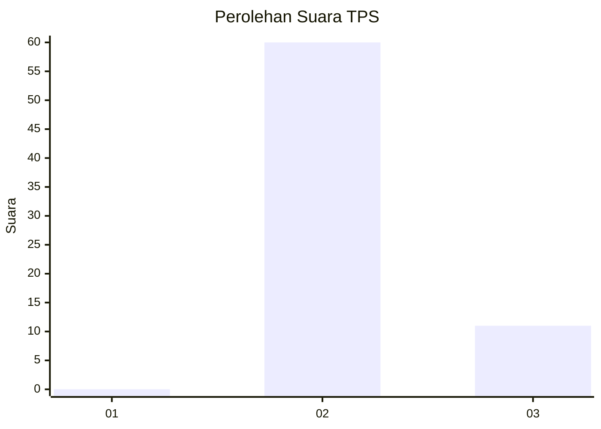
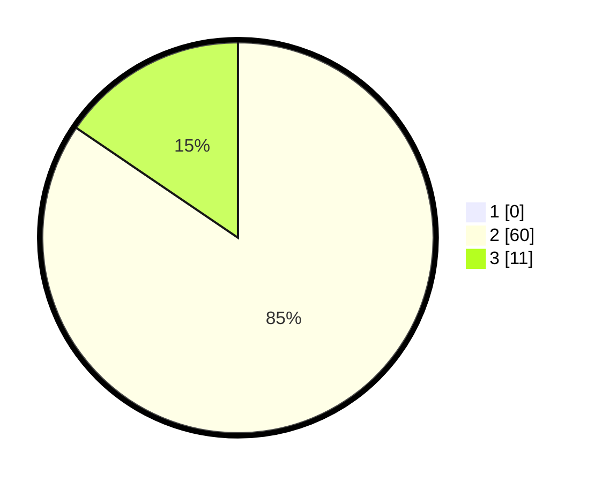

# Hasil

## Grafik

## Tabel

| No. | Nama Paslon    | Suara | Suara (raw) | Persentase |
|:--- |:-------------- | -----:| -----------:| ----------:|
| 1   | ANIES MUHAIMIN | 0     | [0][p-1]    | 0,00       |
| 2   | PRABOWO GIBRAN | 60    | [60][p-2]   | 84,51      |
| 3   | GANJAR MAHFUD  | 11    | [11][p-3]   | 15,49      |

[p-1]: https://github.com/gigit-pemilu/pemilu-2024-12-sumatera-utara/blob/main/pilpres/hitung-suara/sub/12-sumatera-utara/sub/08-simalungun/sub/07-raya-kahean/sub/2011-banu-raya/sub/001-tps/sub/paslon-1.txt
[p-2]: https://github.com/gigit-pemilu/pemilu-2024-12-sumatera-utara/blob/main/pilpres/hitung-suara/sub/12-sumatera-utara/sub/08-simalungun/sub/07-raya-kahean/sub/2011-banu-raya/sub/001-tps/sub/paslon-2.txt
[p-3]: https://github.com/gigit-pemilu/pemilu-2024-12-sumatera-utara/blob/main/pilpres/hitung-suara/sub/12-sumatera-utara/sub/08-simalungun/sub/07-raya-kahean/sub/2011-banu-raya/sub/001-tps/sub/paslon-3.txt

## Foto C Plano

https://sirekap-obj-formc.kpu.go.id/5ed7/pemilu/ppwp/12/08/07/20/11/1208072011001-20240215-093917--a8b08ab9-636d-41aa-9e91-f59fd3563d7b.jpg

https://sirekap-obj-formc.kpu.go.id/5ed7/pemilu/ppwp/12/08/07/20/11/1208072011001-20240214-193000--ed12c068-47c6-4d2a-8959-55f1d4168788.jpg

https://sirekap-obj-formc.kpu.go.id/5ed7/pemilu/ppwp/12/08/07/20/11/1208072011001-20240214-193019--5e74a2f1-7817-42cc-ba9e-f18b55013d1c.jpg

## Metadata

| Key        | Value               |
| ---------- | ------------------- |
| Time Stamp | 2024-02-15 15:00:29 |

