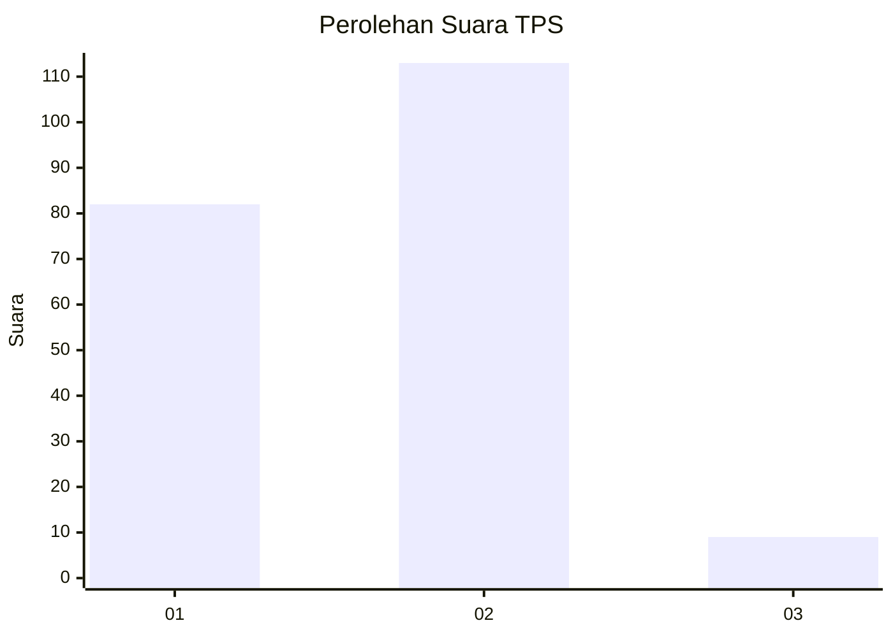
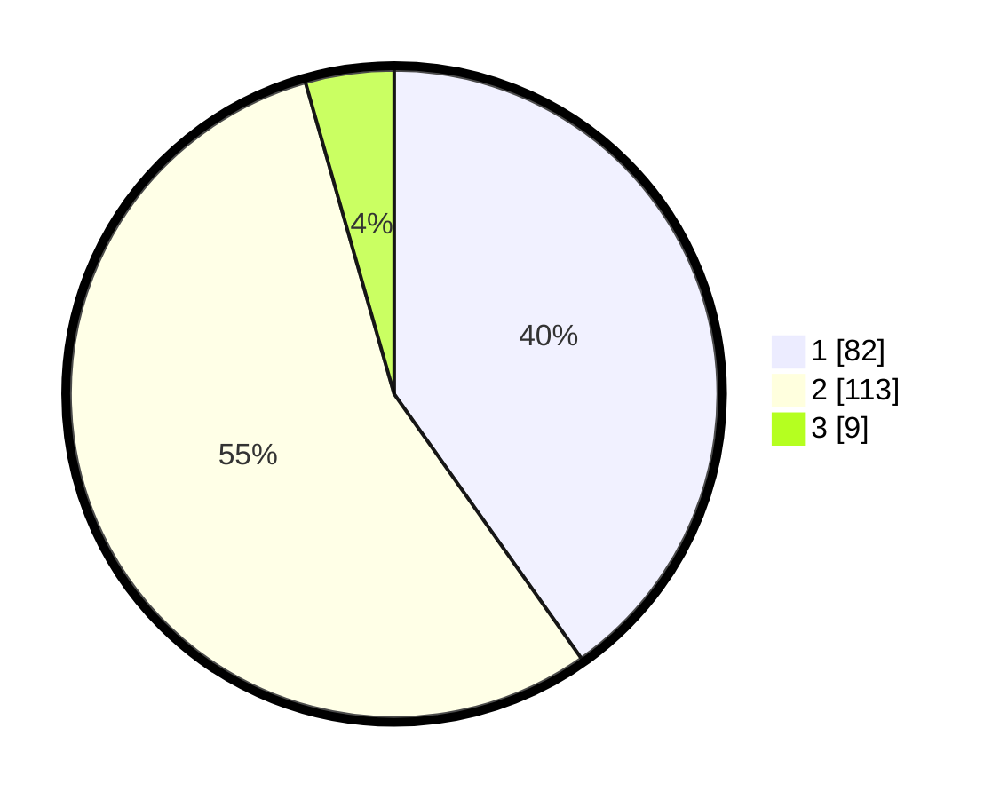

# Hasil

## Grafik

## Tabel

| No. | Nama Paslon    | Suara | Suara (raw) | Persentase |
|:--- |:-------------- | -----:| -----------:| ----------:|
| 1   | ANIES MUHAIMIN | 82    | [82][p-1]   | 40,20      |
| 2   | PRABOWO GIBRAN | 113   | [113][p-2]  | 55,39      |
| 3   | GANJAR MAHFUD  | 9     | [9][p-3]    | 4,41       |

[p-1]: https://github.com/gigit-pemilu/pemilu-2024-12-sumatera-utara/blob/main/pilpres/hitung-suara/sub/12-sumatera-utara/sub/08-simalungun/sub/08-bosar-maligas/sub/1013-bosar-maligas/sub/002-tps/sub/paslon-1.txt
[p-2]: https://github.com/gigit-pemilu/pemilu-2024-12-sumatera-utara/blob/main/pilpres/hitung-suara/sub/12-sumatera-utara/sub/08-simalungun/sub/08-bosar-maligas/sub/1013-bosar-maligas/sub/002-tps/sub/paslon-2.txt
[p-3]: https://github.com/gigit-pemilu/pemilu-2024-12-sumatera-utara/blob/main/pilpres/hitung-suara/sub/12-sumatera-utara/sub/08-simalungun/sub/08-bosar-maligas/sub/1013-bosar-maligas/sub/002-tps/sub/paslon-3.txt

## Foto C Plano

https://sirekap-obj-formc.kpu.go.id/2cd2/pemilu/ppwp/12/08/08/10/13/1208081013002-20240215-002416--c6cebb01-e4c1-4595-914a-6c5376240d23.jpg

https://sirekap-obj-formc.kpu.go.id/2cd2/pemilu/ppwp/12/08/08/10/13/1208081013002-20240215-002006--569672b3-4227-4d1c-b264-bc792da0b486.jpg

https://sirekap-obj-formc.kpu.go.id/2cd2/pemilu/ppwp/12/08/08/10/13/1208081013002-20240215-002452--da19ae08-97d4-4641-bacb-1416d6591ef0.jpg

## Metadata

| Key        | Value               |
| ---------- | ------------------- |
| Time Stamp | 2024-02-15 12:00:28 |

