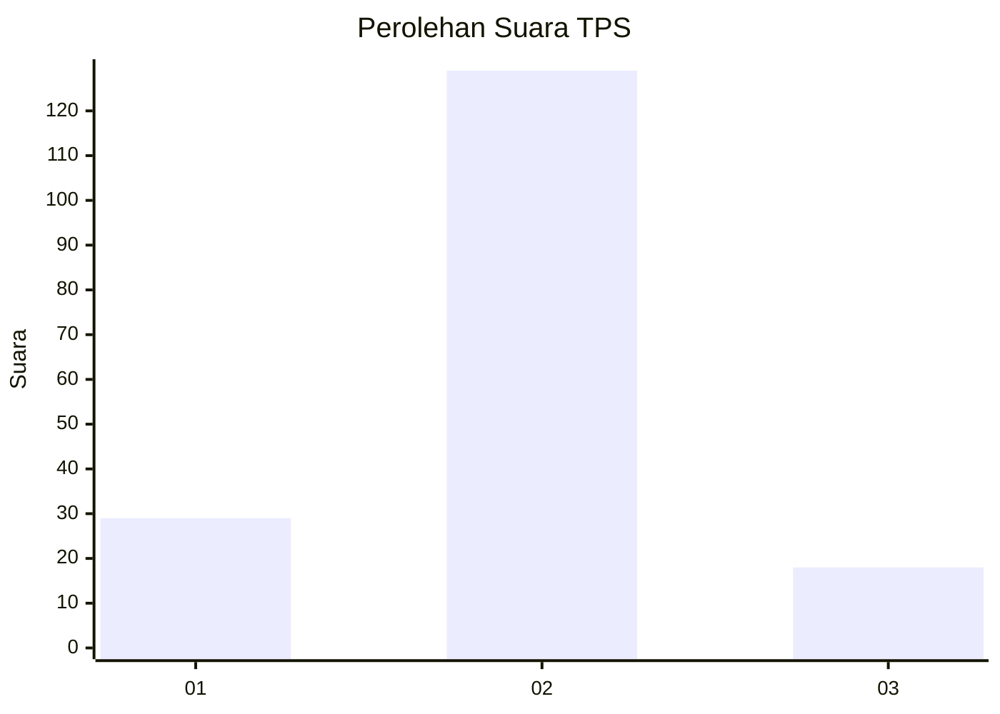
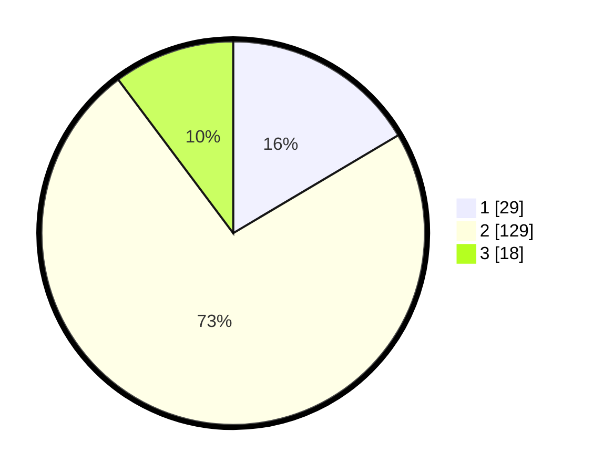

# Hasil

## Grafik

## Tabel

| No. | Nama Paslon    | Suara | Suara (raw) | Persentase |
|:--- |:-------------- | -----:| -----------:| ----------:|
| 1   | ANIES MUHAIMIN | 29    | [29][p-1]   | 16,48      |
| 2   | PRABOWO GIBRAN | 129   | [129][p-2]  | 73,30      |
| 3   | GANJAR MAHFUD  | 18    | [18][p-3]   | 10,23      |

[p-1]: https://github.com/gigit-pemilu/pemilu-2024-12-sumatera-utara/blob/main/pilpres/hitung-suara/sub/12-sumatera-utara/sub/08-simalungun/sub/08-bosar-maligas/sub/1013-bosar-maligas/sub/005-tps/sub/paslon-1.txt
[p-2]: https://github.com/gigit-pemilu/pemilu-2024-12-sumatera-utara/blob/main/pilpres/hitung-suara/sub/12-sumatera-utara/sub/08-simalungun/sub/08-bosar-maligas/sub/1013-bosar-maligas/sub/005-tps/sub/paslon-2.txt
[p-3]: https://github.com/gigit-pemilu/pemilu-2024-12-sumatera-utara/blob/main/pilpres/hitung-suara/sub/12-sumatera-utara/sub/08-simalungun/sub/08-bosar-maligas/sub/1013-bosar-maligas/sub/005-tps/sub/paslon-3.txt

## Foto C Plano

https://sirekap-obj-formc.kpu.go.id/10e1/pemilu/ppwp/12/08/08/10/13/1208081013005-20240214-210603--ec1ec18c-0ba3-4695-9a3b-35f90b340e5b.jpg

https://sirekap-obj-formc.kpu.go.id/10e1/pemilu/ppwp/12/08/08/10/13/1208081013005-20240215-004255--643d8e1d-2665-4990-83cc-7ece19134a18.jpg

https://sirekap-obj-formc.kpu.go.id/10e1/pemilu/ppwp/12/08/08/10/13/1208081013005-20240215-004457--a0f7a218-dfd6-4648-bd1e-b18490678233.jpg

## Metadata

| Key        | Value               |
| ---------- | ------------------- |
| Time Stamp | 2024-02-25 22:00:00 |

