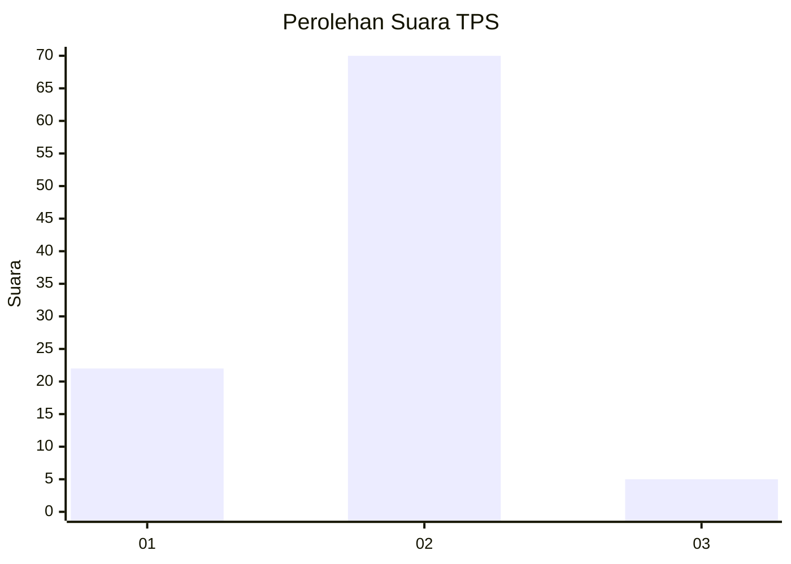
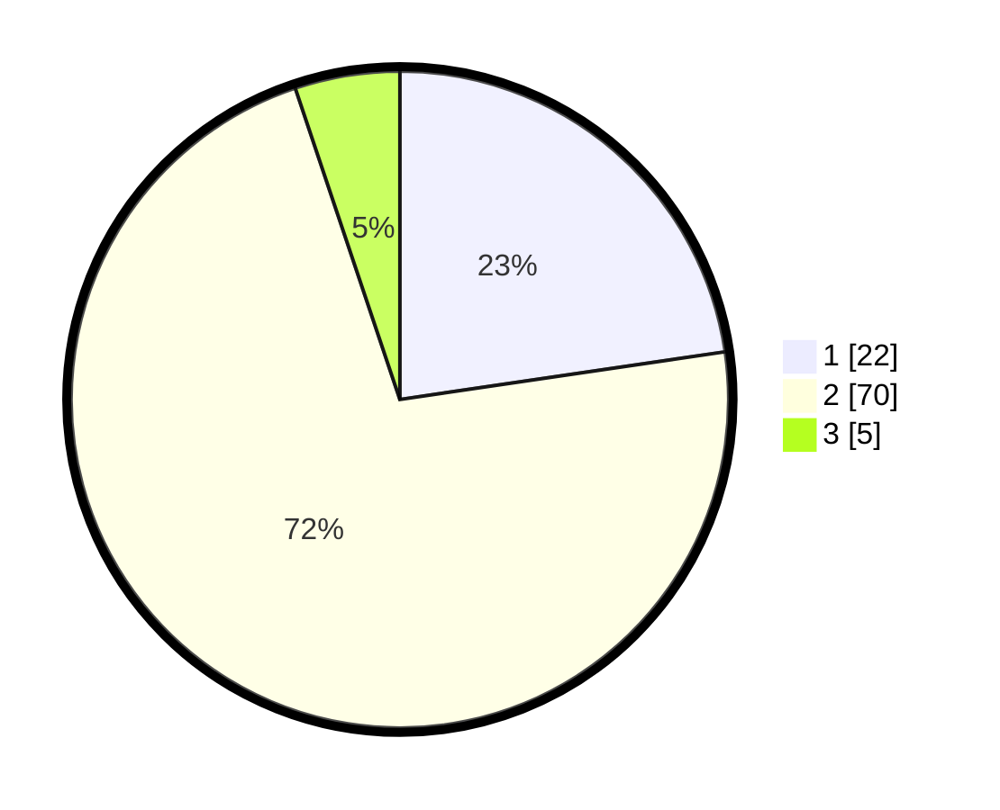

# Hasil

## Grafik

## Tabel

| No. | Nama Paslon    | Suara | Suara (raw) | Persentase |
|:--- |:-------------- | -----:| -----------:| ----------:|
| 1   | ANIES MUHAIMIN | 22    | [22][p-1]   | 22,68      |
| 2   | PRABOWO GIBRAN | 70    | [70][p-2]   | 72,16      |
| 3   | GANJAR MAHFUD  | 5     | [5][p-3]    | 5,15       |

[p-1]: https://github.com/gigit-pemilu/pemilu-2024-12-sumatera-utara/blob/main/pilpres/hitung-suara/sub/12-sumatera-utara/sub/08-simalungun/sub/08-bosar-maligas/sub/2005-gunung-bayu/sub/001-tps/sub/paslon-1.txt
[p-2]: https://github.com/gigit-pemilu/pemilu-2024-12-sumatera-utara/blob/main/pilpres/hitung-suara/sub/12-sumatera-utara/sub/08-simalungun/sub/08-bosar-maligas/sub/2005-gunung-bayu/sub/001-tps/sub/paslon-2.txt
[p-3]: https://github.com/gigit-pemilu/pemilu-2024-12-sumatera-utara/blob/main/pilpres/hitung-suara/sub/12-sumatera-utara/sub/08-simalungun/sub/08-bosar-maligas/sub/2005-gunung-bayu/sub/001-tps/sub/paslon-3.txt

## Foto C Plano

https://sirekap-obj-formc.kpu.go.id/fba8/pemilu/ppwp/12/08/08/20/05/1208082005001-20240215-013843--ea6f01df-baf4-43d6-a5ac-db1a7e4430f6.jpg

https://sirekap-obj-formc.kpu.go.id/fba8/pemilu/ppwp/12/08/08/20/05/1208082005001-20240215-003412--65deb1c9-54b0-4899-b196-f726495d7e2d.jpg

https://sirekap-obj-formc.kpu.go.id/fba8/pemilu/ppwp/12/08/08/20/05/1208082005001-20240215-003531--feb7f4e4-370b-4fef-9f5d-5d5a86ac35a0.jpg

## Metadata

| Key        | Value               |
| ---------- | ------------------- |
| Time Stamp | 2024-02-19 06:16:00 |

