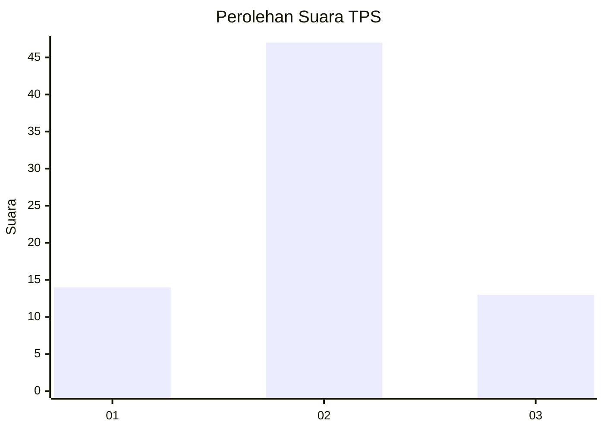
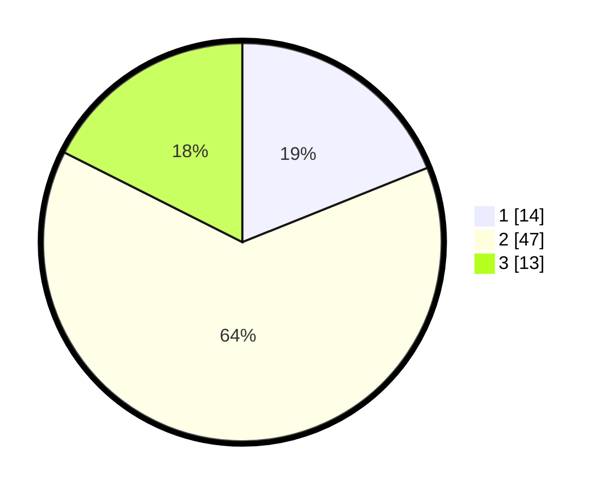

# Hasil

## Grafik

## Tabel

| No. | Nama Paslon    | Suara | Suara (raw) | Persentase |
|:--- |:-------------- | -----:| -----------:| ----------:|
| 1   | ANIES MUHAIMIN | 14    | [14][p-1]   | 18,92      |
| 2   | PRABOWO GIBRAN | 47    | [47][p-2]   | 63,51      |
| 3   | GANJAR MAHFUD  | 13    | [13][p-3]   | 17,57      |

[p-1]: https://github.com/gigit-pemilu/pemilu-2024/blob/main/pilpres/hitung-suara/sub/12-sumatera-utara/sub/08-simalungun/sub/08-bosar-maligas/sub/2017-nanggar-bayu/sub/005-tps/sub/paslon-1.txt
[p-2]: https://github.com/gigit-pemilu/pemilu-2024/blob/main/pilpres/hitung-suara/sub/12-sumatera-utara/sub/08-simalungun/sub/08-bosar-maligas/sub/2017-nanggar-bayu/sub/005-tps/sub/paslon-2.txt
[p-3]: https://github.com/gigit-pemilu/pemilu-2024/blob/main/pilpres/hitung-suara/sub/12-sumatera-utara/sub/08-simalungun/sub/08-bosar-maligas/sub/2017-nanggar-bayu/sub/005-tps/sub/paslon-3.txt

## Foto C Plano

https://sirekap-obj-formc.kpu.go.id/8a34/pemilu/ppwp/12/08/08/20/17/1208082017005-20240221-121112--7c639681-468d-4c34-a1c1-4d6a18f12e1d.jpg

https://sirekap-obj-formc.kpu.go.id/8a34/pemilu/ppwp/12/08/08/20/17/1208082017005-20240221-174630--f9d44778-d4a8-4da9-b9be-78913d9bb46d.jpg

https://sirekap-obj-formc.kpu.go.id/8a34/pemilu/ppwp/12/08/08/20/17/1208082017005-20240221-175629--8db493ff-12c0-4b35-8a56-0cd25a8779ca.jpg

## Metadata

| Key        | Value               |
| ---------- | ------------------- |
| Time Stamp | 2024-02-21 18:00:00 |

