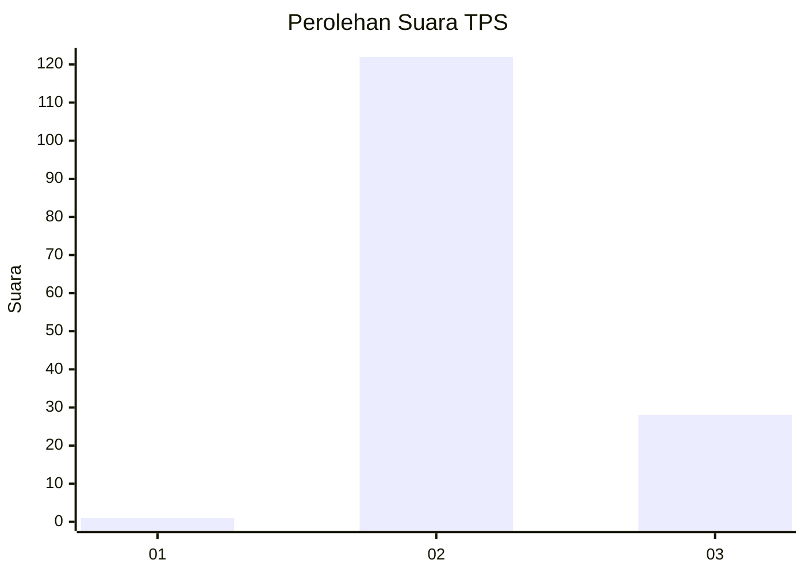
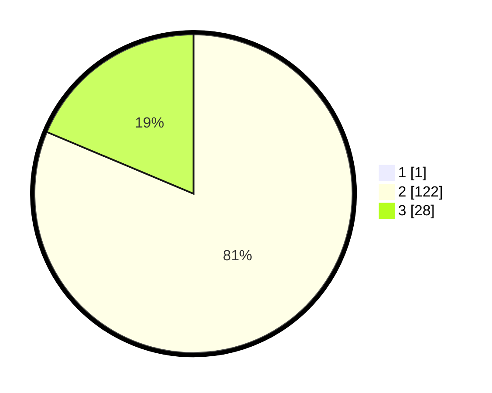

# Hasil

## Grafik

## Tabel

| No. | Nama Paslon    | Suara | Suara (raw) | Persentase |
|:--- |:-------------- | -----:| -----------:| ----------:|
| 1   | ANIES MUHAIMIN | 1     | [1][p-1]    | 0,66       |
| 2   | PRABOWO GIBRAN | 122   | [122][p-2]  | 80,79      |
| 3   | GANJAR MAHFUD  | 28    | [28][p-3]   | 18,54      |

[p-1]: https://github.com/gigit-pemilu/pemilu-2024/blob/main/pilpres/hitung-suara/sub/12-sumatera-utara/sub/08-simalungun/sub/09-sidamanik/sub/1013-sarimatondang/sub/001-tps/sub/paslon-1.txt
[p-2]: https://github.com/gigit-pemilu/pemilu-2024/blob/main/pilpres/hitung-suara/sub/12-sumatera-utara/sub/08-simalungun/sub/09-sidamanik/sub/1013-sarimatondang/sub/001-tps/sub/paslon-2.txt
[p-3]: https://github.com/gigit-pemilu/pemilu-2024/blob/main/pilpres/hitung-suara/sub/12-sumatera-utara/sub/08-simalungun/sub/09-sidamanik/sub/1013-sarimatondang/sub/001-tps/sub/paslon-3.txt

## Foto C Plano

https://sirekap-obj-formc.kpu.go.id/7f55/pemilu/ppwp/12/08/09/10/13/1208091013001-20240215-000133--43e645ee-ef9e-467e-9f1c-9609139ae735.jpg

https://sirekap-obj-formc.kpu.go.id/7f55/pemilu/ppwp/12/08/09/10/13/1208091013001-20240215-000348--76021747-b5a6-48b5-bbe7-daca0f0d5a85.jpg

https://sirekap-obj-formc.kpu.go.id/7f55/pemilu/ppwp/12/08/09/10/13/1208091013001-20240215-000642--22e0e484-e0d6-4abe-b4f6-286896f87832.jpg

## Metadata

| Key        | Value               |
| ---------- | ------------------- |
| Time Stamp | 2024-02-25 00:00:00 |

