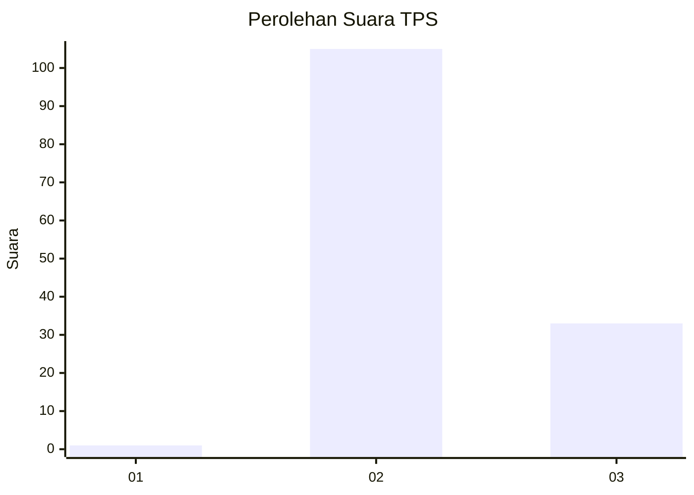
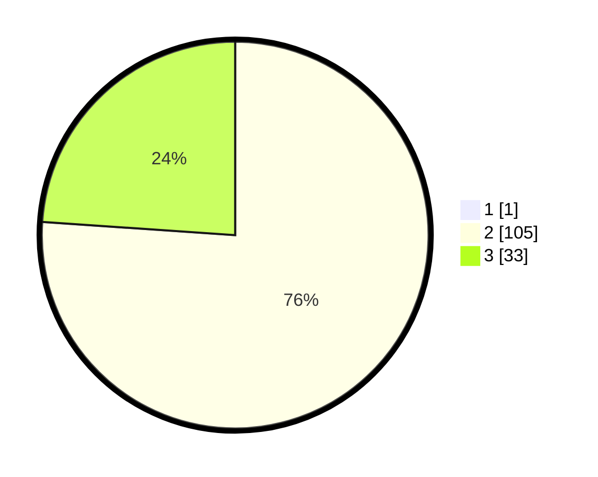

# Hasil

## Grafik

## Tabel

| No. | Nama Paslon    | Suara | Suara (raw) | Persentase |
|:--- |:-------------- | -----:| -----------:| ----------:|
| 1   | ANIES MUHAIMIN | 1     | [1][p-1]    | 0,72       |
| 2   | PRABOWO GIBRAN | 105   | [105][p-2]  | 75,54      |
| 3   | GANJAR MAHFUD  | 33    | [33][p-3]   | 23,74      |

[p-1]: https://github.com/gigit-pemilu/pemilu-2024-12-sumatera-utara/blob/main/pilpres/hitung-suara/sub/12-sumatera-utara/sub/08-simalungun/sub/09-sidamanik/sub/1013-sarimatondang/sub/002-tps/sub/paslon-1.txt
[p-2]: https://github.com/gigit-pemilu/pemilu-2024-12-sumatera-utara/blob/main/pilpres/hitung-suara/sub/12-sumatera-utara/sub/08-simalungun/sub/09-sidamanik/sub/1013-sarimatondang/sub/002-tps/sub/paslon-2.txt
[p-3]: https://github.com/gigit-pemilu/pemilu-2024-12-sumatera-utara/blob/main/pilpres/hitung-suara/sub/12-sumatera-utara/sub/08-simalungun/sub/09-sidamanik/sub/1013-sarimatondang/sub/002-tps/sub/paslon-3.txt

## Foto C Plano

https://sirekap-obj-formc.kpu.go.id/9062/pemilu/ppwp/12/08/09/10/13/1208091013002-20240214-230632--83f37e86-e242-4c5e-bccb-e27ad48369f3.jpg

https://sirekap-obj-formc.kpu.go.id/9062/pemilu/ppwp/12/08/09/10/13/1208091013002-20240214-230245--d8bb5143-7812-44c5-8cc3-dead0be6fb16.jpg

https://sirekap-obj-formc.kpu.go.id/9062/pemilu/ppwp/12/08/09/10/13/1208091013002-20240214-230424--4963a6f2-affa-48c5-9320-267be381591e.jpg

## Metadata

| Key        | Value               |
| ---------- | ------------------- |
| Time Stamp | 2024-02-25 00:00:00 |

