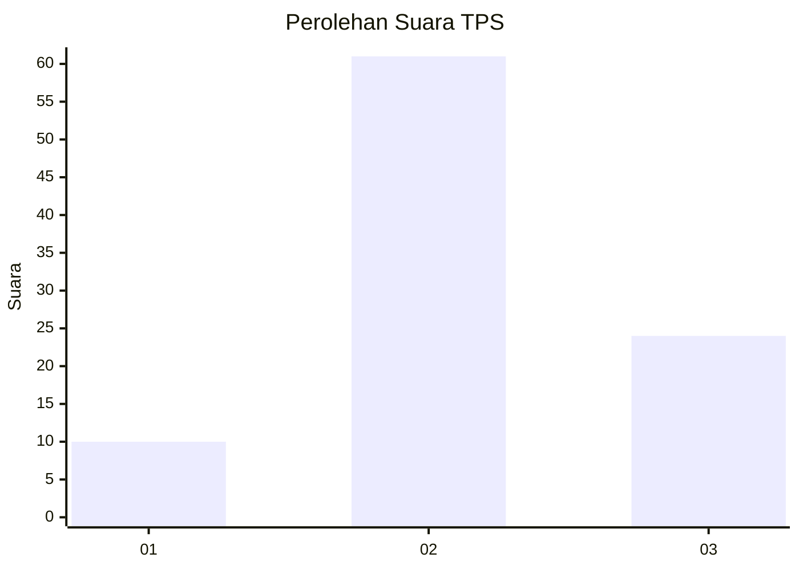
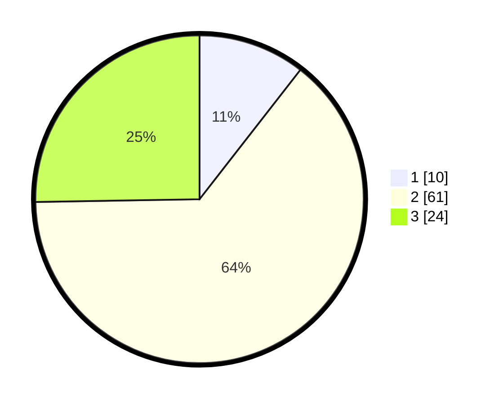

# Hasil

## Grafik

## Tabel

| No. | Nama Paslon    | Suara | Suara (raw) | Persentase |
|:--- |:-------------- | -----:| -----------:| ----------:|
| 1   | ANIES MUHAIMIN | 10    | [10][p-1]   | 10,53      |
| 2   | PRABOWO GIBRAN | 61    | [61][p-2]   | 64,21      |
| 3   | GANJAR MAHFUD  | 24    | [24][p-3]   | 25,26      |

[p-1]: https://github.com/gigit-pemilu/pemilu-2024/blob/main/pilpres/hitung-suara/sub/12-sumatera-utara/sub/08-simalungun/sub/09-sidamanik/sub/1013-sarimatondang/sub/006-tps/sub/paslon-1.txt
[p-2]: https://github.com/gigit-pemilu/pemilu-2024/blob/main/pilpres/hitung-suara/sub/12-sumatera-utara/sub/08-simalungun/sub/09-sidamanik/sub/1013-sarimatondang/sub/006-tps/sub/paslon-2.txt
[p-3]: https://github.com/gigit-pemilu/pemilu-2024/blob/main/pilpres/hitung-suara/sub/12-sumatera-utara/sub/08-simalungun/sub/09-sidamanik/sub/1013-sarimatondang/sub/006-tps/sub/paslon-3.txt

## Foto C Plano

https://sirekap-obj-formc.kpu.go.id/ba70/pemilu/ppwp/12/08/09/10/13/1208091013006-20240214-221703--e9da5688-5f68-4bb8-a146-67b397e48769.jpg

https://sirekap-obj-formc.kpu.go.id/ba70/pemilu/ppwp/12/08/09/10/13/1208091013006-20240214-221844--cb57483e-eed2-4804-82d4-9a42867652db.jpg

https://sirekap-obj-formc.kpu.go.id/ba70/pemilu/ppwp/12/08/09/10/13/1208091013006-20240214-222046--59b2f11f-caf9-46e6-8474-862dad16df90.jpg

## Metadata

| Key        | Value               |
| ---------- | ------------------- |
| Time Stamp | 2024-02-24 22:31:28 |

