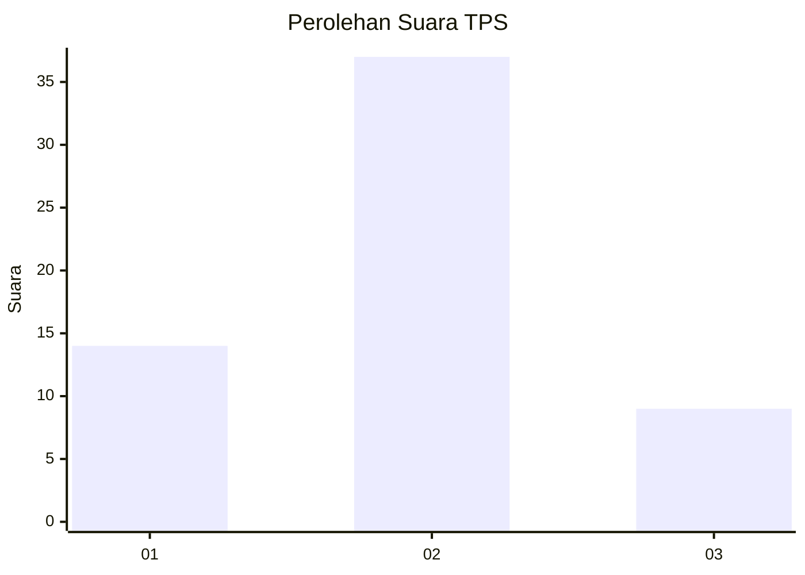
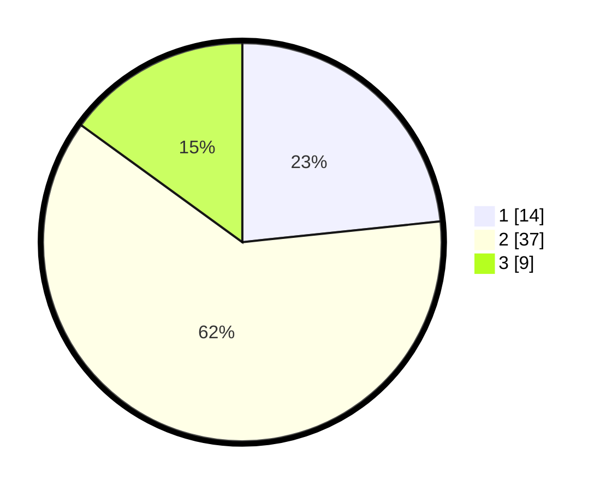

# Hasil

## Grafik

## Tabel

| No. | Nama Paslon    | Suara | Suara (raw) | Persentase |
|:--- |:-------------- | -----:| -----------:| ----------:|
| 1   | ANIES MUHAIMIN | 14    | [14][p-1]   | 23,33      |
| 2   | PRABOWO GIBRAN | 37    | [37][p-2]   | 61,67      |
| 3   | GANJAR MAHFUD  | 9     | [9][p-3]    | 15,00      |

[p-1]: https://github.com/gigit-pemilu/pemilu-2024/blob/main/pilpres/hitung-suara/sub/12-sumatera-utara/sub/08-simalungun/sub/09-sidamanik/sub/1013-sarimatondang/sub/011-tps/sub/paslon-1.txt
[p-2]: https://github.com/gigit-pemilu/pemilu-2024/blob/main/pilpres/hitung-suara/sub/12-sumatera-utara/sub/08-simalungun/sub/09-sidamanik/sub/1013-sarimatondang/sub/011-tps/sub/paslon-2.txt
[p-3]: https://github.com/gigit-pemilu/pemilu-2024/blob/main/pilpres/hitung-suara/sub/12-sumatera-utara/sub/08-simalungun/sub/09-sidamanik/sub/1013-sarimatondang/sub/011-tps/sub/paslon-3.txt

## Foto C Plano

https://sirekap-obj-formc.kpu.go.id/36a7/pemilu/ppwp/12/08/09/10/13/1208091013011-20240214-221319--de0f94bb-c2db-4933-9c34-9bc3aba5f847.jpg

https://sirekap-obj-formc.kpu.go.id/36a7/pemilu/ppwp/12/08/09/10/13/1208091013011-20240215-021829--42e300c8-0b84-468c-9c61-69e30c60aa4d.jpg

https://sirekap-obj-formc.kpu.go.id/36a7/pemilu/ppwp/12/08/09/10/13/1208091013011-20240215-050623--79f428c1-672c-4f4e-bc39-096d058157ad.jpg

## Metadata

| Key        | Value               |
| ---------- | ------------------- |
| Time Stamp | 2024-02-21 23:00:00 |

