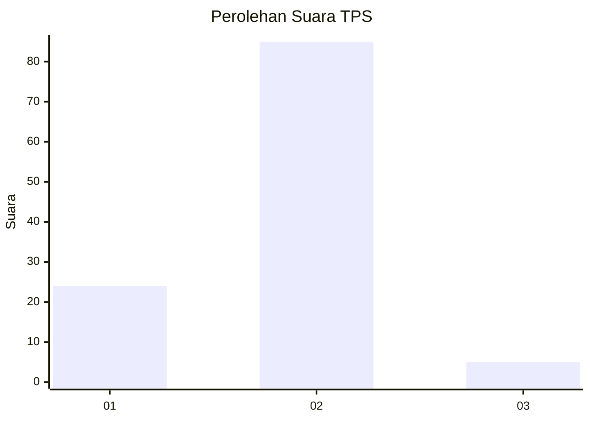
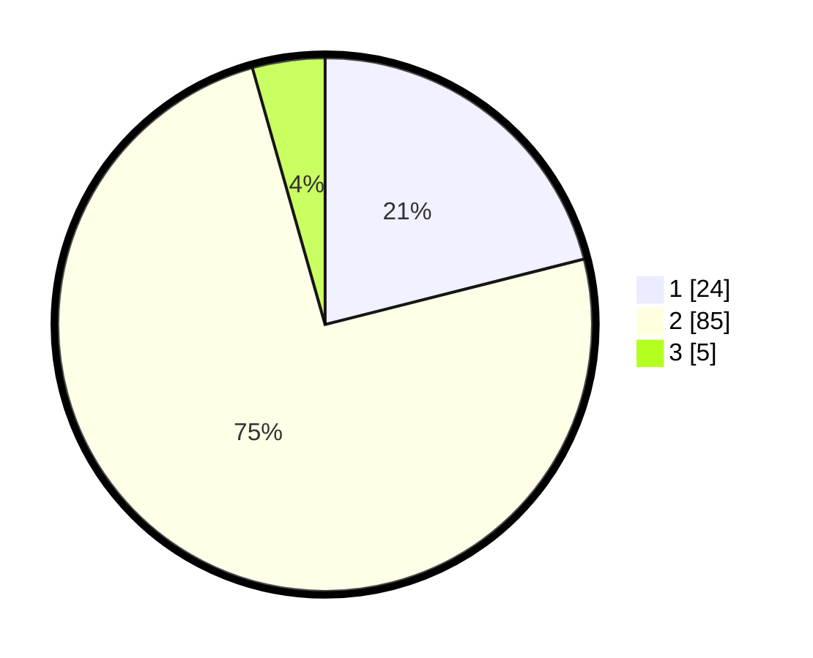

# Hasil

## Grafik

## Tabel

| No. | Nama Paslon    | Suara | Suara (raw) | Persentase |
|:--- |:-------------- | -----:| -----------:| ----------:|
| 1   | ANIES MUHAIMIN | 24    | [24][p-1]   | 21,05      |
| 2   | PRABOWO GIBRAN | 85    | [85][p-2]   | 74,56      |
| 3   | GANJAR MAHFUD  | 5     | [5][p-3]    | 4,39       |

[p-1]: https://github.com/gigit-pemilu/pemilu-2024/blob/main/pilpres/hitung-suara/sub/12-sumatera-utara/sub/08-simalungun/sub/09-sidamanik/sub/2003-ambarisan/sub/007-tps/sub/paslon-1.txt
[p-2]: https://github.com/gigit-pemilu/pemilu-2024/blob/main/pilpres/hitung-suara/sub/12-sumatera-utara/sub/08-simalungun/sub/09-sidamanik/sub/2003-ambarisan/sub/007-tps/sub/paslon-2.txt
[p-3]: https://github.com/gigit-pemilu/pemilu-2024/blob/main/pilpres/hitung-suara/sub/12-sumatera-utara/sub/08-simalungun/sub/09-sidamanik/sub/2003-ambarisan/sub/007-tps/sub/paslon-3.txt

## Foto C Plano

https://sirekap-obj-formc.kpu.go.id/ce9c/pemilu/ppwp/12/08/09/20/03/1208092003007-20240215-025953--cecbf931-4c11-4175-ada9-0b989252d282.jpg

https://sirekap-obj-formc.kpu.go.id/ce9c/pemilu/ppwp/12/08/09/20/03/1208092003007-20240216-094959--ae89d772-b33b-438f-9a62-aeff7159f713.jpg

https://sirekap-obj-formc.kpu.go.id/ce9c/pemilu/ppwp/12/08/09/20/03/1208092003007-20240216-094955--7b54d2b5-cfcb-4b80-9266-caf68fdaf759.jpg

## Metadata

| Key        | Value               |
| ---------- | ------------------- |
| Time Stamp | 2024-02-24 22:31:28 |

