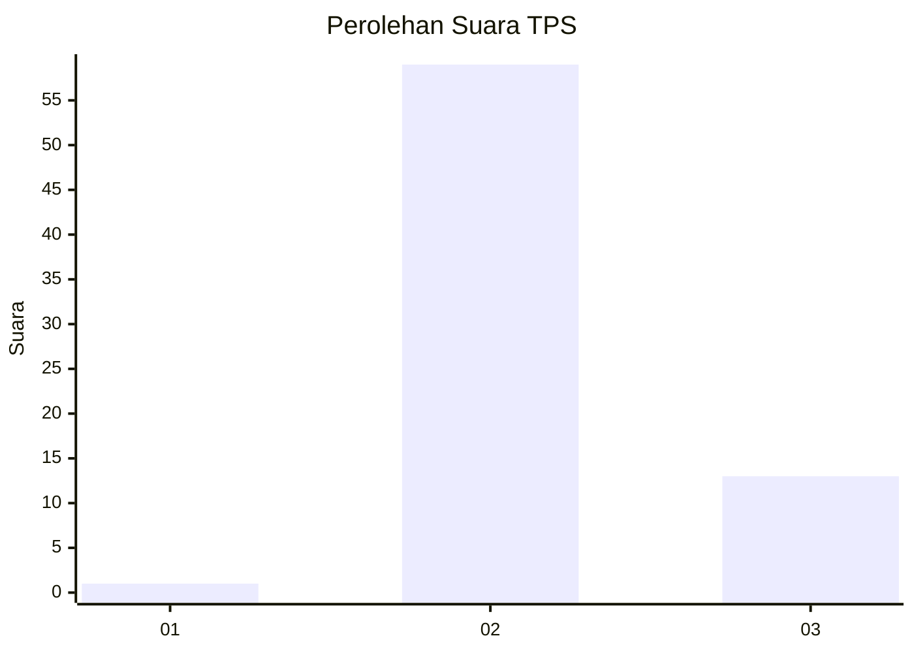
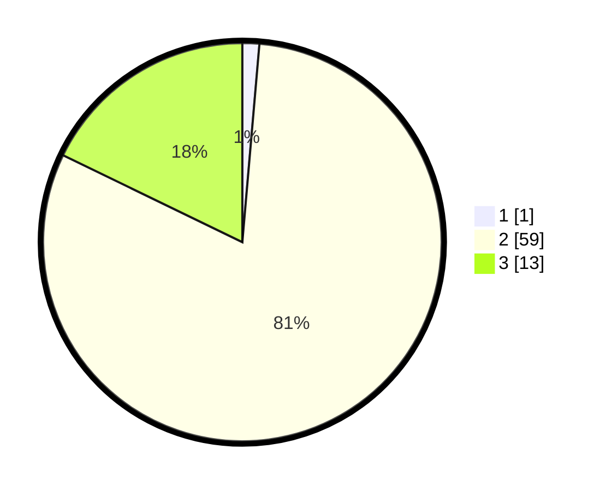

# Hasil

## Grafik

## Tabel

| No. | Nama Paslon    | Suara | Suara (raw) | Persentase |
|:--- |:-------------- | -----:| -----------:| ----------:|
| 1   | ANIES MUHAIMIN | 1     | [1][p-1]    | 1,37       |
| 2   | PRABOWO GIBRAN | 59    | [59][p-2]   | 80,82      |
| 3   | GANJAR MAHFUD  | 13    | [13][p-3]   | 17,81      |

[p-1]: https://github.com/gigit-pemilu/pemilu-2024-12-sumatera-utara/blob/main/pilpres/hitung-suara/sub/12-sumatera-utara/sub/08-simalungun/sub/09-sidamanik/sub/2003-ambarisan/sub/009-tps/sub/paslon-1.txt
[p-2]: https://github.com/gigit-pemilu/pemilu-2024-12-sumatera-utara/blob/main/pilpres/hitung-suara/sub/12-sumatera-utara/sub/08-simalungun/sub/09-sidamanik/sub/2003-ambarisan/sub/009-tps/sub/paslon-2.txt
[p-3]: https://github.com/gigit-pemilu/pemilu-2024-12-sumatera-utara/blob/main/pilpres/hitung-suara/sub/12-sumatera-utara/sub/08-simalungun/sub/09-sidamanik/sub/2003-ambarisan/sub/009-tps/sub/paslon-3.txt

## Foto C Plano

https://sirekap-obj-formc.kpu.go.id/9912/pemilu/ppwp/12/08/09/20/03/1208092003009-20240214-224401--8c4dd596-3c92-4b43-af5b-104af894c2ce.jpg

https://sirekap-obj-formc.kpu.go.id/9912/pemilu/ppwp/12/08/09/20/03/1208092003009-20240215-211629--c5cdd325-7092-453c-ab65-148467e9ccda.jpg

https://sirekap-obj-formc.kpu.go.id/9912/pemilu/ppwp/12/08/09/20/03/1208092003009-20240215-212345--683115da-f7af-4b86-9888-67e91664e9e0.jpg

## Metadata

| Key        | Value               |
| ---------- | ------------------- |
| Time Stamp | 2024-02-16 01:00:27 |

