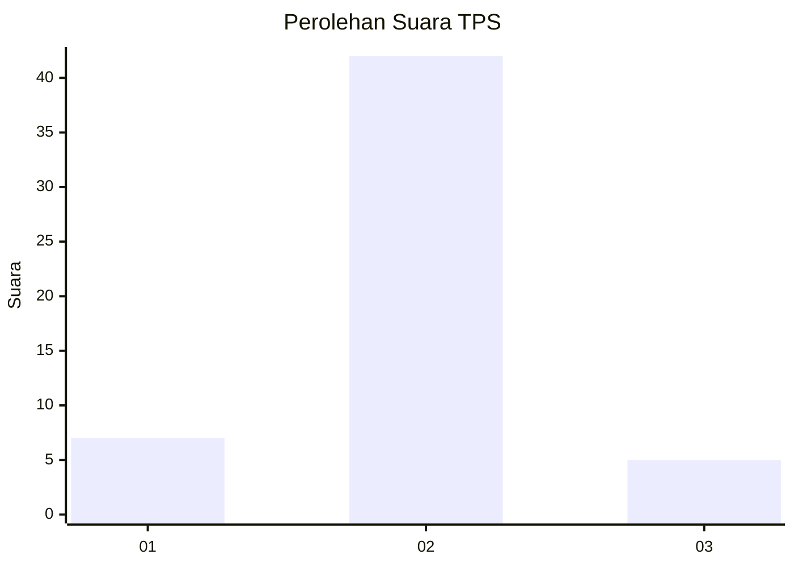
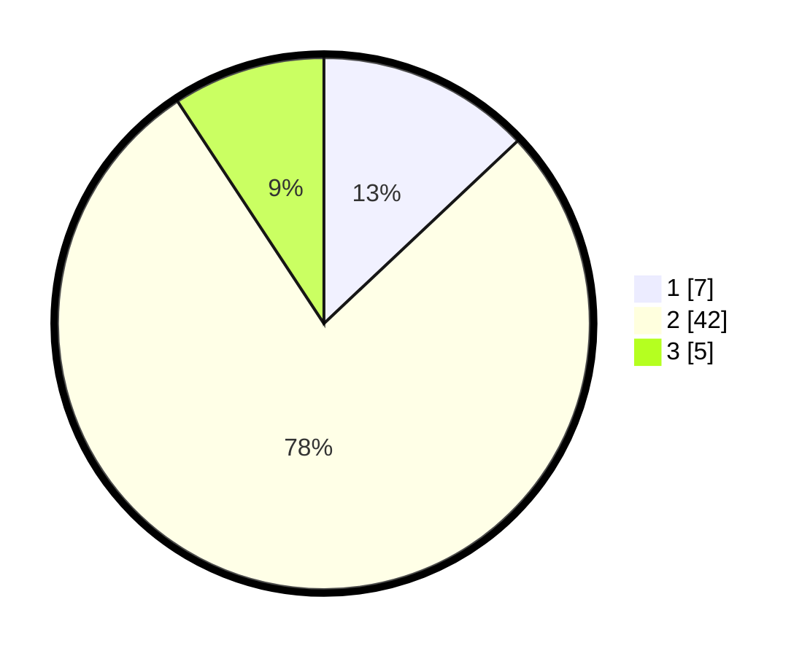

# Hasil

## Grafik

## Tabel

| No. | Nama Paslon    | Suara | Suara (raw) | Persentase |
|:--- |:-------------- | -----:| -----------:| ----------:|
| 1   | ANIES MUHAIMIN | 7     | [7][p-1]    | 12,96      |
| 2   | PRABOWO GIBRAN | 42    | [42][p-2]   | 77,78      |
| 3   | GANJAR MAHFUD  | 5     | [5][p-3]    | 9,26       |

[p-1]: https://github.com/gigit-pemilu/pemilu-2024-12-sumatera-utara/blob/main/pilpres/hitung-suara/sub/12-sumatera-utara/sub/08-simalungun/sub/09-sidamanik/sub/2005-bah-butong-ii/sub/003-tps/sub/paslon-1.txt
[p-2]: https://github.com/gigit-pemilu/pemilu-2024-12-sumatera-utara/blob/main/pilpres/hitung-suara/sub/12-sumatera-utara/sub/08-simalungun/sub/09-sidamanik/sub/2005-bah-butong-ii/sub/003-tps/sub/paslon-2.txt
[p-3]: https://github.com/gigit-pemilu/pemilu-2024-12-sumatera-utara/blob/main/pilpres/hitung-suara/sub/12-sumatera-utara/sub/08-simalungun/sub/09-sidamanik/sub/2005-bah-butong-ii/sub/003-tps/sub/paslon-3.txt

## Foto C Plano

https://sirekap-obj-formc.kpu.go.id/168e/pemilu/ppwp/12/08/09/20/05/1208092005003-20240215-170032--e4ba1835-4860-48fe-b993-b954a3cd4b82.jpg

https://sirekap-obj-formc.kpu.go.id/168e/pemilu/ppwp/12/08/09/20/05/1208092005003-20240214-191145--79ecc1f3-84b0-49dc-b98d-0de4cacc1771.jpg

https://sirekap-obj-formc.kpu.go.id/168e/pemilu/ppwp/12/08/09/20/05/1208092005003-20240214-191317--2db16a8a-c7ff-43a4-875e-b736136c7af1.jpg

## Metadata

| Key        | Value               |
| ---------- | ------------------- |
| Time Stamp | 2024-02-24 22:31:28 |

