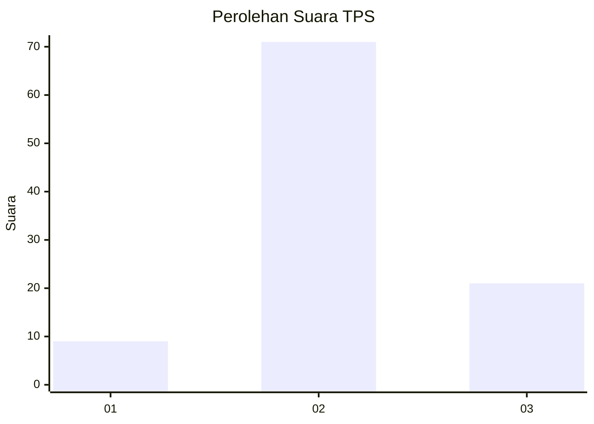
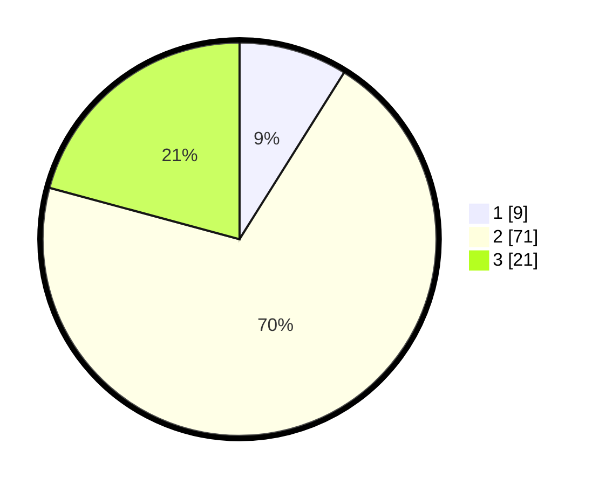

# Hasil

## Grafik

## Tabel

| No. | Nama Paslon    | Suara | Suara (raw) | Persentase |
|:--- |:-------------- | -----:| -----------:| ----------:|
| 1   | ANIES MUHAIMIN | 9     | [9][p-1]    | 8,91       |
| 2   | PRABOWO GIBRAN | 71    | [71][p-2]   | 70,30      |
| 3   | GANJAR MAHFUD  | 21    | [21][p-3]   | 20,79      |

[p-1]: https://github.com/gigit-pemilu/pemilu-2024/blob/main/pilpres/hitung-suara/sub/12-sumatera-utara/sub/08-simalungun/sub/09-sidamanik/sub/2007-manik-hataran/sub/001-tps/sub/paslon-1.txt
[p-2]: https://github.com/gigit-pemilu/pemilu-2024/blob/main/pilpres/hitung-suara/sub/12-sumatera-utara/sub/08-simalungun/sub/09-sidamanik/sub/2007-manik-hataran/sub/001-tps/sub/paslon-2.txt
[p-3]: https://github.com/gigit-pemilu/pemilu-2024/blob/main/pilpres/hitung-suara/sub/12-sumatera-utara/sub/08-simalungun/sub/09-sidamanik/sub/2007-manik-hataran/sub/001-tps/sub/paslon-3.txt

## Foto C Plano

https://sirekap-obj-formc.kpu.go.id/7b32/pemilu/ppwp/12/08/09/20/07/1208092007001-20240216-101038--e683b561-c3b7-4dd1-b213-eced7a4b312e.jpg

https://sirekap-obj-formc.kpu.go.id/7b32/pemilu/ppwp/12/08/09/20/07/1208092007001-20240216-101549--db291505-ba04-4958-bb65-29f972013dc2.jpg

https://sirekap-obj-formc.kpu.go.id/7b32/pemilu/ppwp/12/08/09/20/07/1208092007001-20240216-102255--44208116-b87f-43e7-b0d5-045d25776dd1.jpg

## Metadata

| Key        | Value               |
| ---------- | ------------------- |
| Time Stamp | 2024-02-25 18:00:00 |

