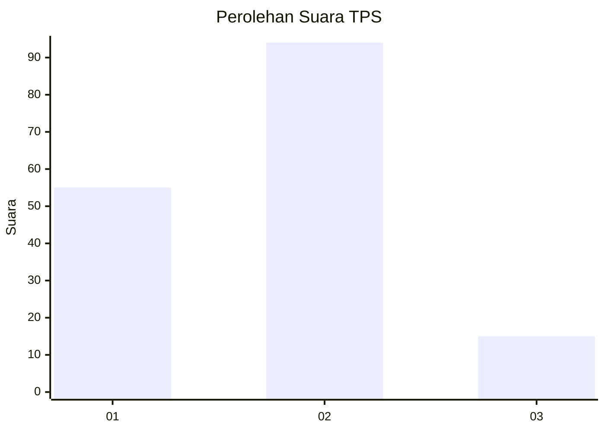
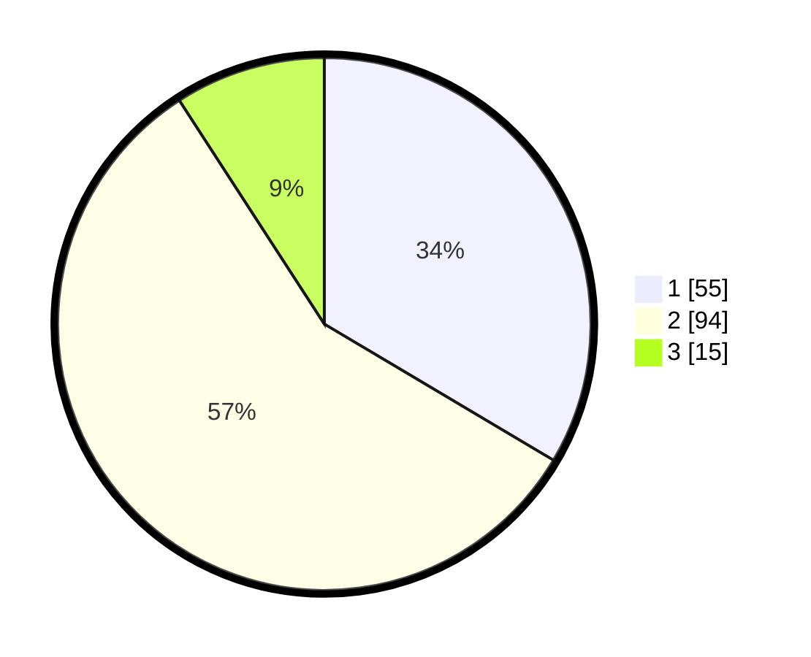

# Hasil

## Grafik

## Tabel

| No. | Nama Paslon    | Suara | Suara (raw) | Persentase |
|:--- |:-------------- | -----:| -----------:| ----------:|
| 1   | ANIES MUHAIMIN | 55    | [55][p-1]   | 33,54      |
| 2   | PRABOWO GIBRAN | 94    | [94][p-2]   | 57,32      |
| 3   | GANJAR MAHFUD  | 15    | [15][p-3]   | 9,15       |

[p-1]: https://github.com/gigit-pemilu/pemilu-2024/blob/main/pilpres/hitung-suara/sub/12-sumatera-utara/sub/08-simalungun/sub/09-sidamanik/sub/2009-manik-maraja/sub/002-tps/sub/paslon-1.txt
[p-2]: https://github.com/gigit-pemilu/pemilu-2024/blob/main/pilpres/hitung-suara/sub/12-sumatera-utara/sub/08-simalungun/sub/09-sidamanik/sub/2009-manik-maraja/sub/002-tps/sub/paslon-2.txt
[p-3]: https://github.com/gigit-pemilu/pemilu-2024/blob/main/pilpres/hitung-suara/sub/12-sumatera-utara/sub/08-simalungun/sub/09-sidamanik/sub/2009-manik-maraja/sub/002-tps/sub/paslon-3.txt

## Foto C Plano

https://sirekap-obj-formc.kpu.go.id/7e3e/pemilu/ppwp/12/08/09/20/09/1208092009002-20240215-175107--06bd404e-649a-409b-887d-8ea4204fe92d.jpg

https://sirekap-obj-formc.kpu.go.id/7e3e/pemilu/ppwp/12/08/09/20/09/1208092009002-20240214-221710--4e51ef36-aaf3-4dc6-b3cc-bf33b9285a20.jpg

https://sirekap-obj-formc.kpu.go.id/7e3e/pemilu/ppwp/12/08/09/20/09/1208092009002-20240215-175336--b64f84c3-ce0c-4964-87fe-a28e56f89b40.jpg

## Metadata

| Key        | Value               |
| ---------- | ------------------- |
| Time Stamp | 2024-02-25 13:00:00 |

