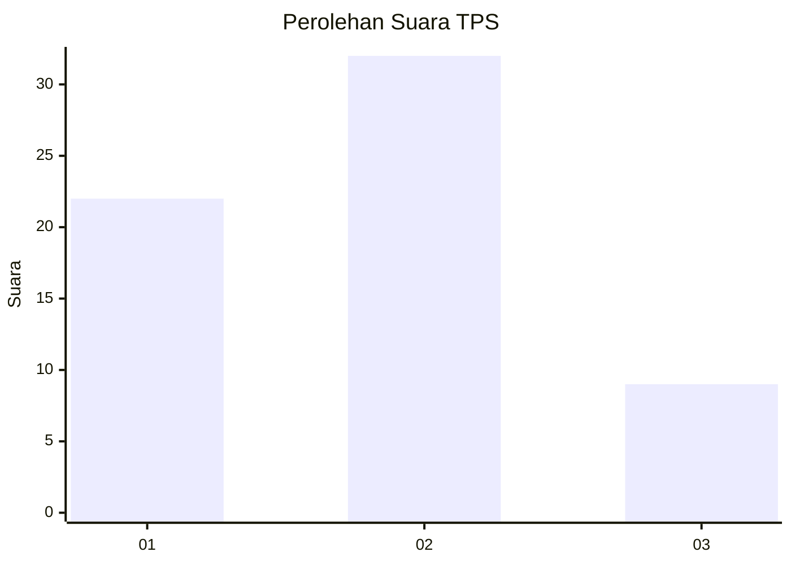
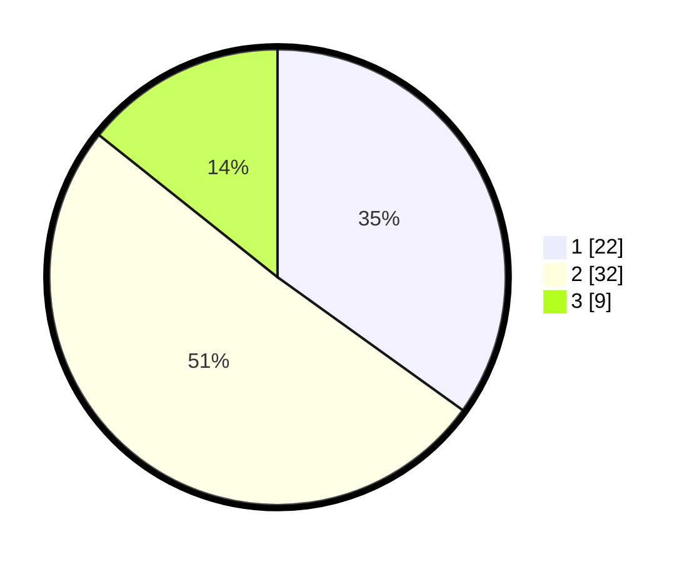

# Hasil

## Grafik

## Tabel

| No. | Nama Paslon    | Suara | Suara (raw) | Persentase |
|:--- |:-------------- | -----:| -----------:| ----------:|
| 1   | ANIES MUHAIMIN | 22    | [22][p-1]   | 34,92      |
| 2   | PRABOWO GIBRAN | 32    | [32][p-2]   | 50,79      |
| 3   | GANJAR MAHFUD  | 9     | [9][p-3]    | 14,29      |

[p-1]: https://github.com/gigit-pemilu/pemilu-2024-12-sumatera-utara/blob/main/pilpres/hitung-suara/sub/12-sumatera-utara/sub/08-simalungun/sub/09-sidamanik/sub/2009-manik-maraja/sub/010-tps/sub/paslon-1.txt
[p-2]: https://github.com/gigit-pemilu/pemilu-2024-12-sumatera-utara/blob/main/pilpres/hitung-suara/sub/12-sumatera-utara/sub/08-simalungun/sub/09-sidamanik/sub/2009-manik-maraja/sub/010-tps/sub/paslon-2.txt
[p-3]: https://github.com/gigit-pemilu/pemilu-2024-12-sumatera-utara/blob/main/pilpres/hitung-suara/sub/12-sumatera-utara/sub/08-simalungun/sub/09-sidamanik/sub/2009-manik-maraja/sub/010-tps/sub/paslon-3.txt

## Foto C Plano

https://sirekap-obj-formc.kpu.go.id/784e/pemilu/ppwp/12/08/09/20/09/1208092009010-20240215-022020--900be232-c565-439f-be07-96216ab55f69.jpg

https://sirekap-obj-formc.kpu.go.id/784e/pemilu/ppwp/12/08/09/20/09/1208092009010-20240215-022323--b4d65f48-84d7-4bf3-9b66-22cb11353adb.jpg

https://sirekap-obj-formc.kpu.go.id/784e/pemilu/ppwp/12/08/09/20/09/1208092009010-20240215-023125--7a5fa9ac-aef8-41b8-a413-23f692799d43.jpg

## Metadata

| Key        | Value               |
| ---------- | ------------------- |
| Time Stamp | 2024-02-25 15:00:00 |

