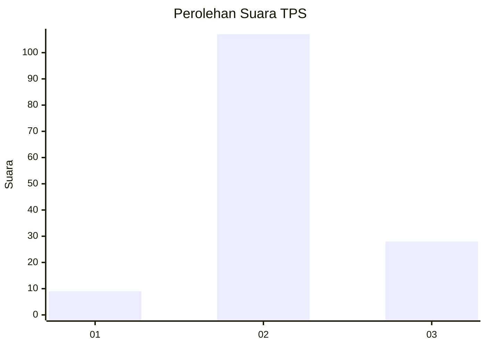
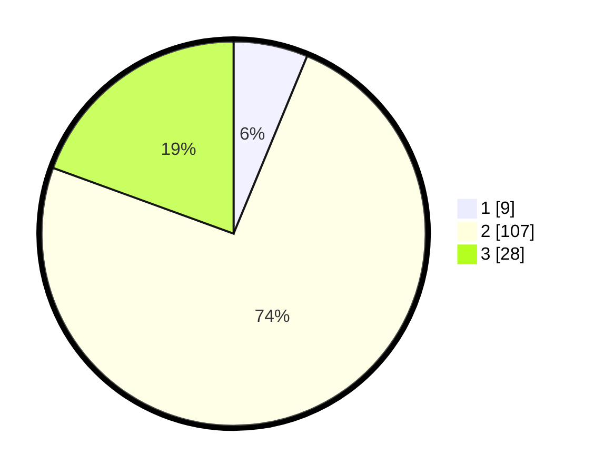

# Hasil

## Grafik

## Tabel

| No. | Nama Paslon    | Suara | Suara (raw) | Persentase |
|:--- |:-------------- | -----:| -----------:| ----------:|
| 1   | ANIES MUHAIMIN | 9     | [9][p-1]    | 6,25       |
| 2   | PRABOWO GIBRAN | 107   | [107][p-2]  | 74,31      |
| 3   | GANJAR MAHFUD  | 28    | [28][p-3]   | 19,44      |

[p-1]: https://github.com/gigit-pemilu/pemilu-2024-12-sumatera-utara/blob/main/pilpres/hitung-suara/sub/12-sumatera-utara/sub/08-simalungun/sub/09-sidamanik/sub/2012-kebun-sayur-bah-butong/sub/003-tps/sub/paslon-1.txt
[p-2]: https://github.com/gigit-pemilu/pemilu-2024-12-sumatera-utara/blob/main/pilpres/hitung-suara/sub/12-sumatera-utara/sub/08-simalungun/sub/09-sidamanik/sub/2012-kebun-sayur-bah-butong/sub/003-tps/sub/paslon-2.txt
[p-3]: https://github.com/gigit-pemilu/pemilu-2024-12-sumatera-utara/blob/main/pilpres/hitung-suara/sub/12-sumatera-utara/sub/08-simalungun/sub/09-sidamanik/sub/2012-kebun-sayur-bah-butong/sub/003-tps/sub/paslon-3.txt

## Foto C Plano

https://sirekap-obj-formc.kpu.go.id/0b50/pemilu/ppwp/12/08/09/20/12/1208092012003-20240215-022800--daa41f23-5263-4af0-8641-aec212b0c20a.jpg

https://sirekap-obj-formc.kpu.go.id/0b50/pemilu/ppwp/12/08/09/20/12/1208092012003-20240215-022958--fd36d4ff-f647-4225-b986-a0943250d938.jpg

https://sirekap-obj-formc.kpu.go.id/0b50/pemilu/ppwp/12/08/09/20/12/1208092012003-20240215-023207--7a8147fe-f392-4585-9a18-7229e513c94c.jpg

## Metadata

| Key        | Value               |
| ---------- | ------------------- |
| Time Stamp | 2024-02-25 17:00:00 |

