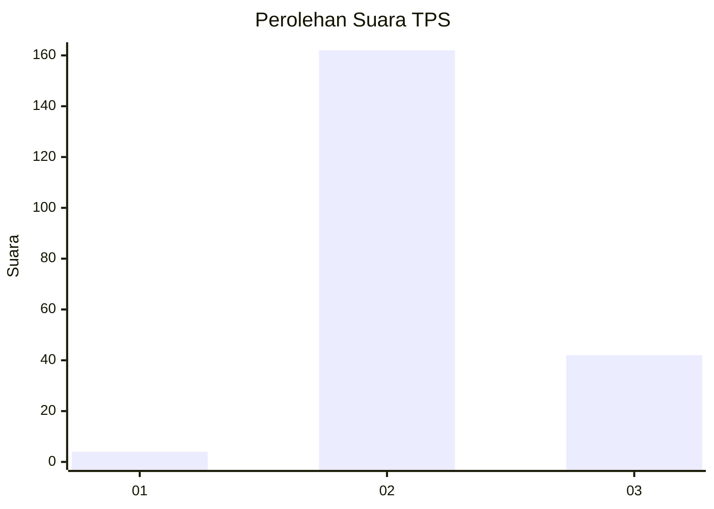

# Hasil

## Grafik

## Tabel

| No. | Nama Paslon    | Suara | Suara (raw) | Persentase |
|:--- |:-------------- | -----:| -----------:| ----------:|
| 1   | ANIES MUHAIMIN | 4     | [4][p-1]    | 1,92       |
| 2   | PRABOWO GIBRAN | 162   | [162][p-2]  | 77,88      |
| 3   | GANJAR MAHFUD  | 42    | [42][p-3]   | 20,19      |

[p-1]: https://github.com/gigit-pemilu/pemilu-2024-12-sumatera-utara/blob/main/pilpres/hitung-suara/sub/12-sumatera-utara/sub/08-simalungun/sub/10-pamatang-sidamanik/sub/2001-sait-buttu-saribu/sub/003-tps/sub/paslon-1.txt
[p-2]: https://github.com/gigit-pemilu/pemilu-2024-12-sumatera-utara/blob/main/pilpres/hitung-suara/sub/12-sumatera-utara/sub/08-simalungun/sub/10-pamatang-sidamanik/sub/2001-sait-buttu-saribu/sub/003-tps/sub/paslon-2.txt
[p-3]: https://github.com/gigit-pemilu/pemilu-2024-12-sumatera-utara/blob/main/pilpres/hitung-suara/sub/12-sumatera-utara/sub/08-simalungun/sub/10-pamatang-sidamanik/sub/2001-sait-buttu-saribu/sub/003-tps/sub/paslon-3.txt

## Foto C Plano

https://sirekap-obj-formc.kpu.go.id/af84/pemilu/ppwp/12/08/10/20/01/1208102001003-20240215-012816--6c0509b6-6a1b-4313-9eb6-f3573aff13e7.jpg

https://sirekap-obj-formc.kpu.go.id/af84/pemilu/ppwp/12/08/10/20/01/1208102001003-20240215-020154--ae24b2a9-4397-4e3b-8fb8-6101fa3727bc.jpg

https://sirekap-obj-formc.kpu.go.id/af84/pemilu/ppwp/12/08/10/20/01/1208102001003-20240215-011605--16ab5dc3-fc32-4120-8f66-48cea44fe05c.jpg

## Metadata

| Key        | Value               |
| ---------- | ------------------- |
| Time Stamp | 2024-02-25 20:00:00 |

